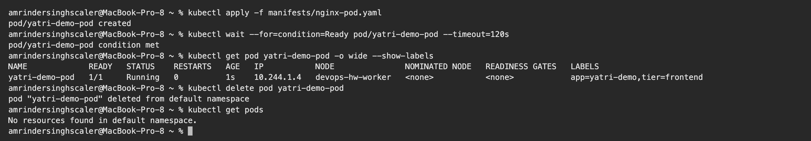
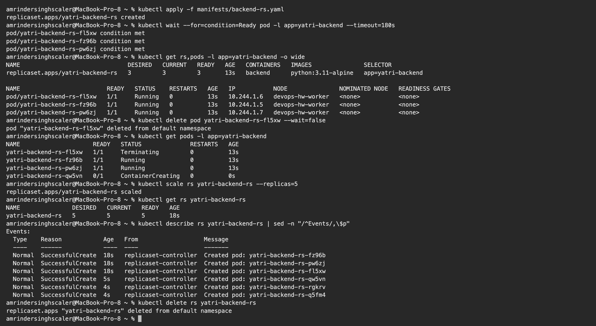
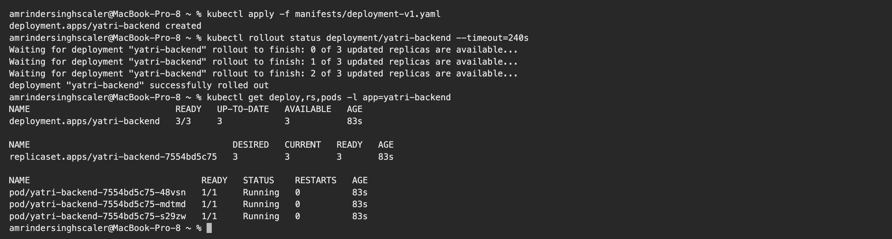
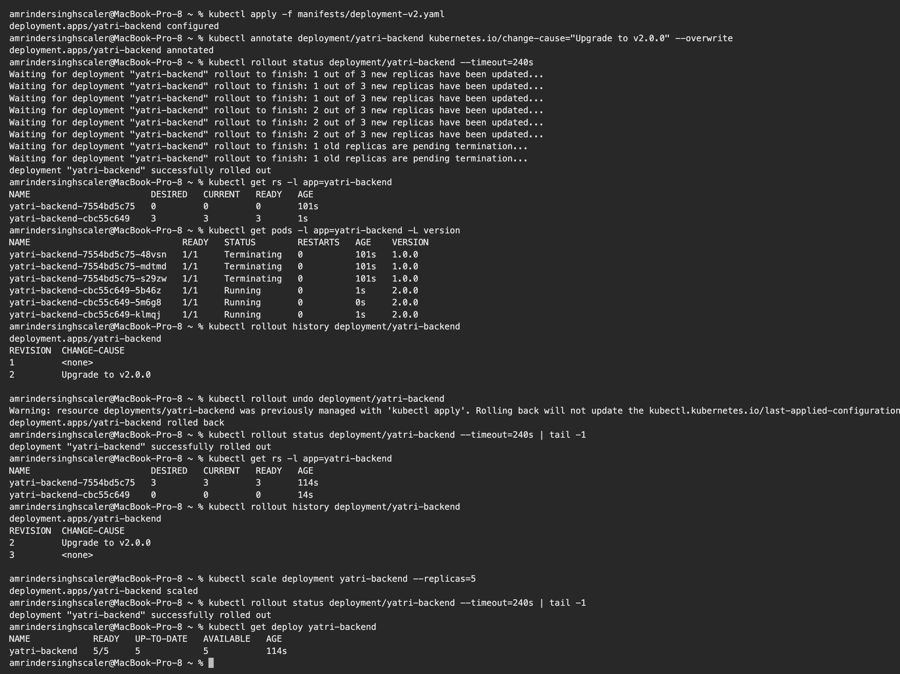
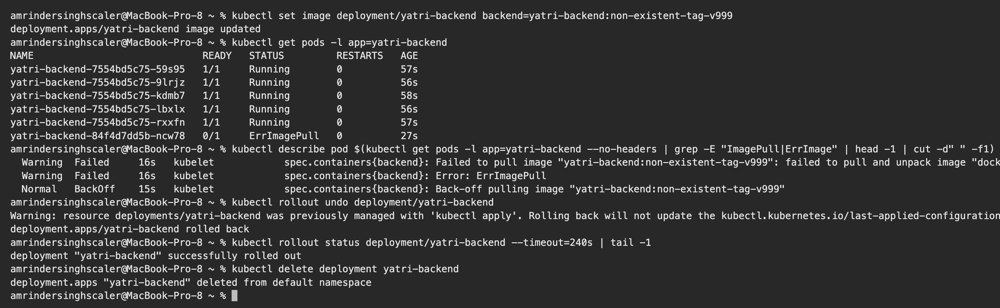
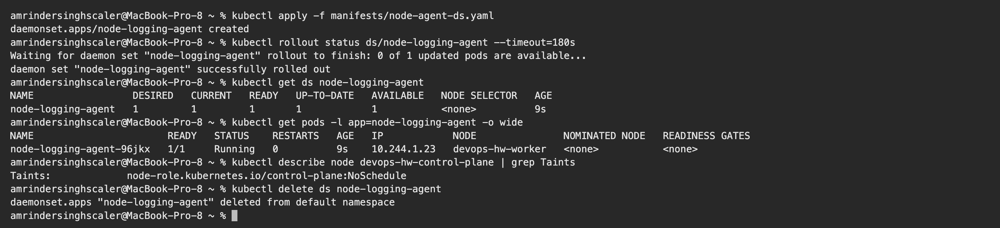
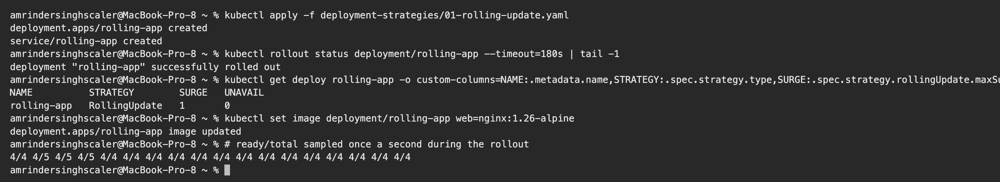
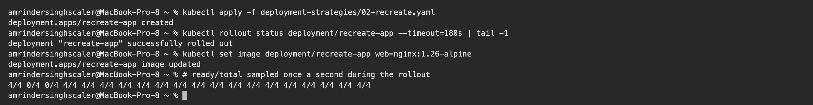
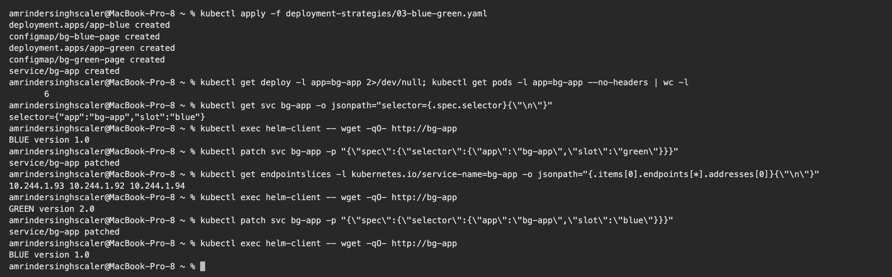
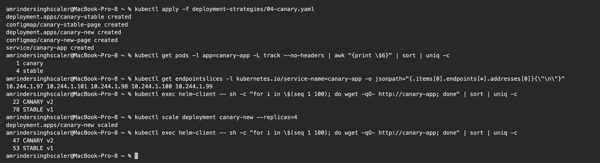

# Kubernetes Pods, ReplicaSets & Deployments – Homework

**Name:** Amrinder Singh
**Roll No:** 24BCS10596

Manifests are from the class repository ([session10-k8s-core-objects](https://github.com/Nency-Ravaliya/devops-heros/tree/main/session10-k8s-core-objects)) and are copied into [manifests/](manifests). I ran them on my local 2-node kind cluster. All outputs are copied from my terminal.

| Object | What it adds |
|---|---|
| **Pod** | Smallest unit: one or more containers sharing an IP and volumes. If it dies, nothing brings it back |
| **ReplicaSet** | Keeps N copies of a Pod running at all times (self-healing, scaling) |
| **Deployment** | Manages ReplicaSets to give rolling updates, history and rollback |
| **DaemonSet** | Runs exactly one Pod on every (eligible) node |

---

## 1. Pod

[manifests/nginx-pod.yaml](manifests/nginx-pod.yaml)

```text
$ kubectl apply -f manifests/nginx-pod.yaml
pod/yatri-demo-pod created

$ kubectl wait --for=condition=Ready pod/yatri-demo-pod --timeout=120s
pod/yatri-demo-pod condition met

$ kubectl get pod yatri-demo-pod -o wide --show-labels
NAME             READY   STATUS    RESTARTS   AGE   IP           NODE               NOMINATED NODE   READINESS GATES   LABELS
yatri-demo-pod   1/1     Running   0          1s    10.244.1.4   devops-hw-worker   <none>           <none>            app=yatri-demo,tier=frontend

$ kubectl delete pod yatri-demo-pod
pod "yatri-demo-pod" deleted from default namespace

$ kubectl get pods
No resources found in default namespace.
```

**What I understood:** a bare Pod is not protected. After `kubectl delete pod` there were **no resources** left, nobody re-created it. That is why Pods are almost never created directly in production.

## 2. ReplicaSet – self-healing and scaling

[manifests/backend-rs.yaml](manifests/backend-rs.yaml) asks for `replicas: 3` with the selector `app=yatri-backend`.

```text
$ kubectl apply -f manifests/backend-rs.yaml
replicaset.apps/yatri-backend-rs created

$ kubectl wait --for=condition=Ready pod -l app=yatri-backend --timeout=180s
pod/yatri-backend-rs-fl5xw condition met
pod/yatri-backend-rs-fz96b condition met
pod/yatri-backend-rs-pw6zj condition met

$ kubectl get rs,pods -l app=yatri-backend -o wide
NAME                               DESIRED   CURRENT   READY   AGE   CONTAINERS   IMAGES               SELECTOR
replicaset.apps/yatri-backend-rs   3         3         3       13s   backend      python:3.11-alpine   app=yatri-backend

NAME                         READY   STATUS    RESTARTS   AGE   IP           NODE               NOMINATED NODE   READINESS GATES
pod/yatri-backend-rs-fl5xw   1/1     Running   0          13s   10.244.1.6   devops-hw-worker   <none>           <none>
pod/yatri-backend-rs-fz96b   1/1     Running   0          13s   10.244.1.5   devops-hw-worker   <none>           <none>
pod/yatri-backend-rs-pw6zj   1/1     Running   0          13s   10.244.1.7   devops-hw-worker   <none>           <none>

$ kubectl delete pod yatri-backend-rs-fl5xw --wait=false
pod "yatri-backend-rs-fl5xw" deleted from default namespace

$ kubectl get pods -l app=yatri-backend
NAME                     READY   STATUS              RESTARTS   AGE
yatri-backend-rs-fl5xw   1/1     Terminating         0          13s
yatri-backend-rs-fz96b   1/1     Running             0          13s
yatri-backend-rs-pw6zj   1/1     Running             0          13s
yatri-backend-rs-qw5vn   0/1     ContainerCreating   0          0s

$ kubectl scale rs yatri-backend-rs --replicas=5
replicaset.apps/yatri-backend-rs scaled

$ kubectl get rs yatri-backend-rs
NAME               DESIRED   CURRENT   READY   AGE
yatri-backend-rs   5         5         5       18s

$ kubectl describe rs yatri-backend-rs | sed -n "/^Events/,\$p"
Events:
  Type    Reason            Age   From                   Message
  ----    ------            ----  ----                   -------
  Normal  SuccessfulCreate  18s   replicaset-controller  Created pod: yatri-backend-rs-fz96b
  Normal  SuccessfulCreate  18s   replicaset-controller  Created pod: yatri-backend-rs-pw6zj
  Normal  SuccessfulCreate  18s   replicaset-controller  Created pod: yatri-backend-rs-fl5xw
  Normal  SuccessfulCreate  5s    replicaset-controller  Created pod: yatri-backend-rs-qw5vn
  Normal  SuccessfulCreate  4s    replicaset-controller  Created pod: yatri-backend-rs-rgkrv
  Normal  SuccessfulCreate  4s    replicaset-controller  Created pod: yatri-backend-rs-q5fm4

$ kubectl delete rs yatri-backend-rs
replicaset.apps "yatri-backend-rs" deleted from default namespace
```

**What I understood:**

- I deleted the Pod `yatri-backend-rs-fl5xw`. The ReplicaSet had already created a replacement (`yatri-backend-rs-qw5vn`, still `ContainerCreating`) in the same instant that the old one went to `Terminating`. The count never stays below 3.
- The ReplicaSet finds its Pods only through the **label selector**, and Pod names get a random suffix.
- `kubectl scale --replicas=5` created 2 more Pods. The `Events` list shows every `SuccessfulCreate`.
- A ReplicaSet cannot do a controlled image update. That is the job of a Deployment.

## 3. Deployment – rolling update, history, rollback

[manifests/deployment-v1.yaml](manifests/deployment-v1.yaml) → [manifests/deployment-v2.yaml](manifests/deployment-v2.yaml)

```text
$ kubectl apply -f manifests/deployment-v1.yaml
deployment.apps/yatri-backend created

$ kubectl rollout status deployment/yatri-backend --timeout=240s
Waiting for deployment "yatri-backend" rollout to finish: 0 of 3 updated replicas are available...
Waiting for deployment "yatri-backend" rollout to finish: 1 of 3 updated replicas are available...
Waiting for deployment "yatri-backend" rollout to finish: 2 of 3 updated replicas are available...
deployment "yatri-backend" successfully rolled out

$ kubectl get deploy,rs,pods -l app=yatri-backend
NAME                            READY   UP-TO-DATE   AVAILABLE   AGE
deployment.apps/yatri-backend   3/3     3            3           83s

NAME                                       DESIRED   CURRENT   READY   AGE
replicaset.apps/yatri-backend-7554bd5c75   3         3         3       83s

NAME                                 READY   STATUS    RESTARTS   AGE
pod/yatri-backend-7554bd5c75-48vsn   1/1     Running   0          83s
pod/yatri-backend-7554bd5c75-mdtmd   1/1     Running   0          83s
pod/yatri-backend-7554bd5c75-s29zw   1/1     Running   0          83s


$ kubectl apply -f manifests/deployment-v2.yaml
deployment.apps/yatri-backend configured

$ kubectl annotate deployment/yatri-backend kubernetes.io/change-cause="Upgrade to v2.0.0" --overwrite
deployment.apps/yatri-backend annotated

$ kubectl rollout status deployment/yatri-backend --timeout=240s
Waiting for deployment "yatri-backend" rollout to finish: 1 out of 3 new replicas have been updated...
Waiting for deployment "yatri-backend" rollout to finish: 1 out of 3 new replicas have been updated...
Waiting for deployment "yatri-backend" rollout to finish: 1 out of 3 new replicas have been updated...
Waiting for deployment "yatri-backend" rollout to finish: 2 out of 3 new replicas have been updated...
Waiting for deployment "yatri-backend" rollout to finish: 2 out of 3 new replicas have been updated...
Waiting for deployment "yatri-backend" rollout to finish: 2 out of 3 new replicas have been updated...
Waiting for deployment "yatri-backend" rollout to finish: 1 old replicas are pending termination...
Waiting for deployment "yatri-backend" rollout to finish: 1 old replicas are pending termination...
deployment "yatri-backend" successfully rolled out

$ kubectl get rs -l app=yatri-backend
NAME                       DESIRED   CURRENT   READY   AGE
yatri-backend-7554bd5c75   0         0         0       101s
yatri-backend-cbc55c649    3         3         3       1s

$ kubectl get pods -l app=yatri-backend -L version
NAME                             READY   STATUS        RESTARTS   AGE    VERSION
yatri-backend-7554bd5c75-48vsn   1/1     Terminating   0          101s   1.0.0
yatri-backend-7554bd5c75-mdtmd   1/1     Terminating   0          101s   1.0.0
yatri-backend-7554bd5c75-s29zw   1/1     Terminating   0          101s   1.0.0
yatri-backend-cbc55c649-5b46z    1/1     Running       0          1s     2.0.0
yatri-backend-cbc55c649-5m6g8    1/1     Running       0          0s     2.0.0
yatri-backend-cbc55c649-klmqj    1/1     Running       0          1s     2.0.0

$ kubectl rollout history deployment/yatri-backend
deployment.apps/yatri-backend 
REVISION  CHANGE-CAUSE
1         <none>
2         Upgrade to v2.0.0


$ kubectl rollout undo deployment/yatri-backend
Warning: resource deployments/yatri-backend was previously managed with 'kubectl apply'. Rolling back will not update the kubectl.kubernetes.io/last-applied-configuration annotation, which may cause unexpected behavior on future 'kubectl apply' operations. Consider using 'kubectl apply' with your previous configuration file instead.
deployment.apps/yatri-backend rolled back

$ kubectl rollout status deployment/yatri-backend --timeout=240s | tail -1
deployment "yatri-backend" successfully rolled out

$ kubectl get rs -l app=yatri-backend
NAME                       DESIRED   CURRENT   READY   AGE
yatri-backend-7554bd5c75   3         3         3       114s
yatri-backend-cbc55c649    0         0         0       14s

$ kubectl rollout history deployment/yatri-backend
deployment.apps/yatri-backend 
REVISION  CHANGE-CAUSE
2         Upgrade to v2.0.0
3         <none>


$ kubectl scale deployment yatri-backend --replicas=5
deployment.apps/yatri-backend scaled

$ kubectl rollout status deployment/yatri-backend --timeout=240s | tail -1
deployment "yatri-backend" successfully rolled out

$ kubectl get deploy yatri-backend
NAME            READY   UP-TO-DATE   AVAILABLE   AGE
yatri-backend   5/5     5            5           114s
```

**What I understood:**

- The chain is **Deployment → ReplicaSet → Pods**. The Pod name shows it: `yatri-backend` + ReplicaSet hash `7554bd5c75` + Pod suffix.
- Applying v2 created a **new ReplicaSet** (`cbc55c649`) and scaled it up while the old one (`7554bd5c75`) was scaled down to 0. `rollout status` shows it happening one replica at a time. With `maxSurge: 1` and `maxUnavailable: 0`, a new Pod must be ready before an old one is removed, so there is no downtime.
- The old ReplicaSet is kept with 0 replicas. That is what makes rollback instant: `kubectl rollout undo` simply scaled `7554bd5c75` back to 3.
- After the undo, revision 1 became revision 3 in `rollout history`. A rollback is recorded as a new revision.
- The `kubernetes.io/change-cause` annotation fills the `CHANGE-CAUSE` column, which is useful to know why a release was made.

## 4. Troubleshooting – a broken image

I pushed a wrong image tag on purpose, the same error as in `troubleshooting/broken-image.yaml`.

```text
$ kubectl set image deployment/yatri-backend backend=yatri-backend:non-existent-tag-v999
deployment.apps/yatri-backend image updated

$ kubectl get pods -l app=yatri-backend
NAME                             READY   STATUS         RESTARTS   AGE
yatri-backend-7554bd5c75-59s95   1/1     Running        0          57s
yatri-backend-7554bd5c75-9lrjz   1/1     Running        0          56s
yatri-backend-7554bd5c75-kdmb7   1/1     Running        0          58s
yatri-backend-7554bd5c75-lbxlx   1/1     Running        0          56s
yatri-backend-7554bd5c75-rxxfn   1/1     Running        0          57s
yatri-backend-84f4d7dd5b-ncw78   0/1     ErrImagePull   0          27s

$ kubectl describe pod $(kubectl get pods -l app=yatri-backend --no-headers | grep -E "ImagePull|ErrImage" | head -1 | cut -d" " -f1) | grep -E "Failed|Back-off" | head -3
  Warning  Failed     16s   kubelet            spec.containers{backend}: Failed to pull image "yatri-backend:non-existent-tag-v999": failed to pull and unpack image "docker.io/library/yatri-backend:non-existent-tag-v999": failed to resolve reference "docker.io/library/yatri-backend:non-existent-tag-v999": pull access denied, repository does not exist or may require authorization: server message: insufficient_scope: authorization failed
  Warning  Failed     16s   kubelet            spec.containers{backend}: Error: ErrImagePull
  Normal   BackOff    15s   kubelet            spec.containers{backend}: Back-off pulling image "yatri-backend:non-existent-tag-v999"

$ kubectl rollout undo deployment/yatri-backend
Warning: resource deployments/yatri-backend was previously managed with 'kubectl apply'. Rolling back will not update the kubectl.kubernetes.io/last-applied-configuration annotation, which may cause unexpected behavior on future 'kubectl apply' operations. Consider using 'kubectl apply' with your previous configuration file instead.
deployment.apps/yatri-backend rolled back

$ kubectl rollout status deployment/yatri-backend --timeout=240s | tail -1
deployment "yatri-backend" successfully rolled out

$ kubectl delete deployment yatri-backend
deployment.apps "yatri-backend" deleted from default namespace
```

**What I understood:**

- The new Pod went to `ErrImagePull`, and then to `ImagePullBackOff` once the kubelet started backing off between retries. `kubectl describe pod` gave the exact reason: the image could not be pulled.
- The rolling update **protected the application**. All 5 old Pods stayed `Running` because the new Pod never became ready, so Kubernetes did not remove any more old ones.
- `kubectl rollout undo` brought the Deployment back to the healthy version.

Debugging order: `kubectl get pods` → `kubectl describe pod` (Events) → `kubectl logs` (add `--previous` for `CrashLoopBackOff`).

## 5. DaemonSet

[manifests/node-agent-ds.yaml](manifests/node-agent-ds.yaml)

```text
$ kubectl apply -f manifests/node-agent-ds.yaml
daemonset.apps/node-logging-agent created

$ kubectl rollout status ds/node-logging-agent --timeout=180s
Waiting for daemon set "node-logging-agent" rollout to finish: 0 of 1 updated pods are available...
daemon set "node-logging-agent" successfully rolled out

$ kubectl get ds node-logging-agent
NAME                 DESIRED   CURRENT   READY   UP-TO-DATE   AVAILABLE   NODE SELECTOR   AGE
node-logging-agent   1         1         1       1            1           <none>          9s

$ kubectl get pods -l app=node-logging-agent -o wide
NAME                       READY   STATUS    RESTARTS   AGE   IP            NODE               NOMINATED NODE   READINESS GATES
node-logging-agent-96jkx   1/1     Running   0          9s    10.244.1.23   devops-hw-worker   <none>           <none>

$ kubectl describe node devops-hw-control-plane | grep Taints
Taints:             node-role.kubernetes.io/control-plane:NoSchedule

$ kubectl delete ds node-logging-agent
daemonset.apps "node-logging-agent" deleted from default namespace
```

**What I understood:** there is no `replicas` field. The number of Pods follows the number of nodes. `DESIRED` is 1 on my 2-node cluster because the control-plane node has a `NoSchedule` taint and this DaemonSet has no toleration for it, so only the worker node is eligible. Typical uses are log collectors, monitoring agents and network plugins. `kube-proxy` and `kindnet` are DaemonSets themselves.

---

## Pod status cheat sheet

| Status | Meaning | First check |
|---|---|---|
| `Pending` | Not scheduled yet | `describe pod`: not enough CPU/memory, taints, unbound PVC |
| `ContainerCreating` | Pulling image or mounting volumes | Wait, then `describe pod` |
| `ImagePullBackOff` / `ErrImagePull` | Wrong image name/tag or no registry access | Image name, tag, pull secret |
| `CrashLoopBackOff` | Container starts and keeps crashing | `kubectl logs --previous` |
| `Running` but `0/1 READY` | Readiness probe failing | Probe path/port, application logs |
| `Completed` | Container finished with exit code 0 | Normal for Jobs |
| `Terminating` | Being shut down (grace period 30s by default) | – |

---

## Screenshots

**Bare Pod: created, deleted, not re-created**



**ReplicaSet: self-healing after a Pod delete, then scaling to 5**



**Deployment v1: Deployment → ReplicaSet → Pods**



**Rolling update to v2, history, and rollback**



**Broken image: `ErrImagePull` while the old Pods keep running, then rollback**



**DaemonSet and the control-plane taint**



---

## Task 1 (added): the four deployment strategies

The updated task list asks for all four. Manifests are in
[deployment-strategies/](deployment-strategies).

For the two that are real Kubernetes `strategy` types I sampled `readyReplicas` once a second
during the rollout, so the difference is measured rather than described.

### Rolling update

[deployment-strategies/01-rolling-update.yaml](deployment-strategies/01-rolling-update.yaml),
4 replicas, `maxSurge: 1`, `maxUnavailable: 0`.

```text
$ kubectl set image deployment/rolling-app web=nginx:1.26-alpine
# ready/total sampled once a second during the rollout
4/4 4/5 4/5 4/5 4/4 4/4 4/4 4/4 4/4 4/4 4/4 4/4 4/4 4/4 4/4 4/4 4/4 4/4
```

Ready never drops below 4. The total briefly goes to 5, which is `maxSurge: 1` adding a pod before
removing one. **No downtime**, at the cost of running one extra pod for a few seconds.



### Recreate

[deployment-strategies/02-recreate.yaml](deployment-strategies/02-recreate.yaml), same 4 replicas,
`strategy.type: Recreate`.

```text
$ kubectl set image deployment/recreate-app web=nginx:1.26-alpine
# ready/total sampled once a second during the rollout
4/4 0/4 0/4 4/4 4/4 4/4 4/4 4/4 4/4 4/4 4/4 4/4 4/4 4/4 4/4 4/4 4/4 4/4 4/4 4/4
```

**0/4 for about two seconds.** Every old pod is terminated before any new one starts, so there is a
window where the application is completely down. That is the measured difference between the two
strategies, on the same deployment and the same image change.

Worth it when two versions genuinely cannot coexist, for example an exclusive lock on a file or a
schema migration that the old version cannot read.



### Blue/green

[deployment-strategies/03-blue-green.yaml](deployment-strategies/03-blue-green.yaml). Not a
Kubernetes `strategy` type. Two complete Deployments run side by side and a Service selector decides
which one gets traffic.

```text
$ kubectl get pods -l app=bg-app --no-headers | wc -l
       6

$ kubectl get svc bg-app -o jsonpath="selector={.spec.selector}"
selector={"app":"bg-app","slot":"blue"}

$ kubectl exec helm-client -- wget -qO- http://bg-app
BLUE version 1.0

$ kubectl patch svc bg-app -p "{\"spec\":{\"selector\":{\"app\":\"bg-app\",\"slot\":\"green\"}}}"
service/bg-app patched

$ kubectl get endpointslices -l kubernetes.io/service-name=bg-app -o jsonpath="{.items[0].endpoints[*].addresses[0]}"
10.244.1.93 10.244.1.92 10.244.1.94

$ kubectl exec helm-client -- wget -qO- http://bg-app
GREEN version 2.0

$ kubectl patch svc bg-app -p "{\"spec\":{\"selector\":{\"app\":\"bg-app\",\"slot\":\"blue\"}}}"
service/bg-app patched

$ kubectl exec helm-client -- wget -qO- http://bg-app
BLUE version 1.0
```

Six pods for a three replica app, because both versions are fully deployed. The switch is one
selector edit, and so is the rollback, which is the appeal: going back is as fast as going forward,
and the old version is still warm.

**One thing I got wrong first time.** I patched the selector and immediately curled, and still got
the old version. I assumed the switch had failed. It had not: the endpoints controller had not
updated the EndpointSlice yet. A few seconds later it served the new version correctly. The switch
is fast but it is not atomic, so "instant" overstates it.



### Canary

[deployment-strategies/04-canary.yaml](deployment-strategies/04-canary.yaml). Two Deployments whose
pods share one label, so a single Service selects both and traffic splits by replica count.

```text
$ kubectl get pods -l app=canary-app -L track --no-headers | awk "{print \$6}" | sort | uniq -c
   1 canary
   4 stable

$ kubectl get endpointslices -l kubernetes.io/service-name=canary-app -o jsonpath="{.items[0].endpoints[*].addresses[0]}"
10.244.1.97 10.244.1.101 10.244.1.98 10.244.1.100 10.244.1.99

$ kubectl exec helm-client -- sh -c "for i in \$(seq 1 100); do wget -qO- http://canary-app; done" | sort | uniq -c
  22 CANARY v2
  78 STABLE v1
```

100 real requests, 22% reaching the canary. The replica ratio predicts 20%, so the split follows the
pod count.

Shifting more traffic is just scaling:

```text
$ kubectl scale deployment canary-new --replicas=4
deployment.apps/canary-new scaled

$ kubectl exec helm-client -- sh -c "for i in \$(seq 1 100); do wget -qO- http://canary-app; done" | sort | uniq -c
  47 CANARY v2
  53 STABLE v1
```

4 and 4 gives 47/53, near enough 50/50.

The limitation is visible in those numbers: you only get ratios the replica counts can express. 5%
to a canary would need 19 stable pods against 1. For real percentages you need an ingress that
supports weighting, or a service mesh.



### Comparison

| Strategy | Downtime | Extra resources | Rollback speed | Traffic control |
|---|---|---|---|---|
| Rolling update | none (measured 4/4 throughout) | 1 extra pod | a rollout, so tens of seconds | none |
| Recreate | yes (measured 0/4 for ~2s) | none | a rollout, plus downtime again | none |
| Blue/green | none | 2x for the whole release | one selector edit | all or nothing |
| Canary | none | 1 extra pod | scale the canary to 0 | by replica ratio |
