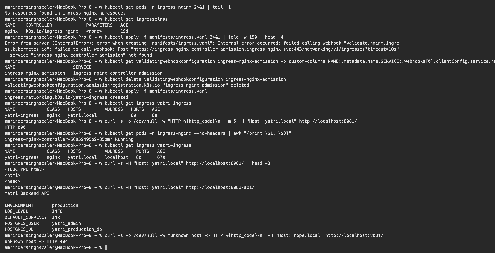

# Ingress vs Ingress Controller

**Name:** Amrinder Singh
**Roll No:** 24BCS10596

I ended up proving this one by accident. While cleaning up after Session 14 I deleted the
`ingress-nginx` namespace, which left the cluster with an IngressClass and no controller. That turned
out to be the perfect way to show the difference, so I kept it and ran the experiment properly.

---

## The short version

| | Ingress | Ingress Controller |
|---|---|---|
| What it is | a Kubernetes **object**, rules stored in etcd | a **program** running in a pod, usually nginx, HAProxy or Traefik |
| What it does | describes how HTTP traffic *should* be routed | reads those objects and actually routes the traffic |
| Created by | you, with `kubectl apply` | installed once per cluster, by the administrator |
| How many | as many as you need | usually one, sometimes several |
| Built into Kubernetes? | yes, `networking.k8s.io/v1` | **no**, you install one yourself |
| On its own | does nothing at all | nothing to route until an Ingress exists |

The sentence I would use: **the Ingress is the request, the Controller is the thing that grants it.**
Writing an Ingress is like filing a ticket. If nobody is reading tickets, nothing happens.

---

## Proving it

### An Ingress with no controller running

```text
$ kubectl get pods -n ingress-nginx 2>&1 | tail -1
No resources found in ingress-nginx namespace.

$ kubectl get ingressclass
NAME    CONTROLLER             PARAMETERS   AGE
nginx   k8s.io/ingress-nginx   <none>       19d

$ kubectl apply -f manifests/ingress.yaml
ingress.networking.k8s.io/yatri-ingress created

$ kubectl get ingress yatri-ingress
NAME            CLASS   HOSTS         ADDRESS   PORTS   AGE
yatri-ingress   nginx   yatri.local             80      8s

$ curl -s -o /dev/null -w "HTTP %{http_code}\n" -m 5 -H "Host: yatri.local" http://localhost:8081/
HTTP 000
```

Read that carefully. The Ingress was **created successfully**. `kubectl get` lists it, the rules are
stored, the class is right. And the **ADDRESS column is empty**, and curl gets nothing at all.

Kubernetes accepted the object and stored it. That is all Kubernetes itself does with an Ingress.
There is no built in router.

### Install the controller, change nothing else

```text
$ kubectl apply -f .../ingress-nginx/controller-v1.13.3/deploy/static/provider/kind/deploy.yaml
$ kubectl -n ingress-nginx rollout status deployment/ingress-nginx-controller
deployment "ingress-nginx-controller" successfully rolled out

$ kubectl get pods -n ingress-nginx --no-headers | awk "{print \$1, \$3}"
ingress-nginx-controller-56859495b9-85pmr Running

$ kubectl get ingress yatri-ingress
NAME            CLASS   HOSTS         ADDRESS     PORTS   AGE
yatri-ingress   nginx   yatri.local   localhost   80      67s

$ curl -s -H "Host: yatri.local" http://localhost:8081/ | head -3
<!DOCTYPE html>
<html>
<head>

$ curl -s -H "Host: yatri.local" http://localhost:8081/api/
Yatri Backend API
=================
ENVIRONMENT     : production
LOG_LEVEL       : INFO
DEFAULT_CURRENCY: INR
POSTGRES_USER   : yatri_admin
POSTGRES_DB     : yatri_production_db

$ curl -s -o /dev/null -w "unknown host -> HTTP %{http_code}\n" -H "Host: nope.local" http://localhost:8081/
unknown host -> HTTP 404
```

**The Ingress object was never edited.** Same YAML, same rules, same name. The only thing that
changed is that a controller now exists.

Two signals flipped:

- `ADDRESS` went from empty to `localhost`. The controller writes that field once it has claimed the
  Ingress. An empty ADDRESS after a minute or two is the clearest sign that no controller is handling
  it.
- Requests went from nothing to 200 on both paths, and a correct 404 for a host the Ingress does not
  mention.



---

## Why both are needed

Kubernetes is deliberately built this way. The Ingress API is a **standard interface**, and the
controller is a **pluggable implementation**.

If routing were built into Kubernetes, everybody would get one fixed proxy with one fixed feature
set. Instead the same Ingress YAML can be served by:

| Controller | Why you might pick it |
|---|---|
| ingress-nginx | the common default, well documented |
| Traefik | automatic Let's Encrypt, good dashboard |
| HAProxy | performance |
| AWS Load Balancer Controller | creates a real ALB instead of running a proxy in the cluster |
| Istio Gateway | when you already run a service mesh |

The portable part is the Ingress object. Swapping controller mostly means changing
`ingressClassName`, and controller specific behaviour lives in annotations, which is why my manifest
has `nginx.ingress.kubernetes.io/rewrite-target`. That annotation means nothing to Traefik, which is
the honest limitation of the design and the reason the Gateway API was created to replace it.

---

## IngressClass, the link between them

`IngressClass` is how an Ingress says which controller should handle it.

```text
$ kubectl get ingressclass
NAME    CONTROLLER             PARAMETERS   AGE
nginx   k8s.io/ingress-nginx   <none>       19d
```

An Ingress picks one with `spec.ingressClassName: nginx`. A controller ignores every Ingress whose
class is not its own, which is what makes it possible to run two controllers in one cluster, for
example an internal one and an internet facing one.

Getting that name wrong is a silent failure. The Ingress is created, no error appears, and nothing
routes, because no controller considers it theirs. That is fault 1 in the
[troubleshooting writeup](../troubleshooting/README.md).

---

## A gotcha worth recording

Deleting the controller's namespace does **not** remove everything it installed:

```text
$ kubectl apply -f manifests/ingress.yaml
Error from server (InternalError): error when creating "manifests/ingress.yaml":
Internal error occurred: failed calling webhook "validate.nginx.ingress.kubernetes.io":
failed to call webhook: Post "https://ingress-nginx-controller-admission.ingress-nginx.svc:443/..."
: service "ingress-nginx-controller-admission" not found
```

ingress-nginx registers a `ValidatingWebhookConfiguration`, which is **cluster scoped** and so
survives deleting the namespace. The webhook then points at a Service that no longer exists, and
because the default failure policy blocks on error, **no Ingress can be created anywhere in the
cluster** until it is cleaned up:

```bash
kubectl delete validatingwebhookconfiguration ingress-nginx-admission
```

The general lesson: `kubectl delete namespace` does not uninstall a component that also created
cluster scoped objects such as ClusterRoles, CRDs or webhooks. Uninstall with the same manifest or
Helm release that installed it.

---

## Examples

**Ingress object** ([manifests/ingress.yaml](../manifests/ingress.yaml)):

```yaml
apiVersion: networking.k8s.io/v1
kind: Ingress
metadata:
  name: yatri-ingress
  annotations:
    nginx.ingress.kubernetes.io/rewrite-target: /$2
spec:
  ingressClassName: nginx
  rules:
    - host: yatri.local
      http:
        paths:
          - path: /api(/|$)(.*)
            pathType: ImplementationSpecific
            backend:
              service:
                name: yatri-backend-service
                port: { number: 80 }
          - path: /
            pathType: Prefix
            backend:
              service:
                name: yatri-frontend-service
                port: { number: 80 }
```

**Ingress controller:** not YAML I wrote. A Deployment, Service, ServiceAccount, RBAC and webhook,
installed from the project's manifest, running nginx in a pod.

```text
$ kubectl get pods -n ingress-nginx
ingress-nginx-controller-56859495b9-85pmr   1/1   Running
```

That pod holds a real nginx configuration file, generated from my Ingress object and rewritten every
time it changes.

---

## How it fits with Services

| Layer | Object | Works at | Routes on |
|---|---|---|---|
| 4 | Service (ClusterIP) | TCP/UDP | IP and port |
| 4 | Service (NodePort, LoadBalancer) | TCP/UDP | IP and port, reachable externally |
| 7 | Ingress + Controller | HTTP/HTTPS | **host and path** |

A Service cannot route on a URL path, because at layer 4 there is no URL to look at. That is the gap
Ingress fills, and it is why one Ingress can put a dozen services behind a single IP instead of
needing a dozen LoadBalancers, each of which costs money at a cloud provider.

The chain end to end:

```
client  ->  Ingress Controller pod  ->  Service  ->  Endpoints  ->  Pod
            (reads the Ingress,          (stable       (the real
             picks a backend)             address)      pod IPs)
```

The controller still goes through the Service. It does not replace it.
