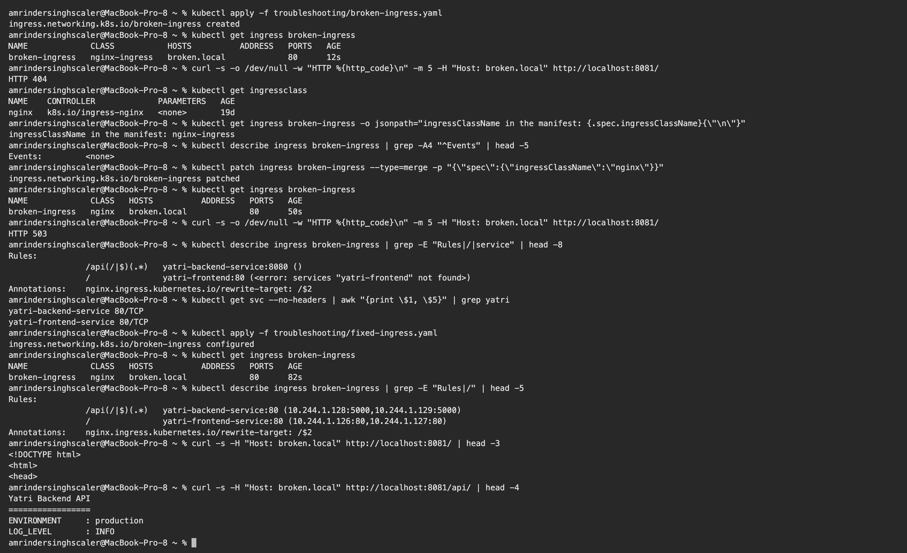

# Ingress Troubleshooting

**Name:** Amrinder Singh
**Roll No:** 24BCS10596

[broken-ingress.yaml](broken-ingress.yaml) has three faults planted in it. The point was to find them
from the cluster rather than by reading the YAML, and to fix them one at a time so each one's symptom
is separate.

The useful part turned out to be that **each fault produced a different HTTP status**, so the status
code alone narrows down where to look.

---

## The symptom

```text
$ kubectl apply -f troubleshooting/broken-ingress.yaml
ingress.networking.k8s.io/broken-ingress created

$ kubectl get ingress broken-ingress
NAME             CLASS           HOSTS          ADDRESS   PORTS   AGE
broken-ingress   nginx-ingress   broken.local             80      12s

$ curl -s -o /dev/null -w "HTTP %{http_code}\n" -m 5 -H "Host: broken.local" http://localhost:8081/
HTTP 404
```

Created with no error, and nothing works. Two clues already visible: **ADDRESS is empty**, and the
CLASS says `nginx-ingress`.

---

## Fault 1: the IngressClass does not exist

### Investigation

```text
$ kubectl get ingressclass
NAME    CONTROLLER             PARAMETERS   AGE
nginx   k8s.io/ingress-nginx   <none>       19d

$ kubectl get ingress broken-ingress -o jsonpath="ingressClassName in the manifest: {.spec.ingressClassName}"
ingressClassName in the manifest: nginx-ingress

$ kubectl describe ingress broken-ingress | grep -A4 "^Events" | head -5
Events:         <none>
```

Three things line up. The cluster has an IngressClass called **`nginx`**. The manifest asks for
**`nginx-ingress`**. And `Events: <none>`.

That empty Events list is the strongest signal. A controller that picks up an Ingress logs a `Sync`
event. No events at all means **no controller ever looked at this object.** It was stored in etcd
and ignored.

### Root cause

`ingressClassName: nginx-ingress` does not match any IngressClass. The ingress-nginx controller only
handles Ingresses whose class is `nginx`, so it skipped this one entirely.

### Fix and result

```text
$ kubectl patch ingress broken-ingress --type=merge -p '{"spec":{"ingressClassName":"nginx"}}'
ingress.networking.k8s.io/broken-ingress patched

$ curl -s -o /dev/null -w "HTTP %{http_code}\n" -m 5 -H "Host: broken.local" http://localhost:8081/
HTTP 503
```

**404 became 503.** That is progress, not a new problem. The controller is now handling the Ingress
and has something to say about it, which is a better place to be than being ignored.

Worth separating the two 404s: before the fix, the controller had no rule for `broken.local` at all,
so it returned its default backend 404. That is the same 404 you get for a genuinely unknown host.

---

## Faults 2 and 3: wrong Service name, wrong port

### Investigation

Now that the controller is involved, `describe` does the work:

```text
$ kubectl describe ingress broken-ingress | grep -E "Rules|/|service" | head -8
Rules:
                /api(/|$)(.*)   yatri-backend-service:8080 ()
                /               yatri-frontend:80 (<error: services "yatri-frontend" not found>)
Annotations:    nginx.ingress.kubernetes.io/rewrite-target: /$2
```

Both remaining faults are in that output, and they look different from each other:

- `/` says **`<error: services "yatri-frontend" not found>`**. The Service does not exist.
- `/api` says **`yatri-backend-service:8080 ()`**. The Service exists, but the parentheses that should
  list endpoint IPs are **empty**. Nothing is listening on the port the rule asks for.

Confirming against the real Services:

```text
$ kubectl get svc --no-headers | awk "{print \$1, \$5}" | grep yatri
yatri-backend-service 80/TCP
yatri-frontend-service 80/TCP
```

### Root causes

| Rule | In the manifest | Actually | Problem |
|---|---|---|---|
| `/` | `yatri-frontend` | `yatri-frontend-service` | Service name wrong, `-service` missing |
| `/api` | port `8080` | port `80` | port wrong |

Both are the kind of mistake that produces a working looking object. Kubernetes does not validate
that a backend Service exists when the Ingress is created, because the Service is allowed to be
created afterwards.

### Fix

[fixed-ingress.yaml](fixed-ingress.yaml), all three corrected.

```text
$ kubectl apply -f troubleshooting/fixed-ingress.yaml
ingress.networking.k8s.io/broken-ingress configured

$ kubectl describe ingress broken-ingress | grep -E "Rules|/" | head -5
Rules:
                /api(/|$)(.*)   yatri-backend-service:80 (10.244.1.128:5000,10.244.1.129:5000)
                /               yatri-frontend-service:80 (10.244.1.126:80,10.244.1.127:80)
Annotations:    nginx.ingress.kubernetes.io/rewrite-target: /$2

$ curl -s -H "Host: broken.local" http://localhost:8081/ | head -3
<!DOCTYPE html>
<html>
<head>

$ curl -s -H "Host: broken.local" http://localhost:8081/api/ | head -4
Yatri Backend API
=================
ENVIRONMENT     : production
LOG_LEVEL       : INFO
```

Both rules now show **real endpoint IPs in the parentheses** instead of an error or an empty list,
and both paths serve.

Notice `yatri-backend-service:80 (10.244.1.128:5000, ...)`. The Service port is 80 and the pods
listen on 5000. That is correct: the Service maps 80 to the pods' `targetPort` of 5000. The Ingress
addresses the **Service** port, not the container port, which is the distinction the `8080` fault got
wrong.



---

## Before and after

| | Before | After |
|---|---|---|
| `ingressClassName` | `nginx-ingress` | `nginx` |
| ADDRESS | empty | assigned |
| Events | `<none>` | controller syncs it |
| `/` backend | `yatri-frontend` not found | `yatri-frontend-service:80` with 2 endpoints |
| `/api` backend | `yatri-backend-service:8080 ()` | `yatri-backend-service:80` with 2 endpoints |
| `GET /` | HTTP 404, then 503 | HTTP 200, frontend page |
| `GET /api/` | HTTP 404, then 503 | HTTP 200, API output |

---

## What the status code tells you

This is the part I will actually remember:

| Status | Means | Look at |
|---|---|---|
| **connection refused / 000** | nothing is listening on the port | is the controller running, is the port mapped |
| **404** | the controller is running but has **no rule** for this host or path | `ingressClassName`, the `host` value, the `Host` header you sent |
| **503** | the controller **has** the rule but cannot reach a backend | `describe ingress` for the endpoint list, then the Service and its pods |
| **502** | the backend answered, but with something invalid | the application itself, or a protocol mismatch such as HTTPS to an HTTP port |
| **200 but the wrong content** | the rule matched a different path than you expected | path order and `pathType` |

404 against 503 is the single most useful split. **404 is a routing problem, 503 is a backend
problem.** They send you to completely different places, and my three faults happened to produce one
of each.

---

## Checklist

1. `kubectl get ingress` — is ADDRESS populated? If not, suspect the class or a missing controller.
2. `kubectl get ingressclass` — does the name in the manifest exist?
3. `kubectl describe ingress` — any Events? Do the backends resolve, and do they list endpoint IPs?
4. `kubectl get svc` — does the Service exist with that exact name and port?
5. `kubectl get endpointslices -l kubernetes.io/service-name=<svc>` — is anything actually behind it?
6. `kubectl logs -n ingress-nginx deploy/ingress-nginx-controller` — the controller's own view.
7. Check the `Host` header. A rule with `host: broken.local` matches nothing if you curl the IP
   directly without that header.

Steps 4 and 5 are the same checks from [Session 14](../../13_K8s_Troubleshooting/README.md). An
Ingress sits in front of a Service, so a broken Service breaks the Ingress too, and it is worth
confirming the Service works on its own before blaming the Ingress.
