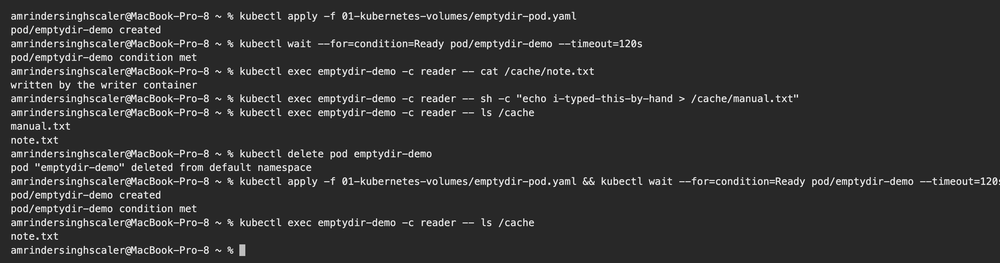
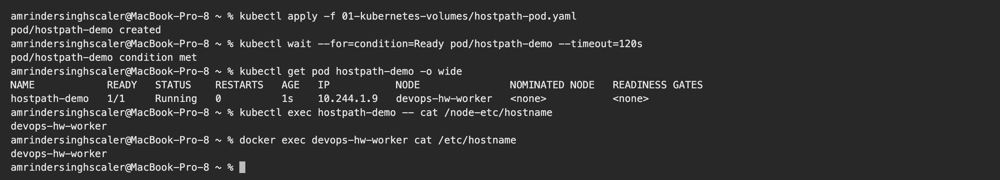
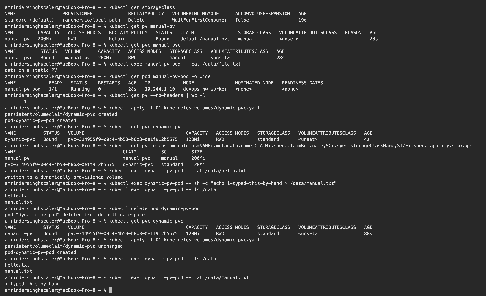
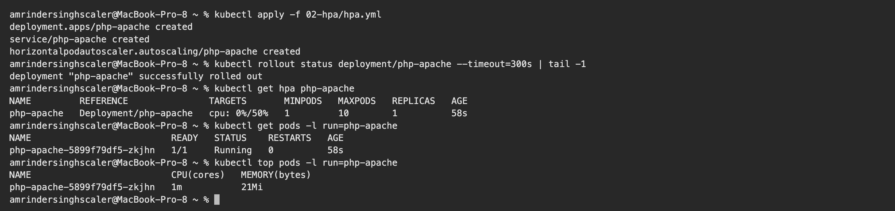
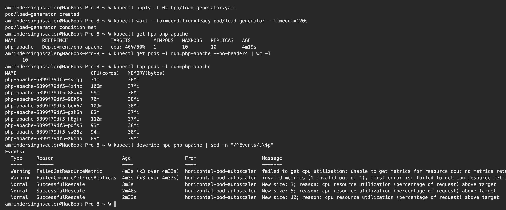
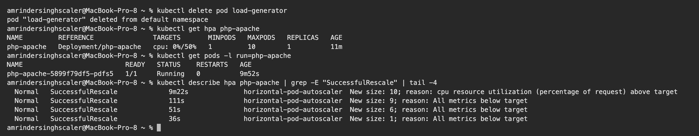
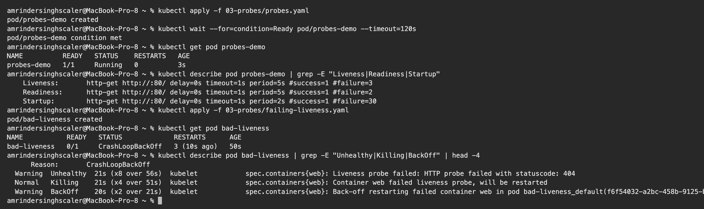
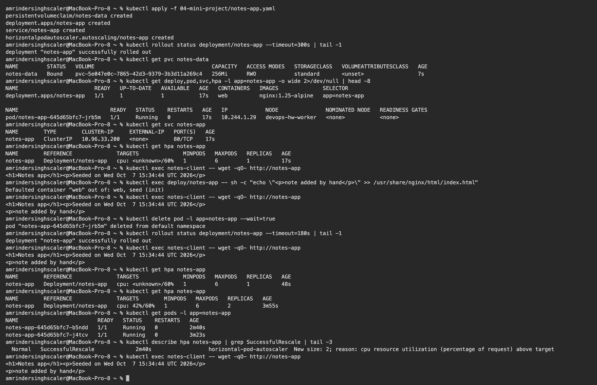

# Session 13: Kubernetes Storage, HPA and Probes

**Name:** Amrinder Singh
**Roll No:** 24BCS10596

Run on my local 2 node kind cluster (`devops-hw`, 1 control plane and 1 worker). All output below is
copied from my terminal.

One setup step was needed before any of the HPA work: kind does not ship metrics-server, and `kubectl
top` and the HPA both depend on it.

```bash
kubectl apply -f https://github.com/kubernetes-sigs/metrics-server/releases/latest/download/components.yaml
kubectl -n kube-system patch deployment metrics-server --type=json \
  -p='[{"op":"add","path":"/spec/template/spec/containers/0/args/-","value":"--kubelet-insecure-tls"}]'
```

The patch matters. kind's kubelets serve self signed certificates, so without
`--kubelet-insecure-tls` the metrics-server pod never goes Ready and the HPA sits at `<unknown>`
forever.

---

## Task 1: Kubernetes Volumes

Full write up with all six topics and the hands-on output is in
[01-kubernetes-volumes/README.md](01-kubernetes-volumes/README.md). Manifests are in the same folder.

Short version of what I proved:

| Test | Result |
|---|---|
| Two containers sharing an `emptyDir` | reader saw the file the writer wrote |
| Delete the Pod, recreate it | the file I made by hand was gone |
| `hostPath` mount of the node's `/etc` | hostname inside the Pod matched the node container |
| Static PV plus PVC | `Bound`, Pod read the file off it |
| PVC naming a StorageClass, no PV written | PV count went 1 to 2, new one auto named `pvc-<uuid>` |
| Delete the Pod using the PVC | PVC stayed `Bound`, file still there |







---

## Task 2: HPA hands-on

Manifests: [02-hpa/hpa.yml](02-hpa/hpa.yml) and [02-hpa/load-generator.yaml](02-hpa/load-generator.yaml).

The target is `registry.k8s.io/hpa-example`, a small PHP page that burns CPU on every request. The
deployment requests `200m` CPU and the HPA targets 50% utilisation, so it should add a pod once each
one is averaging about `100m`.

### Deploy and verify at rest

```text
$ kubectl apply -f 02-hpa/hpa.yml
deployment.apps/php-apache created
service/php-apache created
horizontalpodautoscaler.autoscaling/php-apache created

$ kubectl rollout status deployment/php-apache --timeout=300s | tail -1
deployment "php-apache" successfully rolled out

$ kubectl get hpa php-apache
NAME         REFERENCE               TARGETS       MINPODS   MAXPODS   REPLICAS   AGE
php-apache   Deployment/php-apache   cpu: 0%/50%   1         10        1          58s

$ kubectl get pods -l run=php-apache
NAME                          READY   STATUS    RESTARTS   AGE
php-apache-5899f79df5-zkjhn   1/1     Running   0          58s

$ kubectl top pods -l run=php-apache
NAME                          CPU(cores)   MEMORY(bytes)   
php-apache-5899f79df5-zkjhn   1m           21Mi
```

Idle at 0% of a 50% target, 1 replica.



### Generate load and watch it scale

```text
$ kubectl apply -f 02-hpa/load-generator.yaml
pod/load-generator created

$ kubectl wait --for=condition=Ready pod/load-generator --timeout=120s
pod/load-generator condition met

$ kubectl get hpa php-apache
NAME         REFERENCE               TARGETS        MINPODS   MAXPODS   REPLICAS   AGE
php-apache   Deployment/php-apache   cpu: 46%/50%   1         10        10         4m19s

$ kubectl get pods -l run=php-apache --no-headers | wc -l
      10

$ kubectl top pods -l run=php-apache
NAME                          CPU(cores)   MEMORY(bytes)   
php-apache-5899f79df5-4vmgq   71m          38Mi            
php-apache-5899f79df5-4z4nc   106m         37Mi            
php-apache-5899f79df5-88wx4   99m          38Mi            
php-apache-5899f79df5-98k5n   70m          38Mi            
php-apache-5899f79df5-bcx67   109m         38Mi            
php-apache-5899f79df5-gzk5n   82m          37Mi            
php-apache-5899f79df5-h8gfr   112m         37Mi            
php-apache-5899f79df5-pdfs5   93m          38Mi            
php-apache-5899f79df5-vw26z   94m          38Mi            
php-apache-5899f79df5-zkjhn   89m          39Mi            

$ kubectl describe hpa php-apache | sed -n "/^Events/,$p"
Events:
  Type     Reason                        Age                   From                       Message
  ----     ------                        ----                  ----                       -------
  Warning  FailedGetResourceMetric       4m3s (x3 over 4m33s)  horizontal-pod-autoscaler  failed to get cpu utilization: unable to get metrics for resource cpu: no metrics returned from resource metrics API
  Warning  FailedComputeMetricsReplicas  4m3s (x3 over 4m33s)  horizontal-pod-autoscaler  invalid metrics (1 invalid out of 1), first error is: failed to get cpu resource metric value: failed to get cpu utilization: unable to get metrics for resource cpu: no metrics returned from resource metrics API
  Normal   SuccessfulRescale             3m3s                  horizontal-pod-autoscaler  New size: 3; reason: cpu resource utilization (percentage of request) above target
  Normal   SuccessfulRescale             2m48s                 horizontal-pod-autoscaler  New size: 5; reason: cpu resource utilization (percentage of request) above target
  Normal   SuccessfulRescale             2m33s                 horizontal-pod-autoscaler  New size: 10; reason: cpu resource utilization (percentage of request) above target
```

I sampled the HPA once a minute while the load ran and got `160%/50%` with 5 replicas, then
`43%/50%` with 10. That is the control loop doing its job: utilisation spiked well over target, it
added pods in steps of 3 then 5 then 10, and once the same work was spread across ten pods the
average fell back under 50%.

The two warnings at the top are from the first half minute, before metrics-server had collected its
first sample. They stop once it has data and are not a failure.



### Stop the load and watch it scale back

```text
$ kubectl delete pod load-generator
pod "load-generator" deleted from default namespace

$ kubectl get hpa php-apache
NAME         REFERENCE               TARGETS       MINPODS   MAXPODS   REPLICAS   AGE
php-apache   Deployment/php-apache   cpu: 0%/50%   1         10        1          11m

$ kubectl get pods -l run=php-apache
NAME                          READY   STATUS    RESTARTS   AGE
php-apache-5899f79df5-pdfs5   1/1     Running   0          9m52s

$ kubectl describe hpa php-apache | grep -E "SuccessfulRescale" | tail -4
  Normal   SuccessfulRescale             9m22s              horizontal-pod-autoscaler  New size: 10; reason: cpu resource utilization (percentage of request) above target
  Normal   SuccessfulRescale             111s               horizontal-pod-autoscaler  New size: 9; reason: All metrics below target
  Normal   SuccessfulRescale             51s                horizontal-pod-autoscaler  New size: 6; reason: All metrics below target
  Normal   SuccessfulRescale             36s                horizontal-pod-autoscaler  New size: 1; reason: All metrics below target
```

Scale down did not start the moment the load stopped. CPU read 0% for roughly four minutes while the
replica count stayed at 10, then it came down 10, 9, 6, 1. That delay is the default five minute
stabilisation window, and it exists so a brief dip in traffic does not tear down capacity that is
about to be needed again. Scale up has no such window, which is why going up took seconds and coming
down took minutes.

Full cycle: **1, 3, 5, 10, 9, 6, 1.**



**What I understood:**

- The percentage is measured against the CPU **request**, not the limit and not the node size. With
  `requests.cpu: 200m` and a 50% target, the trigger is 100m per pod. Change the request and the same
  HPA behaves completely differently.
- A pod with no CPU request cannot be autoscaled on CPU at all, because there is nothing to take a
  percentage of.
- `kubectl top` needs metrics-server. So does the HPA. If `top` is broken the HPA is broken too.
- `minReplicas` and `maxReplicas` are the safety rails. Without a sane max, a traffic spike or a
  runaway loop can scale until the cluster runs out of room.

---

## Task 3 (extra): Probes

Not in the task list but the session covers it, and the mini project needs it, so I worked through it.
Manifests: [03-probes/probes.yaml](03-probes/probes.yaml) and
[03-probes/failing-liveness.yaml](03-probes/failing-liveness.yaml).

| Probe | Question it answers | What happens on failure |
|---|---|---|
| `startupProbe` | has the app finished booting? | the other two probes stay paused until it passes |
| `readinessProbe` | can it take traffic right now? | pod is pulled out of the Service endpoints, not restarted |
| `livenessProbe` | is it wedged and in need of a kick? | container is restarted |

### All three on a healthy pod

```text
$ kubectl apply -f 03-probes/probes.yaml
pod/probes-demo created

$ kubectl wait --for=condition=Ready pod/probes-demo --timeout=120s
pod/probes-demo condition met

$ kubectl get pod probes-demo
NAME          READY   STATUS    RESTARTS   AGE
probes-demo   1/1     Running   0          3s

$ kubectl describe pod probes-demo | grep -E "Liveness|Readiness|Startup"
    Liveness:       http-get http://:80/ delay=0s timeout=1s period=5s #success=1 #failure=3
    Readiness:      http-get http://:80/ delay=0s timeout=1s period=5s #success=1 #failure=2
    Startup:        http-get http://:80/ delay=0s timeout=1s period=2s #success=1 #failure=30
```

### A liveness probe pointed at a path that does not exist

```text
$ kubectl apply -f 03-probes/failing-liveness.yaml
pod/bad-liveness created

$ kubectl get pod bad-liveness
NAME           READY   STATUS             RESTARTS      AGE
bad-liveness   0/1     CrashLoopBackOff   3 (10s ago)   50s

$ kubectl describe pod bad-liveness | grep -E "Unhealthy|Killing|BackOff" | head -4
      Reason:       CrashLoopBackOff
  Warning  Unhealthy  21s (x8 over 56s)  kubelet            spec.containers{web}: Liveness probe failed: HTTP probe failed with statuscode: 404
  Normal   Killing    21s (x4 over 51s)  kubelet            spec.containers{web}: Container web failed liveness probe, will be restarted
  Warning  BackOff    20s (x2 over 21s)  kubelet            spec.containers{web}: Back-off restarting failed container web in pod bad-liveness_default(f6f54032-a2bc-458b-9125-b5aad6106a8d)
```

nginx is running perfectly well here. The only thing wrong is that the probe asks for
`/this-path-does-not-exist`, gets a 404, and after two failures kubelet kills the container. Three
restarts in fifty seconds, then `CrashLoopBackOff`.

This is the failure mode worth remembering: **a badly written liveness probe will take down a healthy
application.** A readiness probe pointed at the same wrong path would have been much less damaging,
since it would only have pulled the pod out of the Service.



---

## Task 3: Mini project

[04-mini-project/notes-app.yaml](04-mini-project/notes-app.yaml). One small app that uses all three
topics from this session together:

- a **PVC** holding the served files, so notes survive a pod restart
- an **init container** that seeds `index.html` only if it is not already there
- all three **probes** on the nginx container
- an **HPA** between 1 and 6 replicas at 60% CPU
- a **Service** in front

### Deploy

```text
$ kubectl apply -f 04-mini-project/notes-app.yaml
persistentvolumeclaim/notes-data created
deployment.apps/notes-app created
service/notes-app created
horizontalpodautoscaler.autoscaling/notes-app created

$ kubectl get pvc notes-data
NAME         STATUS   VOLUME                                     CAPACITY   ACCESS MODES   STORAGECLASS   VOLUMEATTRIBUTESCLASS   AGE
notes-data   Bound    pvc-5e047e0c-7865-42d3-9379-3b3d11a269c4   256Mi      RWO            standard       <unset>                 7s

$ kubectl get svc notes-app
NAME        TYPE        CLUSTER-IP     EXTERNAL-IP   PORT(S)   AGE
notes-app   ClusterIP   10.96.33.200   <none>        80/TCP    17s
```

### Storage: add a note, kill every pod, check it is still there

```text
$ kubectl exec notes-client -- wget -qO- http://notes-app
<h1>Notes app</h1><p>Seeded on Wed Oct  7 15:34:44 UTC 2026</p>

$ kubectl exec deploy/notes-app -- sh -c "echo \"<p>note added by hand</p>\" >> /usr/share/nginx/html/index.html"
Defaulted container "web" out of: web, seed (init)

$ kubectl exec notes-client -- wget -qO- http://notes-app
<h1>Notes app</h1><p>Seeded on Wed Oct  7 15:34:44 UTC 2026</p>
<p>note added by hand</p>

$ kubectl delete pod -l app=notes-app --wait=true
pod "notes-app-645d65bfc7-jrb5m" deleted from default namespace

$ kubectl rollout status deployment/notes-app --timeout=180s | tail -1
deployment "notes-app" successfully rolled out

$ kubectl exec notes-client -- wget -qO- http://notes-app
<h1>Notes app</h1><p>Seeded on Wed Oct  7 15:34:44 UTC 2026</p>
<p>note added by hand</p>
```

Both the seeded line and my added note came back on a brand new pod. The seed timestamp is still
`15:34:44`, which is the detail I would check if I were marking this: the init container ran again on
the new pod but its `if [ ! -f /data/index.html ]` guard found the file already on the volume and left
it alone. If the volume had been lost, that timestamp would have changed.

### Autoscaling

```text
$ kubectl get hpa notes-app
NAME        REFERENCE              TARGETS              MINPODS   MAXPODS   REPLICAS   AGE
notes-app   Deployment/notes-app   cpu: <unknown>/60%   1         6         1          48s

$ kubectl get hpa notes-app
NAME        REFERENCE              TARGETS        MINPODS   MAXPODS   REPLICAS   AGE
notes-app   Deployment/notes-app   cpu: 42%/60%   1         6         2          3m55s

$ kubectl get pods -l app=notes-app
NAME                         READY   STATUS    RESTARTS   AGE
notes-app-645d65bfc7-b5ndd   1/1     Running   0          2m40s
notes-app-645d65bfc7-j4tcv   1/1     Running   0          3m23s

$ kubectl describe hpa notes-app | grep SuccessfulRescale | tail -3
  Normal   SuccessfulRescale             2m40s                  horizontal-pod-autoscaler  New size: 2; reason: cpu resource utilization (percentage of request) above target

$ kubectl exec notes-client -- wget -qO- http://notes-app
<h1>Notes app</h1><p>Seeded on Wed Oct  7 15:34:44 UTC 2026</p>
<p>note added by hand</p>
```

Under load it went to 2 replicas and settled at 42% of the 60% target. Both pods serve the same
content because they mount the same PVC.



### Limitation I ran into

The PVC is `ReadWriteOnce`, so every replica has to be scheduled on the same node to share it. That
works here because my cluster has one worker, but it is the first thing that would break on a real
multi node cluster: the HPA would try to place pods on other nodes and they would sit in `Pending`
with a volume node affinity conflict. The fix would be `ReadWriteMany` storage such as NFS or EFS, or
giving each replica its own volume through a StatefulSet with `volumeClaimTemplates`.

---

## Files

```
12_K8s_Storage_HPA_Probes/
├── 01-kubernetes-volumes/
│   ├── README.md
│   ├── emptydir-pod.yaml
│   ├── hostpath-pod.yaml
│   ├── pv-pvc.yaml
│   └── dynamic-pvc.yaml
├── 02-hpa/
│   ├── hpa.yml
│   └── load-generator.yaml
├── 03-probes/
│   ├── probes.yaml
│   └── failing-liveness.yaml
├── 04-mini-project/
│   └── notes-app.yaml
├── screenshots/
└── README.md
```
