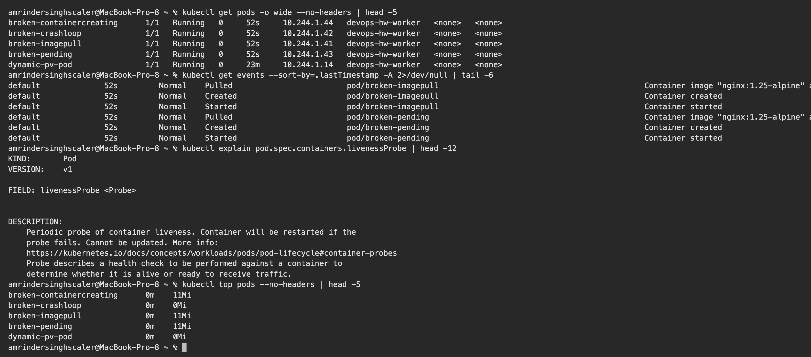
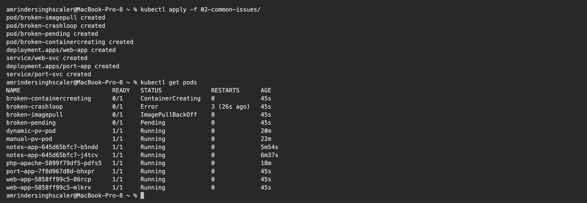
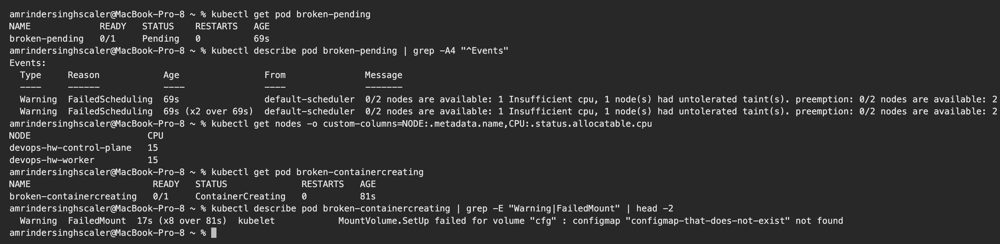
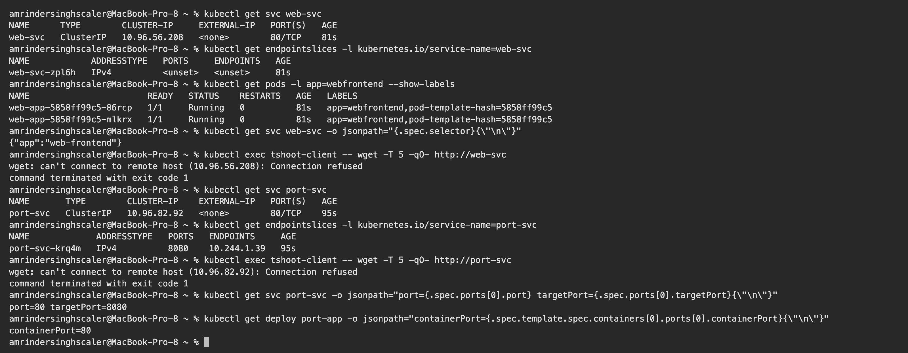
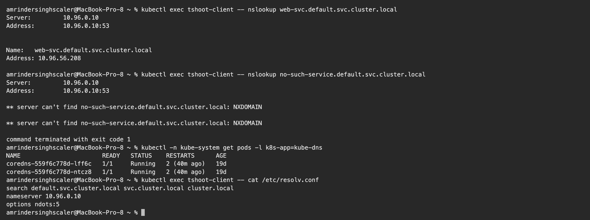
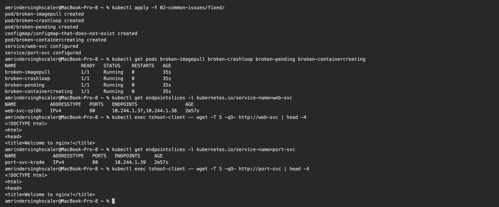
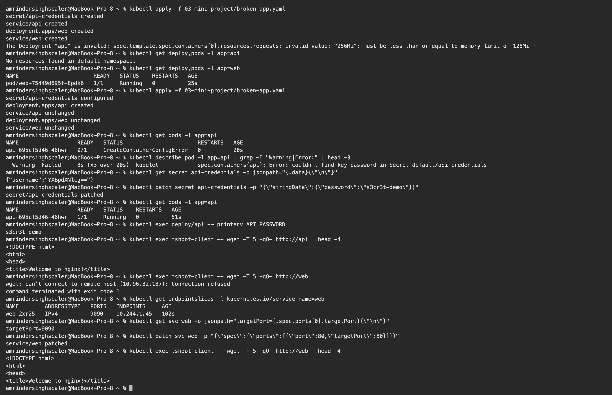

# Session 14: Kubernetes Troubleshooting

**Name:** Amrinder Singh
**Roll No:** 24BCS10596

Run on my local 2 node kind cluster. Every broken pod in this folder is broken on purpose, by a
manifest I wrote, so I could practise finding the fault from the cluster instead of from the YAML.
Manifests are in [02-common-issues/](02-common-issues) and the fixed versions are in
[02-common-issues/fixed/](02-common-issues/fixed).

---

## Task 1: The commands

The order I ended up using almost every time:

| Command | What I use it for |
|---|---|
| `kubectl get pods` | first look. What state is it in, how many restarts |
| `kubectl get pods -o wide` | adds the IP and which node it landed on |
| `kubectl describe pod` | the Events list at the bottom. This is where the actual reason is |
| `kubectl logs` | what the application itself said before it died |
| `kubectl logs --previous` | logs from the crashed instance, not the running one |
| `kubectl get events` | cluster wide view, useful when the problem is not one pod |
| `kubectl exec` | get inside a running container and test from there |
| `kubectl top` | is it actually using the CPU or memory you think |
| `kubectl explain` | what a field is for, without opening a browser |

```text
$ kubectl get pods -o wide --no-headers | head -5
broken-containercreating      1/1   Running   0     52s     10.244.1.44   devops-hw-worker   <none>   <none>
broken-crashloop              1/1   Running   0     52s     10.244.1.42   devops-hw-worker   <none>   <none>
broken-imagepull              1/1   Running   0     52s     10.244.1.41   devops-hw-worker   <none>   <none>
broken-pending                1/1   Running   0     52s     10.244.1.43   devops-hw-worker   <none>   <none>
dynamic-pv-pod                1/1   Running   0     23m     10.244.1.14   devops-hw-worker   <none>   <none>

$ kubectl get events --sort-by=.lastTimestamp -A 2>/dev/null | tail -6
default              52s         Normal    Pulled                         pod/broken-imagepull                                             Container image "nginx:1.25-alpine" already present on machine and can be accessed by the pod
default              52s         Normal    Created                        pod/broken-imagepull                                             Container created
default              52s         Normal    Started                        pod/broken-imagepull                                             Container started
default              52s         Normal    Pulled                         pod/broken-pending                                               Container image "nginx:1.25-alpine" already present on machine and can be accessed by the pod
default              52s         Normal    Created                        pod/broken-pending                                               Container created
default              52s         Normal    Started                        pod/broken-pending                                               Container started

$ kubectl explain pod.spec.containers.livenessProbe | head -12
KIND:       Pod
VERSION:    v1

FIELD: livenessProbe <Probe>


DESCRIPTION:
    Periodic probe of container liveness. Container will be restarted if the
    probe fails. Cannot be updated. More info:
    https://kubernetes.io/docs/concepts/workloads/pods/pod-lifecycle#container-probes
    Probe describes a health check to be performed against a container to
    determine whether it is alive or ready to receive traffic.

$ kubectl top pods --no-headers | head -5
broken-containercreating      0m    11Mi   
broken-crashloop              0m    0Mi    
broken-imagepull              0m    11Mi   
broken-pending                0m    11Mi   
dynamic-pv-pod                0m    0Mi
```



---

## Task 2: Common issues

All six applied at once so I could see the different states side by side:

```text
$ kubectl apply -f 02-common-issues/
pod/broken-imagepull created
pod/broken-crashloop created
pod/broken-pending created
pod/broken-containercreating created
deployment.apps/web-app created
service/web-svc created
deployment.apps/port-app created
service/port-svc created

$ kubectl get pods
NAME                          READY   STATUS              RESTARTS      AGE
broken-containercreating      0/1     ContainerCreating   0             45s
broken-crashloop              0/1     Error               3 (26s ago)   45s
broken-imagepull              0/1     ImagePullBackOff    0             45s
broken-pending                0/1     Pending             0             45s
port-app-7f8d967d8d-bhxpr     1/1     Running             0             45s
web-app-5858ff99c5-86rcp      1/1     Running             0             45s
web-app-5858ff99c5-mlkrx      1/1     Running             0             45s
```

Four different failure states. Note the last three are `Running`, which is the point of the two
Service faults: the pods are fine, the wiring is not.



### Issue 1: ImagePullBackOff and ErrImagePull

**Symptom**

```text
$ kubectl get pod broken-imagepull
NAME               READY   STATUS         RESTARTS   AGE
broken-imagepull   0/1     ErrImagePull   0          69s
```

**Investigation**

```text
$ kubectl describe pod broken-imagepull | grep -E "Failed to pull|not found|Warning" | head -3
  Warning  Failed     26s (x3 over 67s)  kubelet            spec.containers{app}: Failed to pull image "nginx:this-tag-does-not-exist": rpc error: code = NotFound desc = failed to pull and unpack image "docker.io/library/nginx:this-tag-does-not-exist": failed to resolve reference "docker.io/library/nginx:this-tag-does-not-exist": docker.io/library/nginx:this-tag-does-not-exist: not found
  Warning  Failed     26s (x3 over 67s)  kubelet            spec.containers{app}: Error: ErrImagePull
  Warning  Failed     11s (x3 over 66s)  kubelet            spec.containers{app}: Error: ImagePullBackOff
```

**Root cause:** the tag `this-tag-does-not-exist` is not in the registry.

**Fix:** a tag that exists. Pod goes `Running`.

The two status names are the same problem at different stages. `ErrImagePull` is the pull failing.
`ImagePullBackOff` is kubelet having given up for now and waiting before it tries again, with the
wait doubling each time. They alternate, which is why the same pod showed `ImagePullBackOff` in one
check and `ErrImagePull` in the next.

Other causes worth knowing, since the symptom is identical: a typo in the image name, a private
registry with no `imagePullSecret`, or rate limiting from Docker Hub.

### Issue 2: CrashLoopBackOff

**Symptom**

```text
$ kubectl get pod broken-crashloop
NAME               READY   STATUS   RESTARTS      AGE
broken-crashloop   0/1     Error    3 (39s ago)   58s
```

**Investigation**

```text
$ kubectl logs broken-crashloop
starting up
fatal: config missing

$ kubectl get pod broken-crashloop -o jsonpath="{.status.containerStatuses[0].lastState.terminated.exitCode}{\"\n\"}"
1
```

**Root cause:** the container runs, prints an error, and exits 1. Kubernetes restarts it, it does the
same thing again, and the backoff grows.

**Fix:** make the process stay up. In a real app this means supplying whatever it was missing, not
changing the command.

`kubectl logs --previous` is the command usually recommended here, and it failed for me:

```text
$ kubectl logs broken-crashloop --previous | tail -3
unable to retrieve container logs for containerd://d1d0b3bd06ec...
```

The container was churning so fast the previous instance had already been cleaned up. When that
happens, `lastState.terminated.exitCode` from the pod object is the fallback, and it is often enough
on its own. Exit code 1 is a plain application error. 137 would mean it was killed, usually OOM. 143
is a normal SIGTERM.

### Issue 3: Pending

**Symptom**

```text
$ kubectl get pod broken-pending
NAME             READY   STATUS    RESTARTS   AGE
broken-pending   0/1     Pending   0          69s
```

**Investigation**

```text
$ kubectl describe pod broken-pending | grep -A4 "^Events"
Events:
  Type     Reason            Age                From               Message
  ----     ------            ----               ----               -------
  Warning  FailedScheduling  69s                default-scheduler  0/2 nodes are available: 1 Insufficient cpu, 1 node(s) had untolerated taint(s). preemption: 0/2 nodes are available: 2 Preemption is not helpful for scheduling.
  Warning  FailedScheduling  69s (x2 over 69s)  default-scheduler  0/2 nodes are available: 1 Insufficient cpu, 1 node(s) had untolerated taint(s). preemption: 0/2 nodes are available: 2 Preemption is not helpful for scheduling.

$ kubectl get nodes -o custom-columns=NODE:.metadata.name,CPU:.status.allocatable.cpu
NODE                      CPU
devops-hw-control-plane   15
devops-hw-worker          15
```

**Root cause:** the pod requests 100 CPU. The worker has 15 allocatable, so it does not fit, and the
control plane is excluded separately by its `NoSchedule` taint. That is exactly what the scheduler
message says: one node short on CPU, one node tainted.

**Fix:** request `100m` instead of `100`. The missing `m` is a very easy typo to make and turns a
tenth of a core into a hundred cores.

**The useful thing about Pending:** there are no container logs to read, because no container was
ever started. `kubectl describe` on the pod is the only place the answer lives.



### Issue 4: ContainerCreating

**Symptom**

```text
$ kubectl get pod broken-containercreating
NAME                       READY   STATUS              RESTARTS   AGE
broken-containercreating   0/1     ContainerCreating   0          81s
```

**Investigation**

```text
$ kubectl describe pod broken-containercreating | grep -E "Warning|FailedMount" | head -2
  Warning  FailedMount  17s (x8 over 81s)  kubelet            MountVolume.SetUp failed for volume "cfg" : configmap "configmap-that-does-not-exist" not found
```

**Root cause:** the pod mounts a ConfigMap that was never created, so kubelet cannot finish building
the pod.

**Fix:** create the ConfigMap.

`ContainerCreating` for a few seconds is normal. `ContainerCreating` for over a minute means
something is stuck, and it is nearly always a volume, a Secret, or a ConfigMap that is not there.

### Issue 5: Service connectivity, selector mismatch

**Symptom:** pods are `Running`, the Service exists, nothing can reach it.

**Investigation**

```text
$ kubectl get endpointslices -l kubernetes.io/service-name=web-svc
NAME            ADDRESSTYPE   PORTS     ENDPOINTS   AGE
web-svc-zpl6h   IPv4          <unset>   <unset>     81s

$ kubectl get pods -l app=webfrontend --show-labels
NAME                       READY   STATUS    RESTARTS   AGE   LABELS
web-app-5858ff99c5-86rcp   1/1     Running   0          81s   app=webfrontend,pod-template-hash=5858ff99c5
web-app-5858ff99c5-mlkrx   1/1     Running   0          81s   app=webfrontend,pod-template-hash=5858ff99c5

$ kubectl get svc web-svc -o jsonpath="{.spec.selector}{\"\n\"}"
{"app":"web-frontend"}

$ kubectl exec tshoot-client -- wget -T 5 -qO- http://web-svc
wget: can't connect to remote host (10.96.56.208): Connection refused
command terminated with exit code 1
```

**Root cause:** the pods are labelled `app=webfrontend`, the Service selects `app=web-frontend`. One
hyphen. Nothing matches, so the EndpointSlice is empty and there is nowhere to send traffic.

**Fix:** make the selector match the label.

**Empty ENDPOINTS is the single most useful signal in this whole session.** If a Service is not
working, that is the first thing to check, and an empty list always means the selector and the pod
labels disagree.

### Issue 6: Service connectivity, wrong targetPort

This one is nastier than issue 5 because it looks healthy.

**Investigation**

```text
$ kubectl get endpointslices -l kubernetes.io/service-name=port-svc
NAME             ADDRESSTYPE   PORTS   ENDPOINTS     AGE
port-svc-krq4m   IPv4          8080    10.244.1.39   95s

$ kubectl exec tshoot-client -- wget -T 5 -qO- http://port-svc
wget: can't connect to remote host (10.96.82.92): Connection refused
command terminated with exit code 1

$ kubectl get svc port-svc -o jsonpath="port={.spec.ports[0].port} targetPort={.spec.ports[0].targetPort}{\"\n\"}"
port=80 targetPort=8080

$ kubectl get deploy port-app -o jsonpath="containerPort={.spec.template.spec.containers[0].ports[0].containerPort}{\"\n\"}"
containerPort=80
```

**Root cause:** the Service forwards to port 8080, nginx listens on 80.

**Fix:** `targetPort: 80`.

Here the endpoint list is **not** empty, which is what makes it confusing. The selector matched fine,
so Kubernetes happily built an endpoint. Look closely and the endpoint says `8080`, and nothing is
listening there. The check that settles it is comparing `targetPort` on the Service against
`containerPort` on the pod.



### Issue 7: DNS

I expected a broken Service to show up as a DNS failure. It does not:

```text
$ kubectl exec tshoot-client -- nslookup web-svc.default.svc.cluster.local
Server:		10.96.0.10
Address:	10.96.0.10:53


Name:	web-svc.default.svc.cluster.local
Address: 10.96.56.208

$ kubectl exec tshoot-client -- nslookup no-such-service.default.svc.cluster.local
Server:		10.96.0.10
Address:	10.96.0.10:53

** server can't find no-such-service.default.svc.cluster.local: NXDOMAIN

$ kubectl -n kube-system get pods -l k8s-app=kube-dns
NAME                       READY   STATUS    RESTARTS      AGE
coredns-559f6c778d-lff6c   1/1     Running   2 (40m ago)   19d
coredns-559f6c778d-ntcz8   1/1     Running   2 (40m ago)   19d

$ kubectl exec tshoot-client -- cat /etc/resolv.conf
search default.svc.cluster.local svc.cluster.local cluster.local
nameserver 10.96.0.10
options ndots:5
```

`web-svc` resolved perfectly to `10.96.56.208` at the exact moment it had zero endpoints and refused
every connection.

**What I understood:** DNS resolves the Service **object**, not whether anything is behind it. A
name that resolves tells you the Service exists, nothing more. A real DNS problem looks like the
second lookup, `NXDOMAIN`, or like CoreDNS pods not being `Running`. If the name resolves and the
connection still fails, the problem is endpoints or ports, not DNS.



### After the fixes

```text
$ kubectl apply -f 02-common-issues/fixed/
pod/broken-imagepull created
pod/broken-crashloop created
pod/broken-pending created
configmap/configmap-that-does-not-exist created
pod/broken-containercreating created
service/web-svc configured
service/port-svc configured

$ kubectl get pods broken-imagepull broken-crashloop broken-pending broken-containercreating
NAME                       READY   STATUS    RESTARTS   AGE
broken-imagepull           1/1     Running   0          35s
broken-crashloop           1/1     Running   0          35s
broken-pending             1/1     Running   0          35s
broken-containercreating   1/1     Running   0          35s

$ kubectl get endpointslices -l kubernetes.io/service-name=web-svc
NAME            ADDRESSTYPE   PORTS   ENDPOINTS                 AGE
web-svc-zpl6h   IPv4          80      10.244.1.37,10.244.1.38   2m57s

$ kubectl exec tshoot-client -- wget -T 5 -qO- http://web-svc | head -4
<!DOCTYPE html>
<html>
<head>
<title>Welcome to nginx!</title>

$ kubectl get endpointslices -l kubernetes.io/service-name=port-svc
NAME             ADDRESSTYPE   PORTS   ENDPOINTS     AGE
port-svc-krq4m   IPv4          80      10.244.1.39   2m57s

$ kubectl exec tshoot-client -- wget -T 5 -qO- http://port-svc | head -4
<!DOCTYPE html>
<html>
<head>
<title>Welcome to nginx!</title>
```

Four pods `Running`, both EndpointSlices populated and now showing port 80, both Services serving.

Note the pods had to be deleted and recreated rather than re-applied. Most of a running pod's spec is
immutable, so `kubectl apply` over a broken pod will not fix it. Services patch in place, which is
why `web-svc` and `port-svc` just say `configured`.



---

## Task 3: Mini project

[03-mini-project/broken-app.yaml](03-mini-project/broken-app.yaml) is a two tier app, `web` and
`api`, with three faults planted in it and no comments saying where. I worked through it the way I
would a real one.

### Fault 1, found at apply time

```text
$ kubectl apply -f 03-mini-project/broken-app.yaml
secret/api-credentials created
service/api created
deployment.apps/web created
service/web created
The Deployment "api" is invalid: spec.template.spec.containers[0].resources.requests: Invalid value: "256Mi": must be less than or equal to memory limit of 128Mi
```

This one never reached the cluster. The API server rejected it during validation, so the `api`
Deployment was not created at all while everything else in the file was. That is worth noticing: a
partially applied manifest leaves you in a half built state, and `kubectl get pods` alone would just
show `api` missing with no obvious reason.

**Root cause:** `requests.memory` 256Mi is higher than `limits.memory` 128Mi. You cannot reserve more
than the ceiling.

**Fix:** drop the request to 64Mi.

### Fault 2, found at container start

```text
$ kubectl get pods -l app=api
NAME                  READY   STATUS                       RESTARTS   AGE
api-695cf5d46-46hwr   0/1     CreateContainerConfigError   0          20s

$ kubectl describe pod -l app=api | grep -E "Warning|Error:" | head -3
  Warning  Failed     8s (x3 over 20s)  kubelet            spec.containers{api}: Error: couldn't find key password in Secret default/api-credentials
```

```text
$ kubectl get secret api-credentials -o jsonpath="{.data}{\"\n\"}"
{"username":"YXBpdXNlcg=="}
```

The Secret has `username` and nothing else, but the Deployment reads a key called `password`.

**Fix**

```text
$ kubectl patch secret api-credentials -p "{\"stringData\":{\"password\":\"s3cr3t-demo\"}}"
secret/api-credentials patched

$ kubectl get pods -l app=api
NAME                  READY   STATUS    RESTARTS   AGE
api-695cf5d46-46hwr   1/1     Running   0          51s

$ kubectl exec deploy/api -- printenv API_PASSWORD
s3cr3t-demo
```

`CreateContainerConfigError` is a status I had not seen before this session. It means the pod was
scheduled and the image is present, but kubelet could not assemble the container's configuration. It
is almost always a missing Secret or ConfigMap key.

### Fault 3, found only by testing

```text
$ kubectl exec tshoot-client -- wget -T 5 -qO- http://api | head -4
<!DOCTYPE html>
<html>
<head>
<title>Welcome to nginx!</title>

$ kubectl exec tshoot-client -- wget -T 5 -qO- http://web
wget: can't connect to remote host (10.96.32.187): Connection refused
command terminated with exit code 1

$ kubectl get endpointslices -l kubernetes.io/service-name=web
NAME        ADDRESSTYPE   PORTS   ENDPOINTS     AGE
web-2xr25   IPv4          9090    10.244.1.45   102s

$ kubectl get svc web -o jsonpath="targetPort={.spec.ports[0].targetPort}{\"\n\"}"
targetPort=9090
```

Both pods were `Running` at this point and `kubectl get pods` looked completely clean. The only way to
find this was to actually send a request.

**Fix**

```text
$ kubectl patch svc web -p "{\"spec\":{\"ports\":[{\"port\":80,\"targetPort\":80}]}}"
service/web patched

$ kubectl exec tshoot-client -- wget -T 5 -qO- http://web | head -4
<!DOCTYPE html>
<html>
<head>
<title>Welcome to nginx!</title>
```



### What the mini project taught me

The three faults failed at three different moments, and that turned out to be the real lesson:

| Fault | Caught by | Visible as |
|---|---|---|
| requests above limits | API server, at `kubectl apply` | an error on the apply, no object created |
| missing Secret key | kubelet, at container start | `CreateContainerConfigError` |
| wrong targetPort | nothing. Only a real request | everything `Running`, connection refused |

The third is the dangerous one. A green `kubectl get pods` does not mean the application works, and
the only honest check is to send traffic through the Service the way a client would.

---

## Quick reference

| Status | First command to run | Usual cause |
|---|---|---|
| `Pending` | `describe pod` | not enough CPU or memory, a taint, an unbound PVC |
| `ContainerCreating` stuck | `describe pod` | missing ConfigMap, Secret, or volume |
| `ErrImagePull` / `ImagePullBackOff` | `describe pod` | wrong name or tag, private registry, rate limit |
| `CreateContainerConfigError` | `describe pod` | the named key is not in the Secret or ConfigMap |
| `CrashLoopBackOff` | `logs`, then `logs --previous` | the app exits on start |
| `Running` but `0/1 READY` | `describe pod` | readiness probe failing |
| `Running` but unreachable | `get endpointslices` | selector mismatch or wrong `targetPort` |
| `OOMKilled`, exit 137 | `describe pod`, `top pod` | memory limit too low |

My default order: `get pods`, then `describe pod` for the Events, then `logs` if a container actually
started, then `get endpointslices` if it is a networking problem, then `exec` and test from inside the
cluster.

---

## Files

```
13_K8s_Troubleshooting/
├── 02-common-issues/
│   ├── 01-imagepullbackoff.yaml
│   ├── 02-crashloopbackoff.yaml
│   ├── 03-pending-resources.yaml
│   ├── 04-containercreating.yaml
│   ├── 05-service-selector.yaml
│   ├── 06-wrong-port.yaml
│   └── fixed/
├── 03-mini-project/
│   └── broken-app.yaml
├── screenshots/
└── README.md
```
