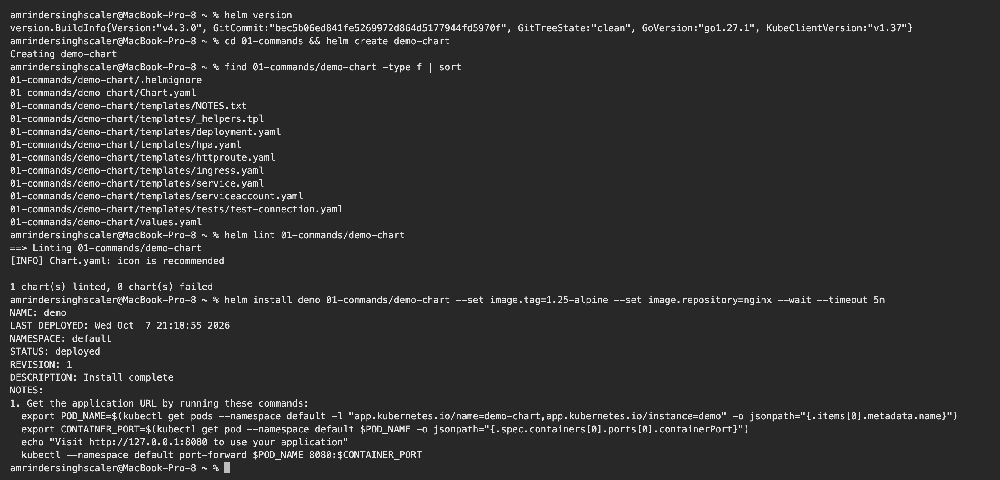
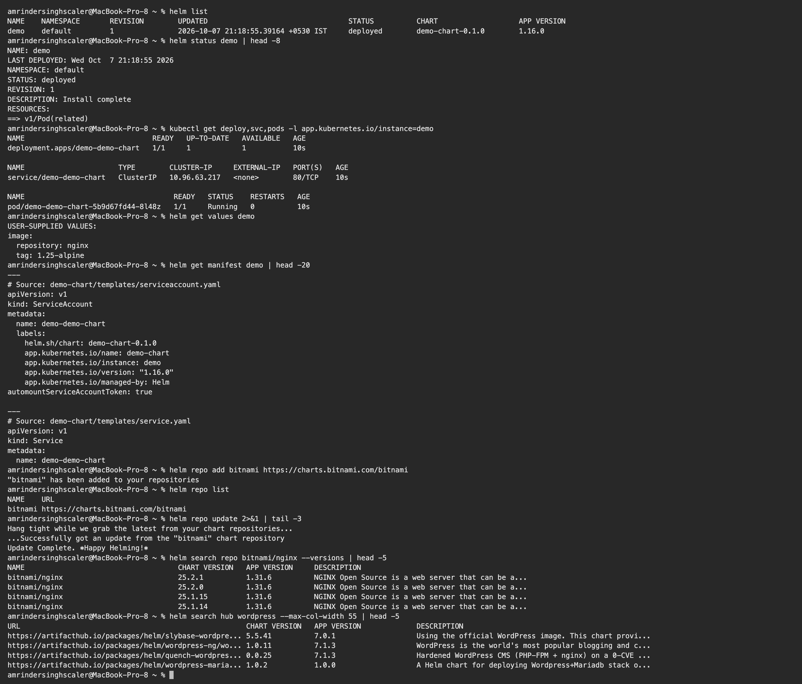
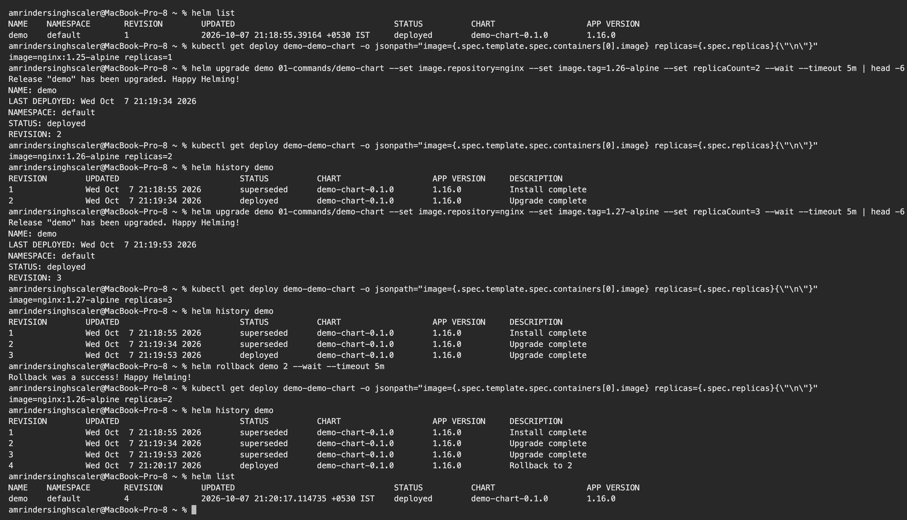
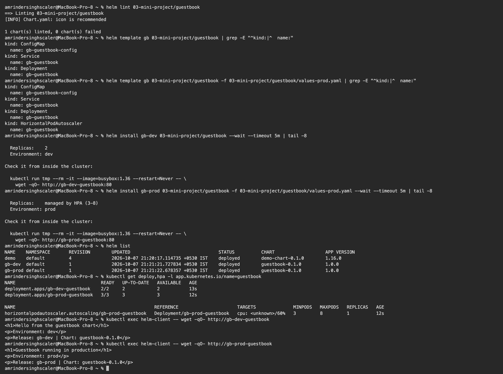
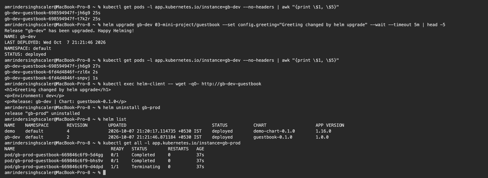

# Session 15: Helm

**Name:** Amrinder Singh
**Roll No:** 24BCS10596

Run on my local 2 node kind cluster with Helm v4.3.0. Two charts in here: the scaffold from
`helm create` used for the command practice, and a chart I wrote by hand for the mini project.

The way I ended up thinking about Helm: `kubectl apply` ships one fixed YAML file. Helm ships a
**template** plus a **set of values**, keeps a **history** of every version it shipped, and can put
any of them back.

---

## Task 1: The commands

### helm create

```text
$ helm version
version.BuildInfo{Version:"v4.3.0", GitCommit:"bec5b06ed841fe5269972d864d5177944fd5970f", GitTreeState:"clean", GoVersion:"go1.27.1", KubeClientVersion:"v1.37"}

$ cd 01-commands && helm create demo-chart
Creating demo-chart

$ find 01-commands/demo-chart -type f | sort
01-commands/demo-chart/.helmignore
01-commands/demo-chart/Chart.yaml
01-commands/demo-chart/templates/NOTES.txt
01-commands/demo-chart/templates/_helpers.tpl
01-commands/demo-chart/templates/deployment.yaml
01-commands/demo-chart/templates/hpa.yaml
01-commands/demo-chart/templates/httproute.yaml
01-commands/demo-chart/templates/ingress.yaml
01-commands/demo-chart/templates/service.yaml
01-commands/demo-chart/templates/serviceaccount.yaml
01-commands/demo-chart/templates/tests/test-connection.yaml
01-commands/demo-chart/values.yaml
```

What each piece is for:

| Path | Purpose |
|---|---|
| `Chart.yaml` | name, chart version, app version |
| `values.yaml` | the defaults every template reads from |
| `templates/` | the YAML, with Go template placeholders |
| `templates/_helpers.tpl` | named snippets reused across templates, mostly naming and labels |
| `templates/NOTES.txt` | the message printed after install |
| `.helmignore` | files to keep out of the packaged chart |

### helm lint and helm install

```text
$ helm lint 01-commands/demo-chart
==> Linting 01-commands/demo-chart
[INFO] Chart.yaml: icon is recommended

1 chart(s) linted, 0 chart(s) failed

$ helm install demo 01-commands/demo-chart --set image.tag=1.25-alpine --set image.repository=nginx --wait --timeout 5m
NAME: demo
LAST DEPLOYED: Wed Oct  7 21:18:55 2026
NAMESPACE: default
STATUS: deployed
REVISION: 1
DESCRIPTION: Install complete
NOTES:
1. Get the application URL by running these commands:
  export POD_NAME=$(kubectl get pods --namespace default -l "app.kubernetes.io/name=demo-chart,app.kubernetes.io/instance=demo" -o jsonpath="{.items[0].metadata.name}")
  export CONTAINER_PORT=$(kubectl get pod --namespace default $POD_NAME -o jsonpath="{.spec.containers[0].ports[0].containerPort}")
  echo "Visit http://127.0.0.1:8080 to use your application"
  kubectl --namespace default port-forward $POD_NAME 8080:$CONTAINER_PORT
```

`--wait` makes Helm block until the pods are actually ready instead of returning as soon as the
objects are created. Worth using in a pipeline, because without it a deploy step goes green before
the app is up.



### helm list, status, get

```text
$ helm list
NAME	NAMESPACE	REVISION	UPDATED                            	STATUS  	CHART           	APP VERSION
demo	default  	1       	2026-10-07 21:18:55.39164 +0530 IST	deployed	demo-chart-0.1.0	1.16.0     

$ helm status demo | head -8
NAME: demo
LAST DEPLOYED: Wed Oct  7 21:18:55 2026
NAMESPACE: default
STATUS: deployed
REVISION: 1
DESCRIPTION: Install complete
RESOURCES:
==> v1/Pod(related)

$ kubectl get deploy,svc,pods -l app.kubernetes.io/instance=demo
NAME                              READY   UP-TO-DATE   AVAILABLE   AGE
deployment.apps/demo-demo-chart   1/1     1            1           10s

NAME                      TYPE        CLUSTER-IP     EXTERNAL-IP   PORT(S)   AGE
service/demo-demo-chart   ClusterIP   10.96.63.217   <none>        80/TCP    10s

NAME                                   READY   STATUS    RESTARTS   AGE
pod/demo-demo-chart-5b9d67fd44-8l48z   1/1     Running   0          10s

$ helm get values demo
USER-SUPPLIED VALUES:
image:
  repository: nginx
  tag: 1.25-alpine

$ helm get manifest demo | head -20
---
# Source: demo-chart/templates/serviceaccount.yaml
apiVersion: v1
kind: ServiceAccount
metadata:
  name: demo-demo-chart
  labels:
    helm.sh/chart: demo-chart-0.1.0
    app.kubernetes.io/name: demo-chart
    app.kubernetes.io/instance: demo
    app.kubernetes.io/version: "1.16.0"
    app.kubernetes.io/managed-by: Helm
automountServiceAccountToken: true

---
# Source: demo-chart/templates/service.yaml
apiVersion: v1
kind: Service
metadata:
  name: demo-demo-chart
```

`helm get values` shows only what I overrode on the command line, not the whole merged set. For the
merged view the flag is `helm get values demo --all`. `helm get manifest` prints the final YAML that
was sent to the cluster, which is the thing to look at when a template is not doing what you expect.

### helm repo and helm search

```text
$ helm repo add bitnami https://charts.bitnami.com/bitnami
"bitnami" has been added to your repositories

$ helm repo list
NAME   	URL                               
bitnami	https://charts.bitnami.com/bitnami

$ helm repo update 2>&1 | tail -3
Hang tight while we grab the latest from your chart repositories...
...Successfully got an update from the "bitnami" chart repository
Update Complete. ⎈Happy Helming!⎈

$ helm search repo bitnami/nginx --versions | head -5
NAME                            	CHART VERSION	APP VERSION	DESCRIPTION                                       
bitnami/nginx                   	25.2.1       	1.31.6     	NGINX Open Source is a web server that can be a...
bitnami/nginx                   	25.2.0       	1.31.6     	NGINX Open Source is a web server that can be a...
bitnami/nginx                   	25.1.15      	1.31.6     	NGINX Open Source is a web server that can be a...
bitnami/nginx                   	25.1.14      	1.31.6     	NGINX Open Source is a web server that can be a...

$ helm search hub wordpress --max-col-width 55 | head -5
URL                                                    	CHART VERSION	APP VERSION        	DESCRIPTION                                            
https://artifacthub.io/packages/helm/slybase-wordpre...	5.5.41       	7.0.1              	Using the official WordPress image. This chart provi...
https://artifacthub.io/packages/helm/wordpress-ng/wo...	1.0.11       	7.1.3              	WordPress is the world's most popular blogging and c...
https://artifacthub.io/packages/helm/quench-wordpres...	0.0.25       	7.1.3              	Hardened WordPress CMS (PHP-FPM + nginx) on a 0-CVE ...
https://artifacthub.io/packages/helm/wordpress-maria...	1.0.2        	1.0.0              	A Helm chart for deploying Wordpress+Mariadb stack o...
```

The difference between the two searches caught me out at first. `helm search repo` looks only in
repos I have added locally, so it finds nothing until `helm repo add`. `helm search hub` queries
Artifact Hub over the internet and finds charts from anywhere.

Also note `CHART VERSION` and `APP VERSION` are different things. Chart 25.2.1 packages nginx 1.31.6.
Bumping the chart does not necessarily bump the app.



---

## Task 2: Rollback workflow

Install, upgrade, verify, upgrade again, verify, roll back, verify. I changed both the image tag and
the replica count at each step so the effect is easy to see.

### Install (revision 1)

```text
$ kubectl get deploy demo-demo-chart -o jsonpath="image={.spec.template.spec.containers[0].image} replicas={.spec.replicas}{\"\n\"}"
image=nginx:1.25-alpine replicas=1
```

### Upgrade (revision 2)

```text
$ helm upgrade demo 01-commands/demo-chart --set image.repository=nginx --set image.tag=1.26-alpine --set replicaCount=2 --wait --timeout 5m | head -6
Release "demo" has been upgraded. Happy Helming!
NAME: demo
LAST DEPLOYED: Wed Oct  7 21:19:34 2026
NAMESPACE: default
STATUS: deployed
REVISION: 2

$ kubectl get deploy demo-demo-chart -o jsonpath="image={.spec.template.spec.containers[0].image} replicas={.spec.replicas}{\"\n\"}"
image=nginx:1.26-alpine replicas=2

$ helm history demo
REVISION	UPDATED                 	STATUS    	CHART           	APP VERSION	DESCRIPTION     
1       	Wed Oct  7 21:18:55 2026	superseded	demo-chart-0.1.0	1.16.0     	Install complete
2       	Wed Oct  7 21:19:34 2026	deployed  	demo-chart-0.1.0	1.16.0     	Upgrade complete
```

### Upgrade again (revision 3)

```text
$ helm upgrade demo 01-commands/demo-chart --set image.repository=nginx --set image.tag=1.27-alpine --set replicaCount=3 --wait --timeout 5m | head -6
Release "demo" has been upgraded. Happy Helming!
NAME: demo
LAST DEPLOYED: Wed Oct  7 21:19:53 2026
NAMESPACE: default
STATUS: deployed
REVISION: 3

$ kubectl get deploy demo-demo-chart -o jsonpath="image={.spec.template.spec.containers[0].image} replicas={.spec.replicas}{\"\n\"}"
image=nginx:1.27-alpine replicas=3

$ helm history demo
REVISION	UPDATED                 	STATUS    	CHART           	APP VERSION	DESCRIPTION     
1       	Wed Oct  7 21:18:55 2026	superseded	demo-chart-0.1.0	1.16.0     	Install complete
2       	Wed Oct  7 21:19:34 2026	superseded	demo-chart-0.1.0	1.16.0     	Upgrade complete
3       	Wed Oct  7 21:19:53 2026	deployed  	demo-chart-0.1.0	1.16.0     	Upgrade complete
```

### Roll back to revision 2

```text
$ helm rollback demo 2 --wait --timeout 5m
Rollback was a success! Happy Helming!

$ kubectl get deploy demo-demo-chart -o jsonpath="image={.spec.template.spec.containers[0].image} replicas={.spec.replicas}{\"\n\"}"
image=nginx:1.26-alpine replicas=2

$ helm history demo
REVISION	UPDATED                 	STATUS    	CHART           	APP VERSION	DESCRIPTION     
1       	Wed Oct  7 21:18:55 2026	superseded	demo-chart-0.1.0	1.16.0     	Install complete
2       	Wed Oct  7 21:19:34 2026	superseded	demo-chart-0.1.0	1.16.0     	Upgrade complete
3       	Wed Oct  7 21:19:53 2026	superseded	demo-chart-0.1.0	1.16.0     	Upgrade complete
4       	Wed Oct  7 21:20:17 2026	deployed	demo-chart-0.1.0	1.16.0     	Rollback to 2   

$ helm list
NAME	NAMESPACE	REVISION	UPDATED                             	STATUS  	CHART           	APP VERSION
demo	default  	4       	2026-10-07 21:20:17.114735 +0530 IST	deployed	demo-chart-0.1.0	1.16.0
```

**The thing worth noticing:** rolling back to 2 did not set the release back to revision 2. It
created **revision 4**, described as `Rollback to 2`, carrying revision 2's content. The image and
replica count really did go back to `1.26-alpine` and 2, but the history only ever grows.

That matters because it means rollback is itself auditable. Nothing is erased, and you can see from
`helm history` that a rollback happened and what it went back to. It also means `helm rollback demo`
with no number goes to the immediately previous revision, which after a rollback is the thing you
just rolled away from.

Full sequence: **install 1, upgrade 2, upgrade 3, rollback creates 4 holding 2's content.**



---

## Task 3: Mini project

[03-mini-project/guestbook](03-mini-project/guestbook) is a chart I wrote from scratch rather than
scaffolding, so I had to think about what actually goes in each file.

What it does:

- serves a page built from values, so each release says who it is
- a `config.enabled` flag that switches the whole ConfigMap template on or off
- an `autoscaling.enabled` flag that does the same for the HPA
- a second values file, `values-prod.yaml`, as a production overlay
- a checksum annotation so a config change rolls the pods

### Templating proves itself before anything is installed

```text
$ helm lint 03-mini-project/guestbook
==> Linting 03-mini-project/guestbook
[INFO] Chart.yaml: icon is recommended

1 chart(s) linted, 0 chart(s) failed

$ helm template gb 03-mini-project/guestbook | grep -E "^kind:|^  name:"
kind: ConfigMap
  name: gb-guestbook-config
kind: Service
  name: gb-guestbook
kind: Deployment
  name: gb-guestbook

$ helm template gb 03-mini-project/guestbook -f 03-mini-project/guestbook/values-prod.yaml | grep -E "^kind:|^  name:"
kind: ConfigMap
  name: gb-guestbook-config
kind: Service
  name: gb-guestbook
kind: Deployment
  name: gb-guestbook
kind: HorizontalPodAutoscaler
  name: gb-guestbook
```

Same chart, two value files, and the second renders a fourth object. That is the `{{- if
.Values.autoscaling.enabled }}` wrapper on `hpa.yaml` doing its job. `helm template` renders without
touching the cluster, which makes it the fastest way to check a template.

### Two releases from one chart

```text
$ helm install gb-dev 03-mini-project/guestbook --wait --timeout 5m | tail -8

  Replicas:    2
  Environment: dev

Check it from inside the cluster:

  kubectl run tmp --rm -it --image=busybox:1.36 --restart=Never -- \
    wget -qO- http://gb-dev-guestbook:80

$ helm install gb-prod 03-mini-project/guestbook -f 03-mini-project/guestbook/values-prod.yaml --wait --timeout 5m | tail -8

  Replicas:    managed by HPA (3-8)
  Environment: prod

Check it from inside the cluster:

  kubectl run tmp --rm -it --image=busybox:1.36 --restart=Never -- \
    wget -qO- http://gb-prod-guestbook:80

$ helm list
NAME   	NAMESPACE	REVISION	UPDATED                             	STATUS  	CHART           	APP VERSION
demo   	default  	4       	2026-10-07 21:20:17.114735 +0530 IST	deployed	demo-chart-0.1.0	1.16.0     
gb-dev 	default  	1       	2026-10-07 21:21:21.727834 +0530 IST	deployed	guestbook-0.1.0 	1.0.0      
gb-prod	default  	1       	2026-10-07 21:21:22.678357 +0530 IST	deployed	guestbook-0.1.0 	1.0.0
```

The NOTES.txt output differs between the two because it reads the same values the templates do.

```text
$ kubectl get deploy,hpa -l app.kubernetes.io/name=guestbook
NAME                                READY   UP-TO-DATE   AVAILABLE   AGE
deployment.apps/gb-dev-guestbook    2/2     2            2           13s
deployment.apps/gb-prod-guestbook   3/3     3            3           12s

NAME                                                    REFERENCE                      TARGETS              MINPODS   MAXPODS   REPLICAS   AGE
horizontalpodautoscaler.autoscaling/gb-prod-guestbook   Deployment/gb-prod-guestbook   cpu: <unknown>/60%   3         8         1          12s

$ kubectl exec helm-client -- wget -qO- http://gb-dev-guestbook
<h1>Hello from the guestbook chart</h1>
<p>Environment: dev</p>
<p>Release: gb-dev | Chart: guestbook-0.1.0</p>

$ kubectl exec helm-client -- wget -qO- http://gb-prod-guestbook
<h1>Guestbook running in production</h1>
<p>Environment: prod</p>
<p>Release: gb-prod | Chart: guestbook-0.1.0</p>
```

Two releases of the same chart running side by side in one namespace, serving different content, with
only prod getting an HPA. Nothing collides because every name is built from `.Release.Name`.



### The checksum annotation

A plain ConfigMap change does not restart anything. The ConfigMap updates, the pods carry on with the
old file mounted, and the new config only takes effect whenever the pods happen to restart. The fix
is an annotation on the pod template that hashes the ConfigMap:

```yaml
annotations:
  checksum/config: {{ include (print $.Template.BasePath "/configmap.yaml") . | sha256sum }}
```

Change the config and the hash changes, which changes the pod template, which makes it a rolling
update. Tested:

```text
$ kubectl get pods -l app.kubernetes.io/instance=gb-dev --no-headers | awk "{print \$1, \$5}"
gb-dev-guestbook-698594947f-jh6g9 25s
gb-dev-guestbook-698594947f-t7k2r 25s

$ helm upgrade gb-dev 03-mini-project/guestbook --set config.greeting="Greeting changed by helm upgrade" --wait --timeout 5m | head -5
Release "gb-dev" has been upgraded. Happy Helming!
NAME: gb-dev
LAST DEPLOYED: Wed Oct  7 21:21:46 2026
NAMESPACE: default
STATUS: deployed

$ kubectl get pods -l app.kubernetes.io/instance=gb-dev --no-headers | awk "{print \$1, \$5}"
gb-dev-guestbook-698594947f-jh6g9 27s
gb-dev-guestbook-6fd4d4846f-rzl6x 2s
gb-dev-guestbook-6fd4d4846f-snpvj 1s

$ kubectl exec helm-client -- wget -qO- http://gb-dev-guestbook
<h1>Greeting changed by helm upgrade</h1>
<p>Environment: dev</p>
<p>Release: gb-dev | Chart: guestbook-0.1.0</p>
```

The pod template hash went from `698594947f` to `6fd4d4846f` and new pods rolled in. Without the
annotation the greeting would have sat in the ConfigMap unused.

### helm uninstall

```text
$ helm uninstall gb-prod
release "gb-prod" uninstalled

$ helm list
NAME  	NAMESPACE	REVISION	UPDATED                             	STATUS  	CHART           	APP VERSION
demo  	default  	4       	2026-10-07 21:20:17.114735 +0530 IST	deployed	demo-chart-0.1.0	1.16.0     
gb-dev	default  	2       	2026-10-07 21:21:46.871184 +0530 IST	deployed	guestbook-0.1.0 	1.0.0      

$ kubectl get all -l app.kubernetes.io/instance=gb-prod
NAME                                     READY   STATUS        RESTARTS   AGE
pod/gb-prod-guestbook-669846c6f9-5d4gg   0/1     Completed     0          37s
pod/gb-prod-guestbook-669846c6f9-bhs9v   0/1     Completed     0          37s
pod/gb-prod-guestbook-669846c6f9-d4dpd   1/1     Terminating   0          37s
```

One command removed the Deployment, Service, ConfigMap and HPA. The pods above were still shutting
down at the moment I ran the check. `gb-dev` was untouched, which is the point of releases being
separate.

By default `helm uninstall` throws the history away too, so the release cannot be rolled back
afterwards. `--keep-history` leaves it in place as `uninstalled` if you want that option.



---

## What I understood

- A release is an **installed instance** of a chart. The same chart installed twice gives two
  releases that do not know about each other, which is how dev and prod coexisted above.
- `helm template` renders locally, `helm install --dry-run` renders through the API server and so
  also catches schema errors. `helm template` is quicker for template bugs, `--dry-run` is better
  before a real install.
- Rollback appends a revision, it does not rewind to one. History is append only.
- `helm lint` only catches structural problems. It passed a chart of mine that rendered a Deployment
  with both `replicas` and an HPA pointed at it, which is a real bug. I had to add
  `{{- if not .Values.autoscaling.enabled }}` around the replicas field myself.
- Conditional templates with `{{- if }}` are what let one chart serve several environments, rather
  than keeping a separate copy of the YAML per environment.

---

## Files

```
14_Helm/
├── 01-commands/
│   └── demo-chart/          scaffold from helm create
├── 03-mini-project/
│   └── guestbook/           chart written by hand
│       ├── Chart.yaml
│       ├── values.yaml
│       ├── values-prod.yaml
│       └── templates/
│           ├── _helpers.tpl
│           ├── configmap.yaml
│           ├── deployment.yaml
│           ├── hpa.yaml
│           ├── service.yaml
│           └── NOTES.txt
├── screenshots/
└── README.md
```
