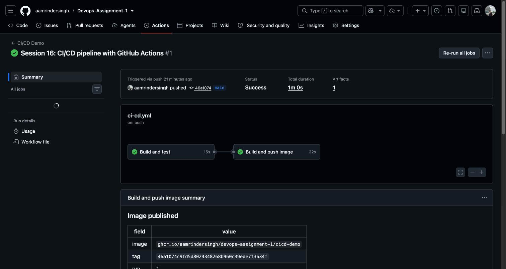
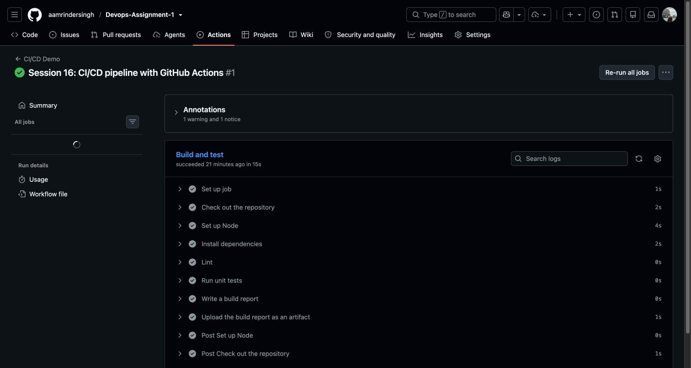
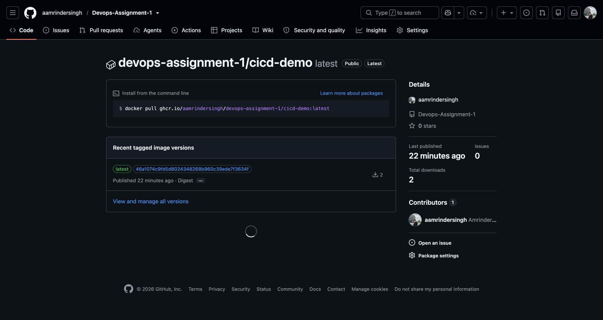
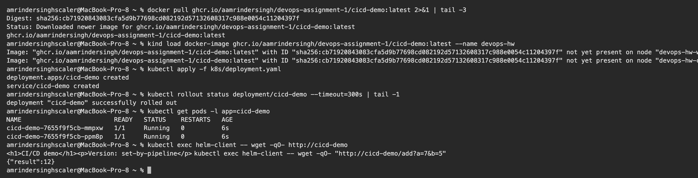

# Session 16: CI/CD and GitHub Actions

**Name:** Amrinder Singh
**Roll No:** 24BCS10596

A working pipeline, not a mock one. The workflow in
[.github/workflows/ci-cd.yml](../.github/workflows/ci-cd.yml) ran on GitHub's hosted runners when I
pushed this folder, built an image, and pushed it to GitHub Container Registry. Run #1 is at
[actions/runs/37647945214](https://github.com/aamrindersingh/Devops-Assignment-1/actions/runs/37647945214).

---

## CI vs CD, in my own words

Before building it I had to get the terms straight, because they get used loosely.

**CI (continuous integration)** is about the code being mergeable. Every push gets built and tested
automatically, so a change that breaks something is caught in minutes instead of at the end of a
sprint. The output of CI is a verdict: this commit is good or it is not.

**CD** is two different things depending on who is saying it:

- **continuous delivery**, where every good commit is automatically turned into a deployable artifact
  and could be released by pressing a button
- **continuous deployment**, where it goes to production with no button at all

What I built is CI plus continuous delivery. The pipeline produces a tagged image in a registry on
every push to main, ready to deploy. The deploy to Kubernetes is a separate step I run myself, for a
reason explained further down.

---

## The application

[app/](app) is a small Express service. It is deliberately boring, because the point is the pipeline,
but it does have real logic worth testing.

| Path | What it is |
|---|---|
| `src/calc.js` | `add` and `percentage`, pulled out so unit tests do not need an HTTP server |
| `src/server.js` | the Express app, plus `/healthz` and `/ready` for the Kubernetes probes |
| `test/calc.test.js` | 4 tests using Node's own test runner, no extra dependency |
| `Dockerfile` | multi-stage, runs as the unprivileged `node` user |

Tested locally before I pushed anything:

```text
$ node --test test/*.test.js
✔ add returns the sum of two numbers (0.286542ms)
✔ add rejects anything that is not a number (0.137666ms)
✔ percentage rounds to the nearest whole number (0.042375ms)
✔ percentage refuses to divide by zero (0.0355ms)
ℹ tests 4
ℹ suites 0
ℹ pass 4
ℹ fail 0
```

One thing that bit me: `node --test test/` fails on Node 24 with `Cannot find module`, because it
reads the bare directory as a module path. The working form is `node --test test/*.test.js`. Better
to find that on my laptop than in a pipeline run.

And the container, built and curled locally before trusting the pipeline with it:

```text
$ curl -s http://localhost:19200/
<h1>CI/CD demo</h1><p>Version: local-test</p>

$ curl -s http://localhost:19200/healthz
{"status":"ok"}

$ curl -s "http://localhost:19200/add?a=2&b=3"
{"result":5}
```

---

## The workflow

### Triggers

```yaml
on:
  push:
    branches: [main]
    paths:
      - '15_CICD_GitHub_Actions/**'
      - '.github/workflows/ci-cd.yml'
  pull_request:
    branches: [main]
  workflow_dispatch:
```

The `paths` filter is there because this repo holds every session. Without it, editing a README in
Session 3 would fire the pipeline for no reason. `workflow_dispatch` adds a manual Run button, which
is handy when nothing has changed but you want a run.

### Jobs, steps, runners

| Term | What it means here |
|---|---|
| **workflow** | the whole file, `ci-cd.yml` |
| **job** | `build-and-test` and `docker`. Separate machines, run in parallel unless told otherwise |
| **step** | one thing inside a job, such as `npm test` |
| **runner** | the VM that executes a job. `runs-on: ubuntu-latest`, provided by GitHub |

The two jobs are deliberately chained:

```yaml
  docker:
    needs: build-and-test
    if: github.event_name == 'push' && github.ref == 'refs/heads/main'
```

`needs` means the image job does not start unless the tests passed. The `if` means a pull request
runs CI but never publishes an image. That combination is the actual gate: broken code cannot become
an image, and an outside PR cannot push to the registry.

### Secrets

The only credential used is `${{ secrets.GITHUB_TOKEN }}`, which Actions creates for each run and
throws away after. It is scoped by the `permissions` block:

```yaml
    permissions:
      contents: read
      packages: write
```

So I did not have to create a registry password or store anything in repository secrets. For a real
third party registry I would add one under Settings, Secrets and variables, Actions, and reference it
the same way. Secrets are masked in logs, so even `echo` of one shows as `***`.

### Artifacts

```yaml
      - name: Upload the build report as an artifact
        uses: actions/upload-artifact@v4
        with:
          name: build-report
          path: 15_CICD_GitHub_Actions/app/reports/build-info.txt
          retention-days: 7
```

An artifact is a file the run keeps after the runner is destroyed. The run page shows **Artifacts: 1**
and it can be downloaded from there. Artifacts are also how one job hands a build output to a later
job, since jobs do not share a filesystem.

---

## The run



Status **Success**, total duration **1m 0s**, **1** artifact, and the two jobs linked in order:
`Build and test` 15s, then `Build and push image` 32s.

Every step of the CI job:



The real test output, pulled back out of the run log with `gh run view --log`:

```text
ok 1 - add returns the sum of two numbers
ok 2 - add rejects anything that is not a number
ok 3 - percentage rounds to the nearest whole number
ok 4 - percentage refuses to divide by zero
# tests 4
# pass 4
# fail 0
```

Same 4 tests that passed on my laptop, passing on a clean Ubuntu runner with a fresh `npm install`.
That is the whole value of CI: it proves the code works somewhere that is not my machine.

### The published image



Tagged twice, `latest` and the full commit SHA `46a1074c9fd5d8024348268b960c39ede7f3634f`. The SHA tag
is the one that matters. `latest` moves, so it cannot tell you what is running; a SHA tag ties a
running container back to the exact commit that produced it.

---

## Deploying it

Here is the honest limitation. My Kubernetes cluster is kind, running in Docker on my laptop. A
GitHub hosted runner is a throwaway VM in GitHub's datacentre and has no route to it. There is no
`kubectl apply` step in the workflow because such a step could not reach my cluster, and I did not
want a step in the file that only pretends to deploy.

So the pipeline publishes the image, and I deploy that published image myself:

```text
$ docker pull ghcr.io/aamrindersingh/devops-assignment-1/cicd-demo:latest 2>&1 | tail -3
Digest: sha256:cb71920843083cfa5d9b77698cd082192d57132608317c988e0054c11204397f
Status: Downloaded newer image for ghcr.io/aamrindersingh/devops-assignment-1/cicd-demo:latest
ghcr.io/aamrindersingh/devops-assignment-1/cicd-demo:latest

$ kind load docker-image ghcr.io/aamrindersingh/devops-assignment-1/cicd-demo:latest --name devops-hw
Image: "ghcr.io/aamrindersingh/devops-assignment-1/cicd-demo:latest" with ID "sha256:cb719208..." not yet present on node "devops-hw-worker", loading...
Image: "ghcr.io/aamrindersingh/devops-assignment-1/cicd-demo:latest" with ID "sha256:cb719208..." not yet present on node "devops-hw-control-plane", loading...

$ kubectl apply -f k8s/deployment.yaml
deployment.apps/cicd-demo created
service/cicd-demo created

$ kubectl rollout status deployment/cicd-demo --timeout=300s | tail -1
deployment "cicd-demo" successfully rolled out

$ kubectl get pods -l app=cicd-demo
NAME                         READY   STATUS    RESTARTS   AGE
cicd-demo-7655f9f5cb-mmpxw   1/1     Running   0          6s
cicd-demo-7655f9f5cb-ppm8p   1/1     Running   0          6s

$ kubectl exec helm-client -- wget -qO- http://cicd-demo
<h1>CI/CD demo</h1><p>Version: set-by-pipeline</p>

$ kubectl exec helm-client -- wget -qO- "http://cicd-demo/add?a=7&b=5"
{"result":12}
```

The image that CI built is running in Kubernetes and answering requests.



The first attempt failed with `ImagePullBackOff` even though `kind load` had succeeded. The reason is
a default I did not know: an image tagged `:latest` gets `imagePullPolicy: Always`, so kubelet ignored
the image already sitting on the node and tried to pull it again. Setting `imagePullPolicy: IfNotPresent`
fixed it. Another argument for SHA tags over `latest`.

To close this loop properly in a real setup I would either run a self hosted runner inside the
cluster's network, or use a pull based tool such as Argo CD that watches the registry from inside the
cluster. That is Session 20.

---

## What I understood

- The gate is the interesting part, not the build. `needs` plus `if` is what makes it impossible for
  untested code to become a published image.
- `GITHUB_TOKEN` with a `permissions` block removes a whole class of secret management. Nothing to
  rotate, nothing to leak.
- `paths` filters matter in a repo that holds more than one project, otherwise every commit anywhere
  burns runner minutes.
- A pipeline that cannot reach the target is a normal situation, not a failure. Splitting it into
  "CI publishes an artifact" and "something inside the network consumes it" is how it is usually
  solved.
- Running the tests and the container locally first made the pipeline work on the first push. Debugging
  through commits is slow, each round trip is a minute.

---

## Files

```
15_CICD_GitHub_Actions/
├── app/
│   ├── Dockerfile
│   ├── package.json
│   ├── src/
│   │   ├── calc.js
│   │   └── server.js
│   └── test/
│       └── calc.test.js
├── k8s/
│   └── deployment.yaml
├── screenshots/
└── README.md

.github/workflows/ci-cd.yml   the workflow itself, at the repo root
```
