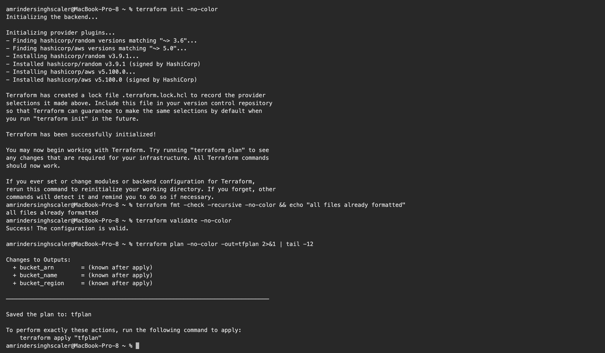
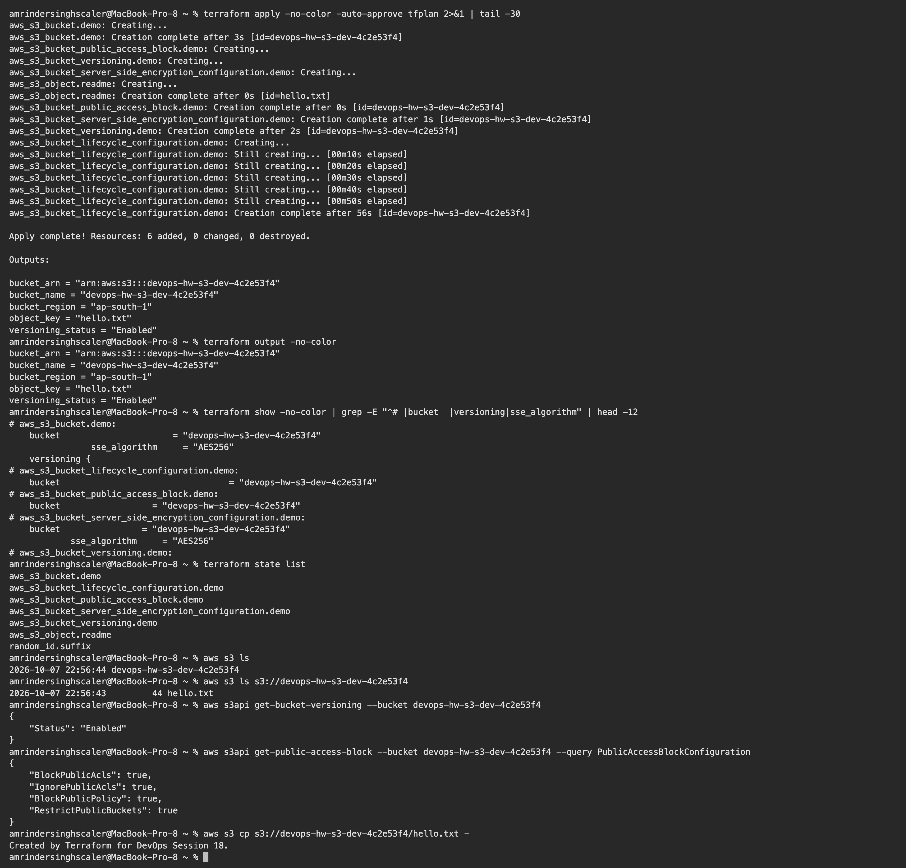
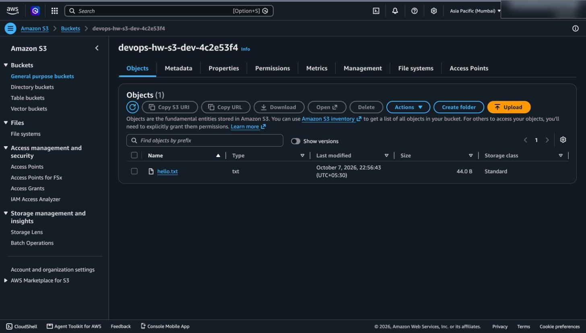
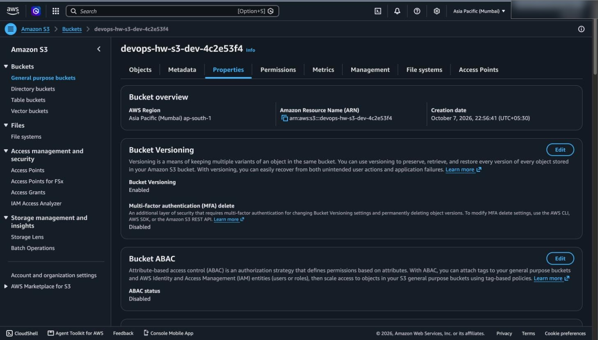
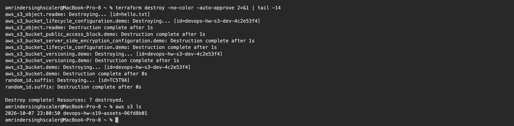

# Session 18: Terraform and Infrastructure as Code

**Name:** Amrinder Singh
**Roll No:** 24BCS10596

Real AWS, not a simulator. The bucket below was created in `ap-south-1`, verified through both
Terraform and the AWS CLI, photographed in the console, and then destroyed.

Terraform v1.16.5, AWS provider v5.100.0.

---

## Task 1: Terraform S3 demo

[terraform-s3-demo/](terraform-s3-demo)

```
terraform-s3-demo/
├── provider.tf              terraform block, provider, default_tags
├── variables.tf             inputs with types, defaults and validation
├── main.tf                  the bucket and everything attached to it
├── outputs.tf               what the module exposes
├── terraform.tfvars.example committed
└── terraform.tfvars         gitignored
```

The split is not cosmetic. `provider.tf` holds version pins, `variables.tf` is the interface,
`main.tf` is the implementation and `outputs.tf` is what callers can use. Anyone who has seen a
Terraform project before knows where to look.

### What it builds

Seven resources, which the plan confirmed before anything was created:

| Resource | Why |
|---|---|
| `random_id.suffix` | S3 names are globally unique, so a fixed name would collide |
| `aws_s3_bucket` | the bucket |
| `aws_s3_bucket_public_access_block` | all four flags on |
| `aws_s3_bucket_versioning` | keep old versions |
| `aws_s3_bucket_server_side_encryption_configuration` | AES256 |
| `aws_s3_bucket_lifecycle_configuration` | expire old versions so versioning does not grow forever |
| `aws_s3_object` | one object so the bucket is not empty |

Modern AWS provider style splits each bucket setting into its own resource rather than nesting them
all inside `aws_s3_bucket`. More verbose, but each setting shows up individually in a plan.

### init, fmt, validate

```text
$ terraform init -no-color
Initializing the backend...

Initializing provider plugins...
- Finding hashicorp/random versions matching "~> 3.6"...
- Finding hashicorp/aws versions matching "~> 5.0"...
- Installing hashicorp/random v3.9.1...
- Installed hashicorp/random v3.9.1 (signed by HashiCorp)
- Installing hashicorp/aws v5.100.0...
- Installed hashicorp/aws v5.100.0 (signed by HashiCorp)

Terraform has created a lock file .terraform.lock.hcl to record the provider
selections it made above. Include this file in your version control repository
so that Terraform can guarantee to make the same selections by default when
you run "terraform init" in the future.

Terraform has been successfully initialized!

$ terraform fmt -check -recursive -no-color && echo "all files already formatted"
all files already formatted

$ terraform validate -no-color
Success! The configuration is valid.
```

I had `.terraform.lock.hcl` in `.gitignore` at first and that message is why I took it out. The lock
file records exact provider versions, so committing it means everyone resolves the same ones. It is
the Terraform equivalent of `package-lock.json`.

What each command actually does:

- `init` downloads providers and sets up the backend. Needs network, needs no credentials.
- `fmt` rewrites files to canonical style. `-check` fails instead of rewriting, which is what belongs
  in CI.
- `validate` checks syntax and internal consistency. Still no credentials and no API calls, so it
  catches a typo in a resource name but not a permissions problem.



### plan

```text
$ terraform plan -no-color -out=tfplan
...
Plan: 7 to add, 0 to change, 0 to destroy.

Changes to Outputs:
  + bucket_arn        = (known after apply)
  + bucket_name       = (known after apply)
  + bucket_region     = (known after apply)
  + object_key        = "hello.txt"
  + versioning_status = "Enabled"

Saved the plan to: tfplan
```

`(known after apply)` marks values AWS has not assigned yet. `object_key` and `versioning_status` are
already known because they come from my own config, not from AWS.

`-out=tfplan` saves the plan so `apply` executes exactly what was reviewed. Without it, `apply`
re-plans, and anything that changed in between gets silently included. In a pipeline the saved plan
is the thing a human approves.

### apply

```text
$ terraform apply -no-color -auto-approve tfplan
random_id.suffix: Creating...
random_id.suffix: Creation complete after 0s [id=TC5T9A]
aws_s3_bucket.demo: Creating...
aws_s3_bucket.demo: Creation complete after 3s [id=devops-hw-s3-dev-4c2e53f4]
aws_s3_bucket_public_access_block.demo: Creating...
aws_s3_bucket_versioning.demo: Creating...
aws_s3_bucket_server_side_encryption_configuration.demo: Creating...
aws_s3_object.readme: Creating...
aws_s3_object.readme: Creation complete after 0s [id=hello.txt]
aws_s3_bucket_public_access_block.demo: Creation complete after 0s [id=devops-hw-s3-dev-4c2e53f4]
aws_s3_bucket_server_side_encryption_configuration.demo: Creation complete after 1s [id=devops-hw-s3-dev-4c2e53f4]
aws_s3_bucket_versioning.demo: Creation complete after 2s [id=devops-hw-s3-dev-4c2e53f4]
aws_s3_bucket_lifecycle_configuration.demo: Creating...
aws_s3_bucket_lifecycle_configuration.demo: Still creating... [00m50s elapsed]
aws_s3_bucket_lifecycle_configuration.demo: Creation complete after 56s [id=devops-hw-s3-dev-4c2e53f4]

Apply complete! Resources: 6 added, 0 changed, 0 destroyed.
```

Two things worth reading in that output.

**The ordering is inferred, not written.** `random_id` first because the bucket name interpolates it.
Then the bucket, because everything else references `aws_s3_bucket.demo.id`. Then the four settings
**in parallel**, because none of them depends on the others. Terraform builds a dependency graph from
the references and runs independent work concurrently. I never wrote a `depends_on`.

**The lifecycle rule took 56 seconds** while everything else took under three. S3 lifecycle
configuration is eventually consistent, and the provider polls until it reads back. The explicit
`depends_on = [aws_s3_bucket_versioning.demo]` in `main.tf` is there because the rule references
noncurrent versions, and that ordering is not visible to Terraform from the references alone. This is
the case where `depends_on` is genuinely needed.

It says 6 added rather than 7 because `random_id.suffix` was already in state from an earlier failed
run, described below.

### show, output, state list

```text
$ terraform output -no-color
bucket_arn = "arn:aws:s3:::devops-hw-s3-dev-4c2e53f4"
bucket_name = "devops-hw-s3-dev-4c2e53f4"
bucket_region = "ap-south-1"
object_key = "hello.txt"
versioning_status = "Enabled"

$ terraform state list
aws_s3_bucket.demo
aws_s3_bucket_lifecycle_configuration.demo
aws_s3_bucket_public_access_block.demo
aws_s3_bucket_server_side_encryption_configuration.demo
aws_s3_bucket_versioning.demo
aws_s3_object.readme
random_id.suffix
```

### Checked independently with the AWS CLI

Terraform reporting success only proves Terraform thinks it worked, so I verified from outside:

```text
$ aws s3 ls
2026-10-07 22:56:44 devops-hw-s3-dev-4c2e53f4

$ aws s3 ls s3://devops-hw-s3-dev-4c2e53f4
2026-10-07 22:56:43         44 hello.txt

$ aws s3api get-bucket-versioning --bucket devops-hw-s3-dev-4c2e53f4
{
    "Status": "Enabled"
}

$ aws s3api get-public-access-block --bucket devops-hw-s3-dev-4c2e53f4 --query PublicAccessBlockConfiguration
{
    "BlockPublicAcls": true,
    "IgnorePublicAcls": true,
    "BlockPublicPolicy": true,
    "RestrictPublicBuckets": true
}

$ aws s3 cp s3://devops-hw-s3-dev-4c2e53f4/hello.txt -
Created by Terraform for DevOps Session 18.
```

All four public access flags true, versioning enabled, and the object readable.



### In the console





Region Asia Pacific (Mumbai) ap-south-1, ARN `arn:aws:s3:::devops-hw-s3-dev-4c2e53f4`, Bucket
Versioning **Enabled**, and `hello.txt` at 44 bytes.

The account ID in the top right of both screenshots is blurred, because this repository is public.

### destroy

```text
$ terraform destroy -no-color -auto-approve
aws_s3_object.readme: Destroying... [id=hello.txt]
aws_s3_bucket_lifecycle_configuration.demo: Destroying... [id=devops-hw-s3-dev-4c2e53f4]
aws_s3_object.readme: Destruction complete after 1s
aws_s3_bucket_public_access_block.demo: Destruction complete after 1s
aws_s3_bucket_server_side_encryption_configuration.demo: Destruction complete after 1s
aws_s3_bucket_lifecycle_configuration.demo: Destruction complete after 1s
aws_s3_bucket_versioning.demo: Destroying... [id=devops-hw-s3-dev-4c2e53f4]
aws_s3_bucket_versioning.demo: Destruction complete after 1s
aws_s3_bucket.demo: Destroying... [id=devops-hw-s3-dev-4c2e53f4]
aws_s3_bucket.demo: Destruction complete after 0s
random_id.suffix: Destroying... [id=TC5T9A]
random_id.suffix: Destruction complete after 0s

Destroy complete! Resources: 7 destroyed.
```

Destroy runs the dependency graph **backwards**: the object and the settings go first, then the
bucket, then the random id. S3 refuses to delete a non empty bucket, which is why `force_destroy =
true` is set. I would not set that on a real bucket, since it turns a protective error into silent
data loss.



---

## The failure that taught me the most

My first `apply` failed:

```text
Error: creating S3 Bucket (devops-hw-s3-dev-4c2e53f4): ... api error AccessDenied:
User: arn:aws:iam::<account>:user/amrinder is not authorized to perform: s3:CreateBucket
on resource: "arn:aws:s3:::devops-hw-s3-dev-4c2e53f4" because no identity-based policy
allows the s3:CreateBucket action
```

The configuration was correct. `init`, `fmt`, `validate` and `plan` had all passed. The IAM user
simply had no policy attached, and `plan` could not have caught it because plan reads, it does not
write.

Two things I took from this:

1. **A green plan is not proof an apply will work.** Plan needs read permissions; apply needs write.
   They are different, and only apply finds out.
2. **The error message is a complete specification of what is missing.** Principal, action, resource,
   and the reason. I used it as the worked example in
   [aws-services/01-iam](aws-services/01-iam/README.md).

It also left `random_id.suffix` in state while nothing else was created, which is why the successful
apply said 6 added instead of 7. A partial apply is normal, and the fix is to run again, not to start
over.

---

## Task 2: AWS services

Separate writeups, each one its own file:

| Service | File |
|---|---|
| IAM, governance | [aws-services/01-iam/README.md](aws-services/01-iam/README.md) |
| EC2, compute | [aws-services/02-ec2/README.md](aws-services/02-ec2/README.md) |
| S3, storage | [aws-services/03-s3/README.md](aws-services/03-s3/README.md) |
| VPC, networking | [aws-services/04-vpc/README.md](aws-services/04-vpc/README.md) |
| DynamoDB and RDS | [aws-services/05-dynamodb-rds/README.md](aws-services/05-dynamodb-rds/README.md) |

---

## What I understood

- The workflow is **write, plan, review, apply**. The review step is the point; plan is a diff
  against reality and reading it is how you avoid destroying something.
- **State** is how Terraform knows what it already owns. It also holds secrets in plaintext, so
  `*.tfstate` is gitignored here, and a real project would use an encrypted S3 backend with DynamoDB
  locking so two people cannot apply at once.
- **Dependencies come from references.** Writing `aws_s3_bucket.demo.id` creates an edge in the
  graph. `depends_on` is only for ordering Terraform cannot see, like the lifecycle rule needing
  versioning to exist first.
- `validate` is free and offline, `plan` needs read access, `apply` needs write access. Each one
  catches a different class of mistake and none substitutes for the next.
- **Destroy matters.** Being able to remove everything cleanly is what makes it safe to experiment,
  and it is the difference between infrastructure as code and infrastructure by hand.
