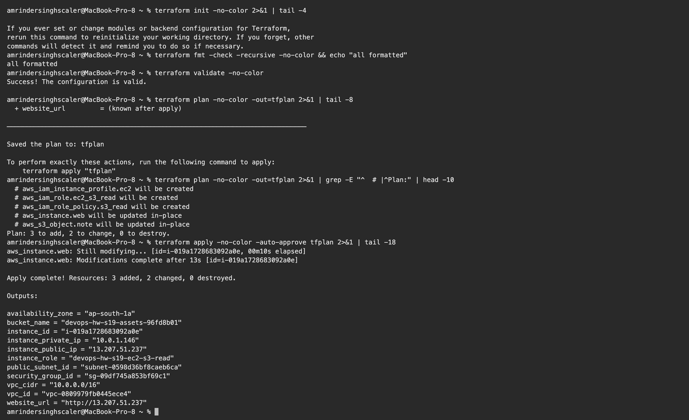
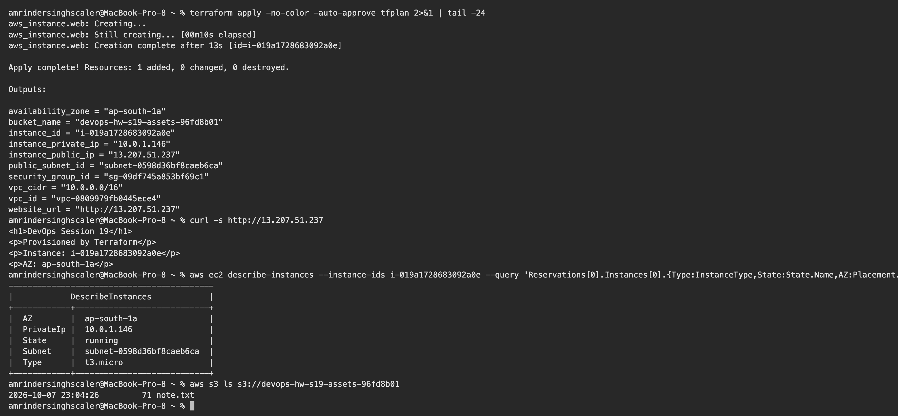
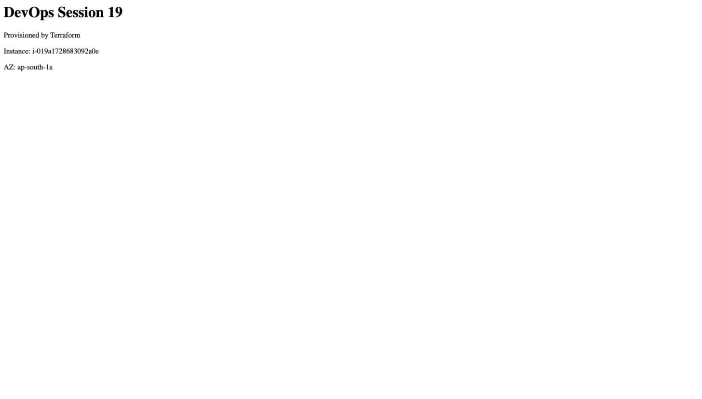
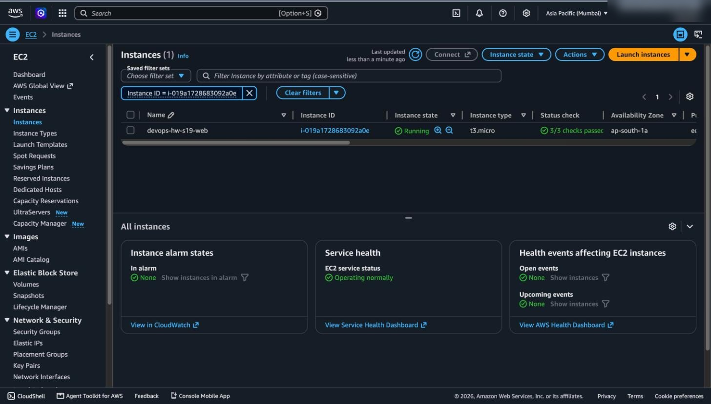
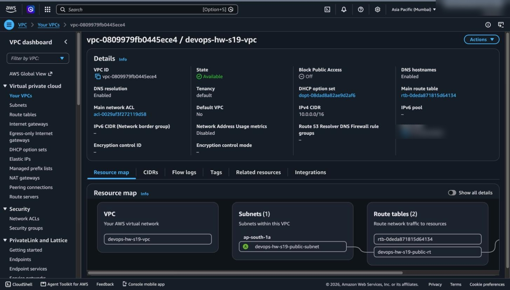

# Session 19: Cloud and Terraform in Action

**Name:** Amrinder Singh
**Roll No:** 24BCS10596

An end to end stack on real AWS in `ap-south-1`: a VPC, a public subnet, an Internet Gateway, a route
table, a security group, an EC2 instance running nginx, an S3 bucket, and an IAM role that lets the
instance read the bucket without any access key.

The website in the screenshot below is served by that instance.

---

## Architecture

```
                        Internet
                            │
                   ┌────────┴────────┐
                   │ Internet Gateway │  igw-04ac058fc2a1343ab
                   └────────┬────────┘
                            │
  ┌─────────────────────────┼──────────────────────────────┐
  │ VPC  devops-hw-s19-vpc  │  10.0.0.0/16                 │
  │                         │                              │
  │   ┌─────────────────────┴───────────────────────┐      │
  │   │ Route table  devops-hw-s19-public-rt        │      │
  │   │   10.0.0.0/16  -> local                     │      │
  │   │   0.0.0.0/0    -> igw      <- makes it public│     │
  │   └─────────────────────┬───────────────────────┘      │
  │                         │                              │
  │   ┌─────────────────────┴───────────────────────┐      │
  │   │ Public subnet 10.0.1.0/24   (ap-south-1a)   │      │
  │   │                                             │      │
  │   │   ┌─────────────────────────────────────┐   │      │
  │   │   │ EC2  t3.micro  devops-hw-s19-web    │   │      │
  │   │   │   public  13.207.51.237             │   │      │
  │   │   │   private 10.0.1.146                │   │      │
  │   │   │   SG: 80 from 0.0.0.0/0             │   │      │
  │   │   │   IAM role -> read the bucket       │   │      │
  │   │   └──────────────────┬──────────────────┘   │      │
  │   └──────────────────────┼──────────────────────┘      │
  └──────────────────────────┼─────────────────────────────┘
                             │ via the AWS API
                   ┌─────────┴──────────┐
                   │ S3  ...-assets-96fd8b01 │
                   └────────────────────┘
```

No NAT Gateway. Nothing lives in a private subnet here, and a NAT Gateway costs roughly $32 a month
before any traffic, so adding one to a learning project would be paying for nothing.

---

## The files

```
terraform/
├── provider.tf    versions, region, default_tags
├── variables.tf   inputs with validation
├── network.tf     VPC, IGW, subnet, route table, association
├── security.tf    security group and its rules
├── compute.tf     AMI lookup and the EC2 instance
├── storage.tf     S3 bucket, IAM role, instance profile
└── outputs.tf     IDs and the website URL
```

Split by concern rather than one big `main.tf`, so the networking can be read without scrolling past
the instance definition.

---

## Terraform features demonstrated

### Providers, pinned

```hcl
required_providers {
  aws = { source = "hashicorp/aws", version = "~> 5.0" }
}
```

`~> 5.0` allows 5.x but not 6.0, so a major release cannot change behaviour without an explicit bump.

`default_tags` in the provider block tags **every** resource automatically, which is how you find and
clean up everything a project made.

### Variables with validation

```hcl
variable "vpc_cidr" {
  type    = string
  default = "10.0.0.0/16"

  validation {
    condition     = can(cidrhost(var.vpc_cidr, 0))
    error_message = "vpc_cidr must be a valid CIDR block."
  }
}
```

A bad CIDR fails at plan time with a readable message instead of failing at apply with an AWS API
error.

The SSH variable defaults to empty on purpose:

```hcl
variable "allowed_ssh_cidr" {
  default = ""   # empty means the SSH rule is not created at all
}

resource "aws_vpc_security_group_ingress_rule" "ssh" {
  count = var.allowed_ssh_cidr == "" ? 0 : 1
  ...
}
```

`count = 0` means the resource does not exist. The safe default is no SSH rule, rather than an SSH
rule open to the world that someone forgets to tighten.

### Data sources

```hcl
data "aws_ami" "amazon_linux" {
  most_recent = true
  owners      = ["amazon"]
  filter {
    name   = "name"
    values = ["al2023-ami-2023.*-x86_64"]
  }
}

data "aws_availability_zones" "available" {
  state = "available"
}
```

Both are reads, not creates. AMI IDs are region specific and AZ names differ per region, so looking
them up is what lets the same code run in another region unchanged.

### Dependencies, which Terraform works out itself

The chain, entirely from references:

```
aws_vpc.main
 ├── aws_internet_gateway.main          vpc_id = aws_vpc.main.id
 ├── aws_subnet.public                  vpc_id = aws_vpc.main.id
 ├── aws_security_group.web             vpc_id = aws_vpc.main.id
 └── aws_route_table.public             gateway_id = aws_internet_gateway.main.id
      └── aws_route_table_association.public

aws_s3_bucket.assets
 └── aws_iam_role_policy.s3_read        Resource = aws_s3_bucket.assets.arn
      └── aws_iam_role.ec2_s3_read
           └── aws_iam_instance_profile.ec2
                └── aws_instance.web    iam_instance_profile = ...
```

There is no `depends_on` anywhere in this project. The apply output shows it: the IGW, subnet and
security group were all created at the same time, because none of them depends on the others, and
only the route table waited for the IGW.

### Outputs

```text
availability_zone = "ap-south-1a"
bucket_name = "devops-hw-s19-assets-96fd8b01"
instance_id = "i-019a1728683092a0e"
instance_private_ip = "10.0.1.146"
instance_public_ip = "13.207.51.237"
instance_role = "devops-hw-s19-ec2-s3-read"
public_subnet_id = "subnet-0598d36bf8caeb6ca"
security_group_id = "sg-09df745a853bf69c1"
vpc_cidr = "10.0.0.0/16"
vpc_id = "vpc-0809979fb0445ece4"
website_url = "http://13.207.51.237"
```

Note `instance_private_ip = 10.0.1.146` falls inside `public_subnet_cidr = 10.0.1.0/24`, which is the
subnet doing its job.

---

## Running it

```text
$ terraform fmt -check -recursive -no-color && echo "all formatted"
all formatted

$ terraform validate -no-color
Success! The configuration is valid.

$ terraform plan -no-color -out=tfplan
Saved the plan to: tfplan
```



```text
$ terraform apply -no-color -auto-approve tfplan
aws_s3_bucket.assets: Creation complete after 2s [id=devops-hw-s19-assets-96fd8b01]
aws_vpc.main: Still creating... [00m10s elapsed]
aws_vpc.main: Creation complete after 12s [id=vpc-0809979fb0445ece4]
aws_internet_gateway.main: Creating...
aws_subnet.public: Creating...
aws_security_group.web: Creating...
aws_internet_gateway.main: Creation complete after 1s [id=igw-04ac058fc2a1343ab]
aws_route_table.public: Creating...
aws_route_table.public: Creation complete after 1s [id=rtb-0b74145350ec1cc92]
aws_security_group.web: Creation complete after 2s [id=sg-09df745a853bf69c1]
aws_subnet.public: Creation complete after 12s [id=subnet-0598d36bf8caeb6ca]
aws_route_table_association.public: Creation complete after 0s [id=rtbassoc-06cc19e8fd1ffc02f]
aws_instance.web: Creation complete after 13s [id=i-019a1728683092a0e]

Apply complete!
```

Read the ordering: the S3 bucket is created immediately and in parallel with the VPC, because the two
are unrelated. The IGW, subnet and security group all start together once the VPC exists. The route
table waits for the IGW. That is the dependency graph, visible in the timing.

### Verified from outside Terraform

```text
$ curl -s http://13.207.51.237
<h1>DevOps Session 19</h1>
<p>Provisioned by Terraform</p>
<p>Instance: i-019a1728683092a0e</p>
<p>AZ: ap-south-1a</p>

$ aws ec2 describe-instances --instance-ids i-019a1728683092a0e --query '...' --output table
-------------------------------------------
|            DescribeInstances            |
+------------+----------------------------+
|  AZ        |  ap-south-1a               |
|  PrivateIp |  10.0.1.146                |
|  State     |  running                   |
|  Subnet    |  subnet-0598d36bf8caeb6ca  |
|  Type      |  t3.micro                  |
+------------+----------------------------+

$ aws s3 ls s3://devops-hw-s19-assets-96fd8b01
2026-10-07 23:04:26         71 note.txt
```

The instance ID and AZ on the web page were not written by me. The `user_data` script asks the
instance metadata service who it is and writes that into the HTML, so the page proves it is being
served by that specific instance.



---

## It was actually on the internet

> **Note on the current state.** The stack was destroyed with `terraform destroy` after these
> screenshots were taken, so `13.207.51.237` no longer answers. Leaving a public EC2 instance running
> on a coursework account with nobody watching it is not something I wanted to do, and tearing it
> down cleanly is half of what infrastructure as code is for. `terraform apply` from
> [terraform/](terraform) rebuilds the whole thing in about ninety seconds, and the instance ID and
> IP would differ. Everything below is from the run that produced the screenshots.



That was a browser on my laptop loading `http://13.207.51.237`, a public IP on an EC2 instance in
Mumbai. Three things had to be right at once for this to work, and missing any one gives a timeout:
a public IP on the instance, a route to the Internet Gateway, and a security group allowing port 80.



`devops-hw-s19-web`, Running, t3.micro, **3/3 checks passed**, ap-south-1a.



The resource map shows the VPC with its one subnet in ap-south-1a and the route tables, including
`devops-hw-s19-public-rt`. IPv4 CIDR `10.0.0.0/16`, Default VPC **No**, so this is mine and not the
one AWS pre creates.

Account IDs are blurred in these, since the repository is public.

---

## Two things that failed

### t2.micro is not free tier here

```text
Error: creating EC2 Instance: ... InvalidParameterCombination: The specified instance
type is not eligible for Free Tier.
```

I had defaulted to `t2.micro` out of habit. This account is on the newer Free Tier plan, which
refuses non eligible types outright rather than just charging for them. Asking AWS which ones qualify
settled it:

```bash
aws ec2 describe-instance-types --filters "Name=free-tier-eligible,Values=true" \
  --query 'InstanceTypes[].InstanceType' --output text --region ap-south-1
# t8i.micro  t4g.small  t3.micro  t4g.micro  t3.small ...
```

`t3.micro` is eligible, `t2.micro` is not offered in ap-south-1 on this account. The variable now
defaults to `t3.micro` with that reasoning in a comment.

### PowerUserAccess cannot create IAM roles

```text
Error: creating IAM Role (devops-hw-s19-ec2-s3-read): ... AccessDenied: User:
.../amrinder is not authorized to perform: iam:CreateRole ... because no
identity-based policy allows the iam:CreateRole action
```

This one is not a bug, it is the policy working correctly. `PowerUserAccess` grants everything
**except** IAM, and the reason is privilege escalation: anyone who can create a role and attach a
policy to it can grant themselves administrator. So "power user" stops short of IAM on purpose.

It also happened mid apply, after the VPC, subnet, IGW, route table, security group and bucket had
all been created. A failed apply leaves a **partial** state, which is fine, because re-running
reconciles the difference rather than starting over. That is the value of state.

Fixed by attaching `IAMFullAccess` as well, after which the role, the inline policy and the instance
profile were created and the instance was updated in place to use them:

```text
Plan: 3 to add, 2 to change, 0 to destroy.
```

The instance was **changed, not replaced**, because an instance profile can be attached to a running
instance. Terraform knows which attribute changes force a new resource and which do not.

---

## The IAM role, and why it is the interesting part

```hcl
resource "aws_iam_role_policy" "s3_read" {
  policy = jsonencode({
    Statement = [{
      Effect = "Allow"
      Action = ["s3:GetObject", "s3:ListBucket"]
      Resource = [
        aws_s3_bucket.assets.arn,
        "${aws_s3_bucket.assets.arn}/*",
      ]
    }]
  })
}
```

The instance can read this one bucket and nothing else. No access key exists on the machine, so there
is nothing on it to steal. Credentials come from the metadata service and rotate automatically.

Two details that matter:

- **Two ARNs.** `s3:ListBucket` acts on the bucket, `s3:GetObject` acts on objects inside it. With
  only the first, listing works and reading fails.
- **IMDSv2 required.** `http_tokens = "required"` in the instance config. IMDSv1 is the version
  involved in SSRF attacks that steal instance credentials, and v2 requires a token obtained by PUT,
  which an SSRF cannot usually do.

---

## Cost and cleanup

| Resource | Cost |
|---|---|
| VPC, subnet, route table, IGW, security group | free |
| EC2 t3.micro | free tier eligible |
| EBS 8 GB gp3 | free tier covers 30 GB |
| S3 bucket with one small object | effectively nothing |
| IAM role | free |
| NAT Gateway | **not created**, would have been ~$32/month |

Teardown is one command:

```bash
terraform destroy
```

It runs the graph backwards: instance, then the route table association and subnet, then the IGW,
then the VPC, with the bucket and IAM objects removed alongside. The Session 18 project in
[../17_Terraform_IaC](../17_Terraform_IaC/README.md) shows a complete destroy run and its output.

---

## What I understood

- **Dependencies are discovered, not declared.** Writing `aws_vpc.main.id` is what creates the edge,
  and Terraform then parallelises everything it can. The apply timings show it directly.
- **A public subnet is just a route.** There is no public flag anywhere; `0.0.0.0/0 -> igw` in the
  route table is the entire difference.
- **A failed apply is recoverable.** State records what exists, so re-running fixes the gap. This is
  the main practical reason infrastructure as code beats clicking in a console, where a half finished
  change leaves you guessing.
- `plan` cannot predict a permissions failure. It reads; apply writes. Both IAM errors in this
  session only appeared at apply.
- **Defaults are a security decision.** `allowed_ssh_cidr = ""` creating no rule at all is safer than
  a default that happens to be wide open.
