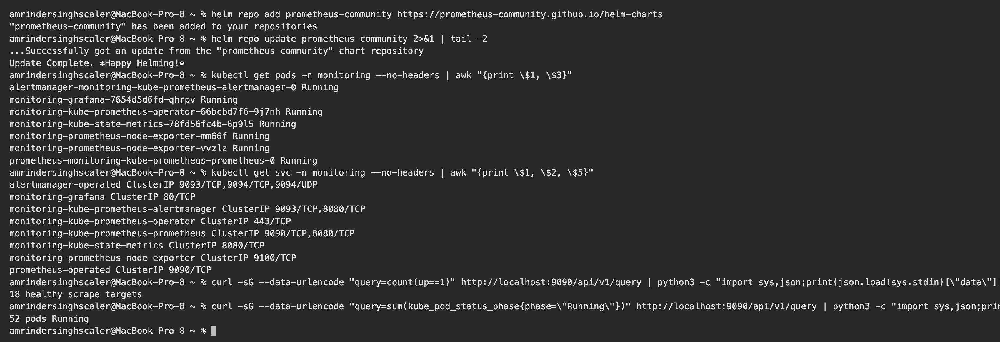
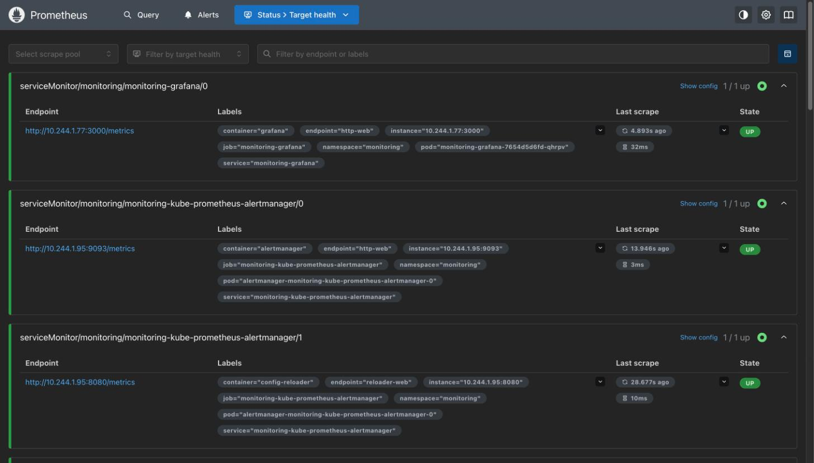
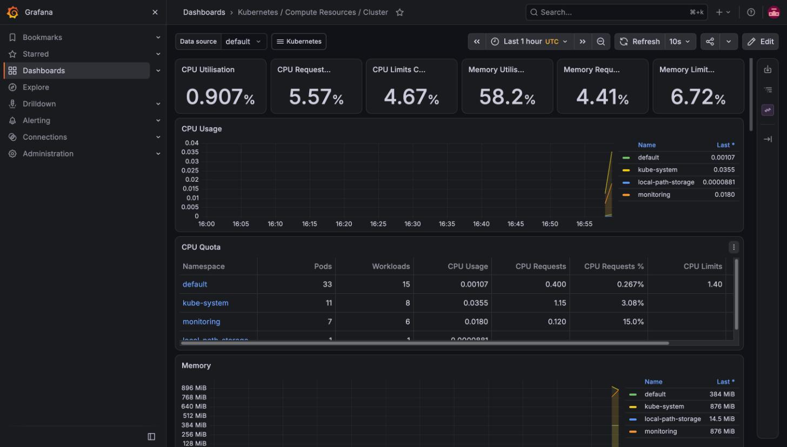
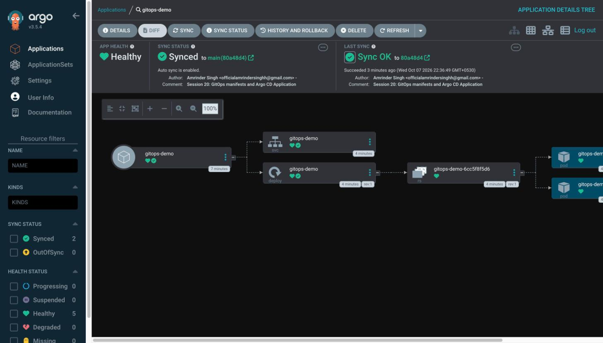
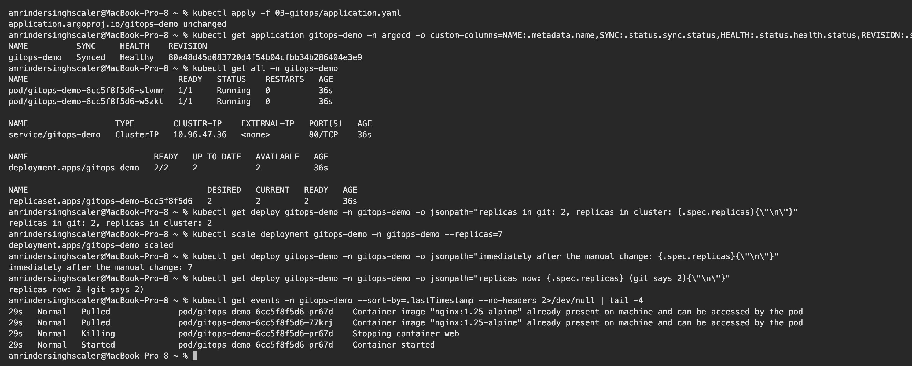

# Session 20: Monitoring, Observability and GitOps

**Name:** Amrinder Singh
**Roll No:** 24BCS10596

Prometheus, Grafana and Alertmanager running on my kind cluster, and Argo CD actually pulling this
repository and reconciling it. Screenshots are of the real UIs with live data from my cluster.

---

## Task 1: Monitoring

### Installing the stack

`kube-prometheus-stack` bundles Prometheus, Grafana, Alertmanager, node-exporter, kube-state-metrics
and the Prometheus Operator. Values are in
[01-monitoring/values-kube-prometheus.yaml](01-monitoring/values-kube-prometheus.yaml).

```bash
helm repo add prometheus-community https://prometheus-community.github.io/helm-charts
helm install monitoring prometheus-community/kube-prometheus-stack \
  --namespace monitoring --create-namespace \
  -f 01-monitoring/values-kube-prometheus.yaml --wait --timeout 12m
```

Four settings in my values file matter, and all four are because this is kind and not a real cluster:

| Setting | Why |
|---|---|
| `kubeControllerManager/Scheduler/Proxy/Etcd: enabled: false` | kind does not expose these components on the ports the chart expects, so leaving them on gives four permanently red targets |
| `serviceMonitorSelectorNilUsesHelmValues: false` | without it Prometheus only picks up ServiceMonitors with the chart's own release label |
| `persistence: false`, `retention: 2h` | no PVs to spare on a laptop, and this is a demo |
| resource requests trimmed | the defaults assume a real node |

```text
$ kubectl get pods -n monitoring --no-headers | awk "{print \$1, \$3}"
alertmanager-monitoring-kube-prometheus-alertmanager-0 Running
monitoring-grafana-7654d5d6fd-qhrpv Running
monitoring-kube-prometheus-operator-66bcbd7f6-9j7nh Running
monitoring-kube-state-metrics-78fd56fc4b-6p9l5 Running
monitoring-prometheus-node-exporter-mm66f Running
monitoring-prometheus-node-exporter-vvzlz Running
prometheus-monitoring-kube-prometheus-prometheus-0 Running
```

Note there are **two** node-exporter pods, one per node. It is a DaemonSet, because CPU and memory
have to be read on each machine separately.

### Metrics

Querying Prometheus directly over its HTTP API rather than through a dashboard, so the numbers are
clearly real:

```text
$ curl -sG --data-urlencode "query=count(up==1)" http://localhost:9090/api/v1/query | python3 -c "..."
18 healthy scrape targets

$ curl -sG --data-urlencode "query=sum(kube_pod_status_phase{phase=\"Running\"})" http://localhost:9090/api/v1/query | python3 -c "..."
52 pods Running

$ curl -s ".../query?query=node_memory_MemAvailable_bytes" | python3 -c "..."
node 172.19.0.2:9100 available MiB: 5955
node 172.19.0.3:9100 available MiB: 5862
```



### Prometheus targets



Every target UP, with the endpoint, the discovered labels and how long ago it was last scraped. This
page is the first thing to check when a metric is missing: if the target is not here, the
ServiceMonitor is not matching; if it is here but DOWN, the endpoint is not serving `/metrics`.

### Grafana



Live numbers off my own cluster at the moment of the screenshot:

| Metric | Value |
|---|---|
| CPU utilisation | 0.907% |
| CPU requests committed | 5.57% |
| CPU limits committed | 4.67% |
| Memory utilisation | 58.2% |
| Memory requests committed | 4.41% |

And the per namespace table: `default` 33 pods across 15 workloads, `kube-system` 11 across 8,
`monitoring` 7 across 6, `local-path-storage` 1.

The gap between **utilisation** and **requests** is the interesting part. CPU utilisation is under
1% but 5.57% of the cluster's CPU is reserved by requests. The scheduler places pods using requests,
not actual usage, so a cluster can refuse to schedule anything while sitting almost idle. That is
exactly the `Pending` failure from Session 14.

### Alerts

The chart ships a default alert ruleset and Alertmanager to route it. Grafana reported no firing
alerts during this run, which is the correct result for a healthy cluster: the rules cover things
like a pod in CrashLoopBackOff, a node running out of disk, or a target being down.

A real setup would add a receiver in Alertmanager (Slack, email, PagerDuty). I left the default
null receiver, since there is nowhere sensible to send a laptop cluster's alerts.

---

## Task 2: Observability

Monitoring and observability get used interchangeably and they are not the same thing.

**Monitoring** watches things you already knew to watch. You decided in advance that CPU above 80%
matters, so you made a dashboard and an alert for it. It answers questions you asked ahead of time.

**Observability** is whether you can answer questions you did **not** think of in advance, using only
the data already coming out of the system. "Why were checkouts slow for users in one region between
14:02 and 14:07" is not a dashboard you built. You can only answer it if the system emits enough.

### The three pillars

| Pillar | What it is | Good at | Bad at | Tool here |
|---|---|---|---|---|
| **Metrics** | numbers over time, aggregated | cheap, fast, great for alerts and trends | no per request detail, high cardinality is expensive | Prometheus |
| **Logs** | timestamped events, usually text | exact detail of one event | expensive at volume, hard to aggregate | kubectl logs, Loki in a real setup |
| **Traces** | one request's path across services | finding which hop in a chain was slow | needs instrumentation in every service | Jaeger or Tempo, not installed here |

How I think about using them together: a **metric** tells you something is wrong and when. A **trace**
tells you which service is responsible. A **log** tells you exactly what happened in that service.
Going metric to log directly works for a single service, and falls apart the moment a request crosses
four of them.

### Why Kubernetes needs this more than a single server

- Pods are replaced constantly, so anything stored on a pod disappears with it. Logs have to be
  shipped off the node.
- One request can cross several services, each with several replicas. "The app is slow" is not
  enough to find it.
- An IP address is meaningless the next minute, so data has to be labelled by pod, service and
  namespace rather than by host.

This is why Prometheus pulls metrics via service discovery instead of being handed a list of servers,
and why every metric in the screenshots above is labelled with `namespace` and `pod`.

### What is here and what is not

| Pillar | Status |
|---|---|
| Metrics | Prometheus, Grafana, node-exporter, kube-state-metrics, all running |
| Logs | `kubectl logs` only. A real cluster would run Loki or Elasticsearch with a Fluent Bit DaemonSet |
| Traces | not installed. Would need OpenTelemetry instrumentation in the application plus Jaeger or Tempo |

Tracing is left out deliberately rather than faked. It needs the application code to propagate trace
context, and the nginx demo apps in this repo do not do that.

---

## Task 3: GitOps

### What it is

GitOps inverts the deployment direction. In a normal pipeline the CI runner holds cluster credentials
and **pushes** changes in. In GitOps a controller inside the cluster **pulls** the desired state from
git and reconciles continuously.

The four principles:

1. **Declarative.** The desired state is described, not scripted.
2. **Versioned and immutable.** Git is the single source of truth, with history and review built in.
3. **Pulled automatically.** An agent in the cluster fetches approved changes.
4. **Continuously reconciled.** The agent keeps correcting drift, not just at deploy time.

Why it is a real improvement over the Session 16 pipeline:

| | Push (GitHub Actions) | Pull (Argo CD) |
|---|---|---|
| Credentials | runner needs cluster admin, stored as a secret | nothing outside the cluster has access |
| Network | runner must reach the cluster | cluster reaches out, works behind a firewall |
| Drift | nobody notices a manual `kubectl edit` | corrected automatically |
| Audit | spread across pipeline logs | `git log` |

The firewall point is the one that actually solved my Session 16 problem: a hosted runner could not
reach my kind cluster, so I had to deploy by hand. Argo CD runs inside the cluster and reaches out to
GitHub, so it works fine.

### Setting it up

```bash
kubectl create namespace argocd
kubectl apply -n argocd --server-side=true \
  -f https://raw.githubusercontent.com/argoproj/argo-cd/stable/manifests/install.yaml
```

`--server-side=true` is needed. The plain client-side apply fails:

```
The CustomResourceDefinition "applicationsets.argoproj.io" is invalid:
metadata.annotations: Too long: may not be more than 262144 bytes
```

Client side apply stores the whole previous manifest in an annotation, and that CRD is bigger than
the 256KB annotation limit. Server side apply does not use that annotation.

### The Application

[03-gitops/application.yaml](03-gitops/application.yaml) is the entire deployment pipeline:

```yaml
  source:
    repoURL: https://github.com/aamrindersingh/Devops-Assignment-1.git
    targetRevision: main
    path: 19_Monitoring_Observability_GitOps/03-gitops/manifests
  syncPolicy:
    automated:
      selfHeal: true
      prune: true
    syncOptions:
      - CreateNamespace=true
```

The manifests it points at had to be committed and pushed **before** creating the Application. In
GitOps, if it is not in git it does not exist, so there was nothing to sync until the push landed.

### It synced

```text
$ kubectl get application gitops-demo -n argocd -o custom-columns=NAME:.metadata.name,SYNC:.status.sync.status,HEALTH:.status.health.status,REVISION:.status.sync.revision
NAME          SYNC     HEALTH    REVISION
gitops-demo   Synced   Healthy   80a48d45d083720d4f54b04cfbb34b286404e3e9

$ kubectl get all -n gitops-demo
NAME                               READY   STATUS    RESTARTS   AGE
pod/gitops-demo-6cc5f8f5d6-slvmm   1/1     Running   0          36s
pod/gitops-demo-6cc5f8f5d6-w5zkt   1/1     Running   0          36s

NAME                  TYPE        CLUSTER-IP    EXTERNAL-IP   PORT(S)   AGE
service/gitops-demo   ClusterIP   10.96.47.36   <none>        80/TCP    36s

NAME                          READY   UP-TO-DATE   AVAILABLE   AGE
deployment.apps/gitops-demo   2/2     2            2           36s
```

The namespace, Deployment, Service, ReplicaSet and both pods were created by Argo CD reading git. I
never ran `kubectl apply` on any of them, and the revision matches the commit I had just pushed.



The UI shows the resource tree all green, and under Last Sync it names the commit author and the
commit message that triggered it. That link from a running pod back to a specific commit is the
auditability GitOps is sold on.

### Self healing

The part worth proving. I changed the cluster by hand and left git alone:

```text
$ kubectl get deploy gitops-demo -n gitops-demo -o jsonpath="replicas in git: 2, replicas in cluster: {.spec.replicas}"
replicas in git: 2, replicas in cluster: 2

$ kubectl scale deployment gitops-demo -n gitops-demo --replicas=7
deployment.apps/gitops-demo scaled

$ kubectl get deploy gitops-demo -n gitops-demo -o jsonpath="immediately after the manual change: {.spec.replicas}"
immediately after the manual change: 7

$ kubectl get deploy gitops-demo -n gitops-demo -o jsonpath="replicas now: {.spec.replicas} (git says 2)"
replicas now: 2 (git says 2)
```

Within 20 seconds it was back to 2. The cluster events show the extra pods being created and then
killed again:

```text
29s   Normal   Pulled    pod/gitops-demo-6cc5f8f5d6-pr67d   Container image "nginx:1.25-alpine" already present on machine
29s   Normal   Killing   pod/gitops-demo-6cc5f8f5d6-pr67d   Stopping container web
```

`selfHeal: true` is what does this. Without it Argo CD would mark the app `OutOfSync` and wait for a
human. With it, the only way to change the cluster is to change git, which is the whole point.



### A problem I hit

The first sync failed and sat at `Unknown`:

```text
Failed to load target state: failed to generate manifest for source 1 of 1:
rpc error: code = DeadlineExceeded desc = context deadline exceeded
```

The repo-server log was more specific:

```text
`git fetch origin --tags --force --prune` failed timeout after 1m30s
```

My first guess was that the cluster had no internet access. I checked instead of assuming:

```text
$ kubectl run egress-test -n argocd --image=alpine/git --restart=Never --command --rm -i -- \
    git ls-remote --heads https://github.com/aamrindersingh/Devops-Assignment-1.git
80a48d45d083720d4f54b04cfbb34b286404e3e9	refs/heads/main
```

That worked, and returned the right commit, so egress was fine. The real cause is that this repo is
now about 16MB because of all the session screenshots, and a full fetch of that history over my
connection takes longer than the default 90 second exec timeout.

```bash
kubectl -n argocd set env deployment/argocd-repo-server ARGOCD_EXEC_TIMEOUT=5m ARGOCD_GIT_ATTEMPTS_COUNT=3
```

Synced on the next attempt. Worth remembering that a repo full of binary assets gets slow for any
tool that clones it, which is an argument for keeping manifests in their own small repo.

---

## What I understood

- Prometheus **pulls**. It discovers targets through the Kubernetes API and scrapes them, which is
  why a new pod appears in monitoring with no configuration change.
- Requests and utilisation are different numbers and the gap between them is where capacity problems
  live.
- Monitoring answers questions you planned for, observability is about the ones you did not.
- GitOps is a direction change, not a tool. The cluster pulling means no external system needs
  credentials to it.
- `selfHeal` turns drift from something you discover during an incident into something that cannot
  persist.

---

## Files

```
19_Monitoring_Observability_GitOps/
├── 01-monitoring/
│   └── values-kube-prometheus.yaml
├── 03-gitops/
│   ├── application.yaml
│   └── manifests/
│       └── guestbook.yaml
├── screenshots/
└── README.md
```
