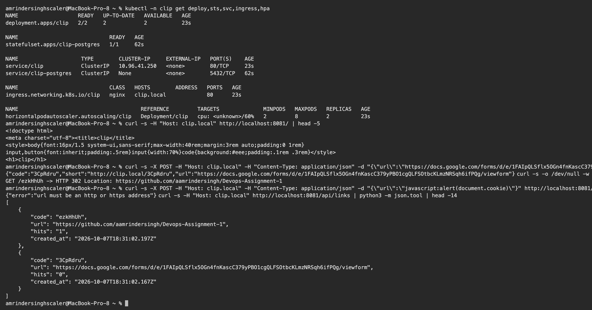
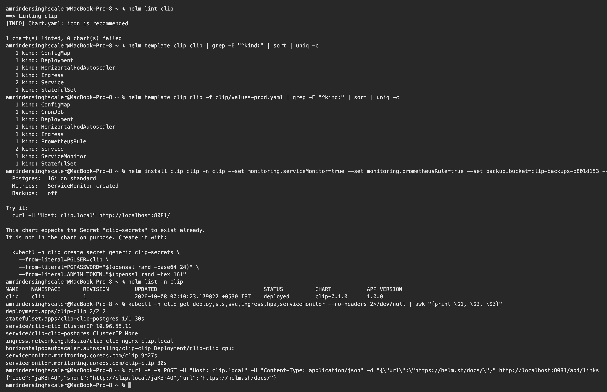
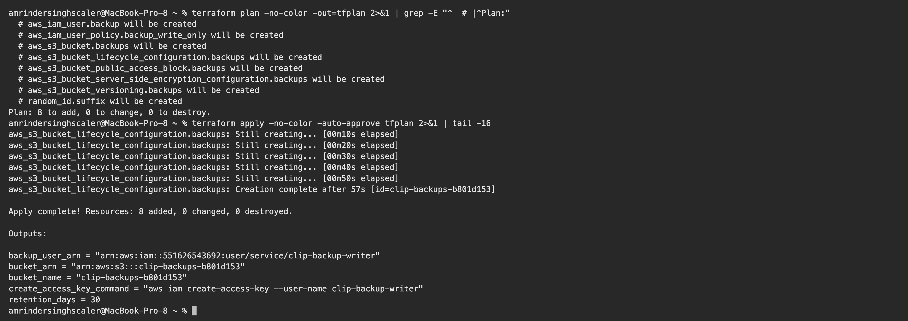
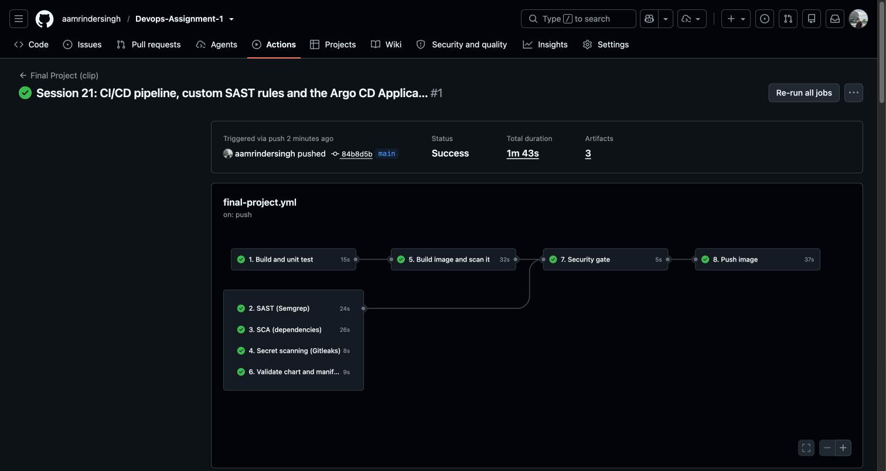
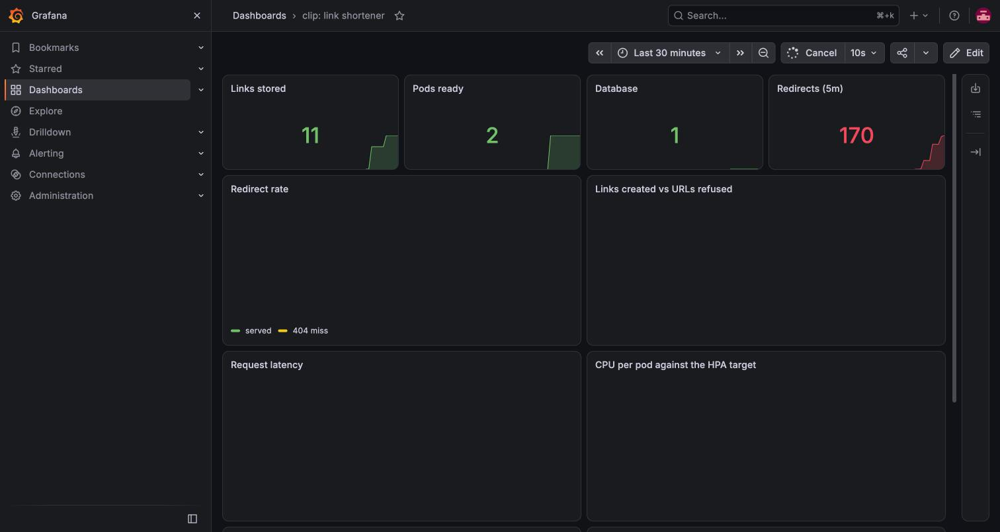
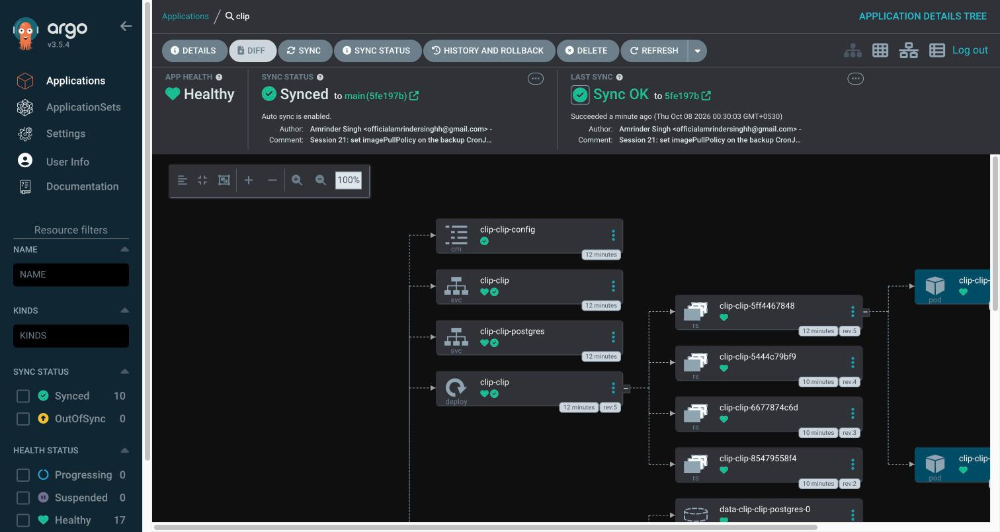
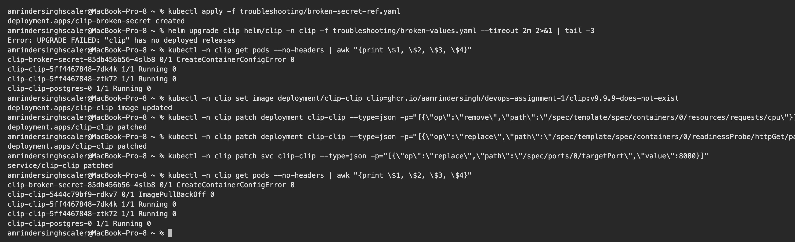
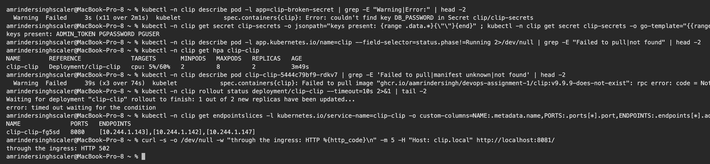
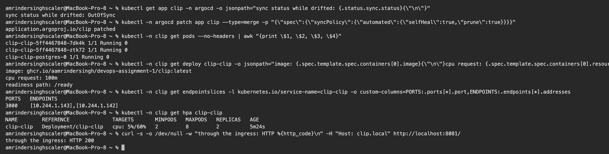
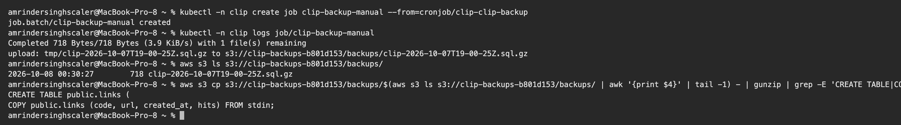

# Session 21: Final DevOps Project

**Name:** Amrinder Singh
**Roll No:** 24BCS10596

Everything in this writeup was run. The AWS resources are real, the pipeline ran on GitHub's
runners, the cluster is a local 2 node kind cluster, and every number quoted is copied from a
terminal.

Project tree: [final-devops-project/](final-devops-project)

---

## Project overview

**clip** is a link shortener for long college URLs.

The motivation is concrete. Submitting this coursework meant pasting twenty GitHub README links into
a Google Form whose own URL was ninety characters long. Sharing a Drive link or a form in a WhatsApp
group has the same problem. `clip` turns those into something that fits in a message and can be read
out loud.

The application is deliberately small, because the point of this session is the machinery around it.
It is not a toy though: it has a database, real validation logic with a security consequence, three
different probe behaviours, and metrics it emits itself.

What it does:

| Route | Purpose |
|---|---|
| `GET /` | a small page with a form and the current link count |
| `POST /api/links` | shorten a URL, returns a 7 character code |
| `GET /api/links` | list stored links with hit counts |
| `DELETE /api/links/:code` | remove a link, requires an admin token |
| `GET /:code` | the redirect |
| `GET /healthz` | liveness, never touches the database |
| `GET /ready` | readiness, does touch the database |
| `GET /metrics` | Prometheus exposition |

---

## Architecture diagram

```
 DEVELOPER                        GITHUB                              AWS
 ─────────                        ──────                              ───
 git push ───────────────► GitHub Actions
                               │
                               ├─ 1 build + unit test (10 tests)
                               ├─ 2 SAST    Semgrep + custom rules
                               ├─ 3 SCA     Trivy, blocking
                               ├─ 4 secrets Gitleaks, full history
                               ├─ 5 image   build + Trivy scan
                               ├─ 6 chart   helm lint + kubeconform
                               ├─ 7 ═══ SECURITY GATE ═══
                               └─ 8 push ─────► ghcr.io/.../clip:sha
                               │
                               └─ repo is also the GitOps source
                                        │
                                        │ Argo CD pulls (nothing pushes in)
                                        ▼
 ┌──────────────────── kind cluster (2 nodes) ─────────────────────┐
 │                                                                  │
 │  ingress-nginx ──► Service ──► Deployment clip  x2 ◄── HPA 2-8  │
 │  host clip.local        │           │                            │
 │                         │           ├─ startup  /healthz         │
 │                         │           ├─ ready    /ready  ─┐       │
 │                         │           └─ live     /healthz │       │
 │                         │                                │       │
 │                         └──► StatefulSet postgres ◄──────┘       │
 │                                   │  PVC 1Gi                     │
 │                                   │                              │
 │  Prometheus ──scrape /metrics──► clip                            │
 │     │                                                            │
 │     ├──► Grafana dashboard (10 panels)                           │
 │     └──► Alertmanager (4 rules)                                  │
 │                                                                  │
 │  CronJob clip-backup  02:00 daily ─ pg_dump ─┐                   │
 └───────────────────────────────────────────────┼──────────────────┘
                                                 │
                            Terraform provisions ▼
                            S3 clip-backups-b801d153
                            + IAM user: PutObject on backups/* only
```

The direction of the arrows matters. **Nothing outside the cluster has credentials to it.** CI
publishes an image and Argo CD, running inside, pulls the chart from git. That is what makes it
possible for a hosted runner to "deploy" to a cluster on a laptop it cannot reach.

---

## Technologies used

| Layer | Tool | Version |
|---|---|---|
| Application | Node.js, Express, node-postgres, prom-client | Node 20 |
| Database | PostgreSQL | 16-alpine |
| Container | Docker, multi stage, tini as PID 1 | 49 MB final image |
| Orchestration | Kubernetes via kind | v1.37.0, 2 nodes |
| Packaging | Helm | v4.3.0 |
| Ingress | ingress-nginx | v1.13.3 |
| CI/CD | GitHub Actions | 8 jobs |
| SAST | Semgrep + custom rules | p/javascript, p/security-audit |
| SCA | Trivy, npm audit | v0.36.0 action |
| Secret scanning | Gitleaks | v2 action |
| Manifest validation | kubeconform | offline schemas |
| Monitoring | Prometheus, Grafana, Alertmanager | kube-prometheus-stack |
| GitOps | Argo CD | v3.5.4 |
| IaC | Terraform, AWS provider | 1.16.5, aws ~> 5.0 |
| Cloud | AWS S3 + IAM | ap-south-1 |

---

## Application setup

[final-devops-project/application/](final-devops-project/application)

```
application/
├── package.json
├── src/
│   ├── shorten.js    pure logic, no database and no HTTP
│   ├── db.js         Postgres pool and queries
│   ├── metrics.js    Prometheus collectors
│   └── server.js     Express routes
└── test/
    └── shorten.test.js
```

`shorten.js` is separated out on purpose. It has no database and no HTTP listener, so it can be unit
tested directly, and the tests run in milliseconds with no fixtures.

```text
$ node --test test/*.test.js
ℹ tests 10
ℹ pass 10
ℹ fail 0
```

### The security control lives in one function

A shortener exists to redirect to URLs a stranger supplied. The redirect itself can never be made
safe. What makes it safe is refusing to **store** anything that is not plain http or https:

```js
function isSafeUrl(input) {
  if (typeof input !== "string" || input.length === 0) return false;
  if (input.length > MAX_URL_LENGTH) return false;
  let parsed;
  try { parsed = new URL(input); } catch { return false; }
  if (parsed.protocol !== "http:" && parsed.protocol !== "https:") return false;
  if (!parsed.hostname) return false;
  return true;
}
```

Four of the ten tests cover this, including the subtle one:

```js
test("isSafeUrl rejects a scheme relative url", () => {
  // "//evil.com" inherits the current scheme and silently works in a browser
  assert.ok(!isSafeUrl("//evil.com"));
});
```

Verified against the running service:

```text
$ curl -s -X POST ... -d '{"url":"javascript:alert(document.cookie)"}' .../api/links
{"error":"url must be an http or https address"}

$ curl -s -X POST ... -d '{"url":"//evil.com"}' .../api/links
{"error":"url must be an http or https address"}
```

### The alphabet

Short codes get typed by hand and read out loud, so `0`, `O`, `1`, `l` and `I` are left out. There is
a test asserting they are absent, because that is the kind of detail a later refactor quietly
removes.

---

## Docker setup

[final-devops-project/docker/Dockerfile](final-devops-project/docker/Dockerfile)

Multi stage. The build stage installs dependencies, the runtime stage copies only `node_modules`,
`package.json` and `src`.

```text
image size: 49 MB
runs as user: node
```

Three choices worth defending:

- **`USER node`.** The official Node image ships an unprivileged user. A container reachable from the
  internet has no reason to run as root.
- **`tini` as PID 1.** Without an init, `node` is PID 1 and ignores SIGTERM by default, so `docker
  stop` and pod termination both wait out the full grace period. With tini a pod stops in about a
  second.
- **No test files in the image.** `.dockerignore` excludes `test/` and `node_modules/`, and the
  runtime stage installs with `--omit=dev`.

---

## Kubernetes deployment

[final-devops-project/kubernetes/](final-devops-project/kubernetes) holds the raw manifests. They
are what the Helm chart templates, kept separately because reading plain YAML is easier than reading
a template when you want to know what actually gets created.

| File | Object |
|---|---|
| `00-namespace.yaml` | Namespace |
| `01-configmap.yaml` | ConfigMap, non secret config |
| `02-secret.yaml` | Secret template, placeholders only |
| `03-postgres.yaml` | headless Service + StatefulSet + volumeClaimTemplate |
| `04-app.yaml` | Deployment with three probes + Service |
| `05-ingress.yaml` | Ingress, host and path routing |
| `06-hpa.yaml` | HorizontalPodAutoscaler 2 to 8 |
| `07-backup-cronjob.yaml` | nightly pg_dump to S3 |

```text
$ kubectl -n clip get deploy,sts,svc,ingress,hpa
NAME                   READY   UP-TO-DATE   AVAILABLE   AGE
deployment.apps/clip   2/2     2            2           23s

NAME                             READY   AGE
statefulset.apps/clip-postgres   1/1     62s

NAME                    TYPE        CLUSTER-IP     PORT(S)    AGE
service/clip            ClusterIP   10.96.41.250   80/TCP     23s
service/clip-postgres   ClusterIP   None           5432/TCP   62s

NAME                             CLASS   HOSTS        PORTS   AGE
ingress.networking.k8s.io/clip   nginx   clip.local   80      23s

NAME                                       REFERENCE         TARGETS              MINPODS   MAXPODS   REPLICAS
horizontalpodautoscaler.autoscaling/clip   Deployment/clip   cpu: <unknown>/60%   2         8         2
```



### The three probes

This is the part most submissions describe and few demonstrate, so it is worth being precise.

| Probe | Endpoint | Touches the database? | On failure |
|---|---|---|---|
| startup | `/healthz` | no | keeps the other two paused while booting |
| readiness | `/ready` | **yes** | pod leaves the Service, is **not** restarted |
| liveness | `/healthz` | **no** | container is restarted |

Liveness deliberately does not check the database. If it did, a database outage would make kubelet
restart every otherwise healthy pod, turning a short outage into a restart storm. Readiness does
check it, because a pod that cannot reach Postgres genuinely cannot serve a redirect.

Measured, by stopping Postgres with the app running:

```text
baseline   liveness=200  readiness=200
db down    liveness=200  readiness=503
recovered  liveness=200  readiness=200
process never restarted
```

Storage: Postgres is a **StatefulSet** with a `volumeClaimTemplate`, not a Deployment, because the
database has an identity and its own disk. The app itself is stateless and scales freely, which is
what lets the HPA work honestly.

Hardening on the app pod: `runAsNonRoot`, `runAsUser: 1000`, `readOnlyRootFilesystem: true`,
`allowPrivilegeEscalation: false`, `capabilities: drop: ["ALL"]`, `seccompProfile: RuntimeDefault`.

---

## Helm deployment

[final-devops-project/helm/clip/](final-devops-project/helm/clip)

The same objects, templated, plus feature flags. The chart has no external dependency: I wrote the
Postgres StatefulSet rather than pulling in a subchart, after finding that `bitnami/postgresql:16`
no longer resolves.

```text
$ docker pull bitnami/postgresql:16
Error response from daemon: ... docker.io/bitnami/postgresql:16: not found
```

That also avoided needing `Chart.lock` committed for Argo CD to render the chart.

The flags earn their place. Same chart, two value files, different output:

```text
$ helm template clip clip | grep -E "^kind:" | sort | uniq -c
   1 ConfigMap   1 Deployment   1 HorizontalPodAutoscaler
   1 Ingress     2 Service      1 StatefulSet

$ helm template clip clip -f clip/values-prod.yaml | grep -E "^kind:" | sort | uniq -c
   1 ConfigMap   1 CronJob      1 Deployment   1 HorizontalPodAutoscaler
   1 Ingress     1 PrometheusRule   2 Service   1 ServiceMonitor   1 StatefulSet
```

Prod renders three objects dev does not. The ServiceMonitor and PrometheusRule are behind flags
because they need the Prometheus Operator CRDs, and the chart should install on a cluster without
them.



### Secrets are not in the chart

`values.yaml` has `secret.existingSecret: clip-secrets`. The chart expects that Secret to exist and
does not create it.

A chart that lives in git cannot create a real Secret without putting the value in git, and base64
in a manifest is encoding, not encryption. So the Secret is created out of band:

```bash
kubectl -n clip create secret generic clip-secrets \
  --from-literal=PGUSER=clip \
  --from-literal=PGPASSWORD="$(openssl rand -base64 24)" \
  --from-literal=ADMIN_TOKEN="$(openssl rand -hex 16)"
```

`kubernetes/02-secret.yaml` is committed with `REPLACE_ME` placeholders so the required keys are
documented without the values being present.

### Config changes roll the pods

The Deployment template carries a checksum annotation:

```yaml
annotations:
  checksum/config: {{ include (print $.Template.BasePath "/configmap.yaml") . | sha256sum }}
```

Without it, changing the ConfigMap updates the object and the running pods keep the old environment
until something else restarts them.

---

## Terraform infrastructure

[final-devops-project/terraform/](final-devops-project/terraform)

Terraform provisions what the nightly backup needs. This is the part of the project where the cloud
infrastructure is load bearing rather than decorative: without the bucket and its IAM policy, the
CronJob fails.

```text
Plan: 8 to add, 0 to change, 0 to destroy.

Apply complete! Resources: 8 added, 0 changed, 0 destroyed.

Outputs:
backup_user_arn = "arn:aws:iam::<account>:user/service/clip-backup-writer"
bucket_arn = "arn:aws:s3:::clip-backups-b801d153"
bucket_name = "clip-backups-b801d153"
create_access_key_command = "aws iam create-access-key --user-name clip-backup-writer"
retention_days = 30
```

The bucket has all four public access blocks on, SSE-S3, versioning, and a lifecycle rule that
expires backups after 30 days and non current versions after 7. Backups that grow without limit get
switched off to save money, so the expiry is part of the design.



### The IAM policy is genuinely narrow

```hcl
Statement = [{
  Sid      = "WriteBackupsOnly"
  Effect   = "Allow"
  Action   = ["s3:PutObject"]
  Resource = "${aws_s3_bucket.backups.arn}/backups/*"
}]
```

One action, one prefix, one bucket. Tested with that user's own credentials:

```text
can it list the bucket?   DENIED (correct)
can it read backups?      DENIED (correct)
```

A job that writes backups has no business reading or deleting them. If that key leaks, the worst an
attacker can do is write objects into one prefix.

### Two deliberate choices

**Terraform does not create the access key.** `aws_iam_access_key` would write the secret into
`terraform.tfstate` in plaintext. The output is the command to create one by hand instead.

**On EKS none of this would exist.** The job would assume an IAM role through IRSA and there would be
no long lived key anywhere. kind has no OIDC provider, so a scoped user is the honest fallback. My
own [IAM writeup](../17_Terraform_IaC/aws-services/01-iam/README.md) argues against stored keys, so
saying so here rather than quietly doing the opposite seemed necessary.

The key created for the demonstration below was deleted immediately afterwards:

```text
deleted the backup service key (...DG4F)
remaining keys on that user: 0
```

---

## CI/CD pipeline

[.github/workflows/final-project.yml](../.github/workflows/final-project.yml)

Eight jobs. Jobs 2, 3, 4 and 6 run in parallel because none depends on the others.



Status **Success**, 1m 43s, 3 artifacts, all eight green on the first run.

| Job | What it does |
|---|---|
| 1 build-test | lint, 10 unit tests |
| 2 sast | Semgrep, community rulesets plus custom rules |
| 3 sca | Trivy on dependencies, **blocking**, plus npm audit |
| 4 secret-scan | Gitleaks over the full history |
| 5 image-scan | build the image, Trivy it, count findings |
| 6 helm-validate | `helm lint` both value sets, kubeconform offline |
| 7 security-gate | collects all five results and decides |
| 8 publish | push to GHCR, only on main, only if the gate opened |

The gate is `needs: [...]` plus `if: always()`, so it sees every result including failures. Job 8 has
`needs: [security-gate]`, so a failed scan means no image is published.

There is **no `kubectl` step**. A hosted runner cannot reach a kind cluster on my laptop, and a
deploy step that cannot deploy is worse than no step at all. Argo CD closes that loop instead.

---

## DevSecOps implementation

Four scanners, each answering a different question.

### SAST found nothing, and that was the interesting part

I expected Semgrep to flag the redirect as an open redirect. It did not:

```text
✅ Scan completed successfully.
 • Findings: 0 (0 blocking)
 • Rules run: 83
```

The reason is worth understanding. The dangerous flow is:

```
req.params.code  ->  Postgres  ->  res.redirect(url)
```

Taint analysis follows data through function calls, not through a database round trip. From
Semgrep's point of view the URL appears out of nowhere inside `resolveLink`. No generic rule can see
this.

**Zero findings is not the same as no risk.** So I wrote a rule that knows this codebase:

[security/semgrep-rules/open-redirect.yaml](final-devops-project/security/semgrep-rules/open-redirect.yaml)

```yaml
  - id: clip-redirect-to-non-literal
    patterns:
      - pattern: $RES.redirect(...)
      - pattern-not: $RES.redirect("...")
      - pattern-not: $RES.redirect($CODE, "...")
```

It fires:

```text
    application/src/server.js
   ❯❯❱ security.semgrep-rules.clip-redirect-to-non-literal
          ❰❰ Blocking ❱❱
   106┆ res.redirect(302, url);
 • Findings: 1 (1 blocking)
```

### Then the finding is accepted, not fixed

Redirecting to a stored URL is the entire function of a shortener. The line cannot be removed. So it
is suppressed with a justification that names the rule, states the compensating control and carries
a review date:

```js
  // Accepted, with justification. Redirecting to a stored URL is the
  // entire function of a shortener, so this line cannot be removed. The
  // control is at the write path: POST /api/links refuses anything that
  // is not http or https via isSafeUrl(), covered by four unit tests
  // including javascript:, data:, file: and the scheme relative
  // //evil.com case. Nothing reaches this line that did not pass that
  // check. Reviewed 2026-10-08, revisit if the write path ever changes.
  //
  // The suppression has to sit on the line directly above the match.
  // nosemgrep: clip-redirect-to-non-literal
  res.redirect(302, url);
```

A suppression with no reason is how a scanner quietly stops meaning anything. This one says what the
control is and when to look again.

(The adjacency requirement is real: my first attempt put the justification between `nosemgrep` and
the code, and the suppression did not apply.)

### The other three

| Scanner | Scope | Gating |
|---|---|---|
| Trivy, dependencies | `package-lock.json`, `--ignore-unfixed` | **yes** |
| Gitleaks | full git history, `fetch-depth: 0` | **yes** |
| Trivy, image | OS and app packages in the built image | reported, not gating |

The image scan is reported rather than gating on purpose. Its findings come from `node:20-alpine` and
its bundled npm, and no change to this application fixes them. A gate that can never pass is a gate
somebody disables. `--ignore-unfixed` on the dependency scan follows the same logic: failing a build
over a CVE with no patch available teaches people to ignore the build.

Gitleaks needs full history because a secret that was committed and later deleted is still in the
history and still compromised.

---

## Monitoring

The app emits its own metrics. This is the difference between "I installed Grafana" and actually
having observability.

[application/src/metrics.js](final-devops-project/application/src/metrics.js)

| Metric | Type | Why |
|---|---|---|
| `clip_links_created_total` | counter | usage |
| `clip_redirects_total` | counter | the hot path |
| `clip_redirect_misses_total` | counter | 404s, and a signal for code enumeration |
| `clip_rejected_urls_total` | counter | someone probing for an open redirect |
| `clip_links_total` | gauge | size of the store |
| `clip_db_up` | gauge | set by the readiness check |
| `clip_http_request_duration_seconds` | histogram | latency by route |

**Redirects are deliberately not labelled by short code.** One label value per link means unbounded
cardinality, which is the standard way a Prometheus install falls over. The code is in the database
if anyone needs it.

The histogram is labelled by **route pattern**, not path, so `/abc1234` and `/xyz9876` share one
series rather than creating one each.

### Scraped and queried

```text
$ kubectl apply -f monitoring/servicemonitor.yaml
  t+40s clip targets=2

links created                      8.0
redirects served                   42.0
misses (404)                       5.0
unsafe urls refused                3.0
links stored                       8.0
db up                              1.0
p95 latency (s)                    0.011
```



Ten panels, built from those metrics: 11 links stored, 2 pods ready, database up, 170 redirects in
five minutes.

### Alerts

[monitoring/prometheusrule.yaml](final-devops-project/monitoring/prometheusrule.yaml). Four rules,
each with a `for:` duration so one bad scrape does not page anyone, and a runbook annotation:

| Alert | Fires when |
|---|---|
| `ClipDown` | `up == 0` for 1m |
| `ClipDatabaseUnreachable` | `min(clip_db_up) == 0` for 1m |
| `ClipHighMissRate` | more than 1 miss/sec for 5m, suggests code enumeration |
| `ClipRejectingManyUrls` | sustained refusals, a broken client or someone probing |

`ClipDatabaseUnreachable` fires on a gauge the application sets from its own readiness check, so the
alert reflects what the app believes rather than an inference from outside.

---

## GitOps

[final-devops-project/gitops/application.yaml](final-devops-project/gitops/application.yaml)

Argo CD pulls the Helm chart from this repository and reconciles the cluster against it.

```text
$ kubectl get application clip -n argocd
NAME   SYNC     HEALTH    REVISION
clip   Synced   Healthy   84b8d5bb2a30ddc8436ccec0a873b0ee3c7938af
```



The resource tree is green and Last Sync names the commit, its author and its message. That link
from a running pod back to a specific commit is the audit trail.

Two settings that are not obvious:

**`ignoreDifferences` on `/spec/replicas`.** The HPA writes the replica count; git says 2. Without
this, Argo sees a scaled up Deployment as drift and scales it back, the HPA scales it up again, and
the two controllers fight indefinitely. Telling Argo to ignore that one field is what lets
autoscaling and GitOps coexist.

**The finalizer.** Without `resources-finalizer.argocd.argoproj.io`, deleting the Application
orphans everything it created.

### Why pull beats push here

| | Push, from Actions | Pull, Argo CD |
|---|---|---|
| Credentials | runner needs cluster admin, stored as a secret | nothing outside has access |
| Network | runner must reach the cluster | cluster reaches out |
| Drift | a manual `kubectl edit` goes unnoticed | corrected automatically |
| Audit | spread across pipeline logs | `git log` |

The network row is not theoretical. It is exactly why Session 16's pipeline had to deploy by hand.

---

## Troubleshooting

Five faults, one per layer, applied by patching live objects, which is how configuration drift
actually happens.



| # | Fault | Layer | Symptom |
|---|---|---|---|
| 1 | Secret key renamed to `DB_PASSWORD` | container config | `CreateContainerConfigError` |
| 2 | image tag `v9.9.9-does-not-exist` | image | `ImagePullBackOff` |
| 3 | CPU request removed | autoscaling | HPA loses its denominator |
| 4 | readiness path `/healthcheck` | health | pods never become Ready, rollout stalls |
| 5 | Service `targetPort: 8080` | networking | **502** through the Ingress |

### Investigation

**Fault 1.** The error names the key and the Secret:

```text
Warning  Failed  kubelet  spec.containers{clip}: Error: couldn't find key DB_PASSWORD in Secret clip/clip-secrets
```

```text
$ kubectl -n clip get secret clip-secrets -o go-template='{{range $k,$v := .data}}{{$k}} {{end}}'
ADMIN_TOKEN PGPASSWORD PGUSER
```

The Secret has `PGPASSWORD`. The Deployment asks for `DB_PASSWORD`. `CreateContainerConfigError`
means the pod was scheduled and the image is present, but kubelet could not assemble the container's
configuration, which is almost always a missing Secret or ConfigMap key.

**Fault 2.**

```text
Warning  Failed  kubelet  Failed to pull image "ghcr.io/.../clip:v9.9.9-does-not-exist":
  ... failed to resolve reference ...: not found
```

**Fault 4** shows up as a stalled rollout rather than an error:

```text
$ kubectl -n clip rollout status deployment/clip-clip --timeout=10s
Waiting for deployment "clip-clip" rollout to finish: 1 out of 2 new replicas have been updated...
error: timed out waiting for the condition
```

The old pods stayed up the whole time, which is the rolling update protecting the service: a new pod
that never becomes Ready means no old pod is removed.

**Fault 5** is the nastiest, because nothing looks broken:

```text
$ kubectl -n clip get endpointslices -l kubernetes.io/service-name=clip-clip \
    -o custom-columns=PORTS:.ports[*].port,ENDPOINTS:.endpoints[*].addresses
PORTS   ENDPOINTS
8080    [10.244.1.143],[10.244.1.142],[10.244.1.147]

$ curl -H "Host: clip.local" http://localhost:8081/
through the ingress: HTTP 502
```

Endpoints **exist**, so the selector is fine. They point at port 8080, and nothing listens there.



### 502 against 503, which I had wrong before

In [Session 12](../11_K8s_Ingress_ConfigMaps_Secrets/troubleshooting/README.md) a broken Ingress gave
**503**. Here the same shape of fault gives **502**. They are not the same thing:

| Status | Means |
|---|---|
| 404 | the controller has no rule matching this host or path |
| **503** | the rule exists, but there are **no endpoints** to send to |
| **502** | endpoints exist, the proxy connected, and the backend **refused** |

503 is "nowhere to send it". 502 is "I sent it and got nothing back". That distinction tells you
whether to look at the selector or at the port.

### The fix: GitOps

All five faults were drift from what git says. So the fix was not five `kubectl patch` commands, it
was re-enabling self heal:

```text
sync status while drifted: OutOfSync

$ kubectl -n argocd patch app clip --type=merge \
    -p '{"spec":{"syncPolicy":{"automated":{"selfHeal":true,"prune":true}}}}'

  t+20s sync=Synced health=Healthy
```

Twenty seconds, one action, all five reverted:

```text
image:          ghcr.io/aamrindersingh/devops-assignment-1/clip:latest
cpu request:    100m
readiness path: /ready

PORTS   ENDPOINTS
3000    [10.244.1.143],[10.244.1.142]

NAME        REFERENCE              TARGETS       MINPODS   MAXPODS   REPLICAS
clip-clip   Deployment/clip-clip   cpu: 5%/60%   2         8         2

through the ingress: HTTP 200
```



One fault was **not** healed: the standalone `clip-broken-secret` Deployment. Argo prunes objects it
manages that disappear from git, but it never knew about that one, so it was left alone and I deleted
it by hand. Worth knowing: GitOps only governs what it owns, and something applied outside the
Application is invisible to it.

---

## Backups, end to end

The one piece that ties Kubernetes and AWS together.

```text
$ kubectl -n clip create job clip-backup-manual --from=cronjob/clip-clip-backup
job.batch/clip-backup-manual created

$ kubectl -n clip logs job/clip-backup-manual
upload: tmp/clip-2026-10-07T19-00-25Z.sql.gz to s3://clip-backups-b801d153/backups/clip-2026-10-07T19-00-25Z.sql.gz

$ aws s3 ls s3://clip-backups-b801d153/backups/
2026-10-08 00:30:27        718 clip-2026-10-07T19-00-25Z.sql.gz

$ aws s3 cp s3://.../clip-2026-10-07T19-00-25Z.sql.gz - | gunzip | grep -E 'CREATE TABLE|COPY'
CREATE TABLE public.links (
COPY public.links (code, url, created_at, hits) FROM stdin;
```

Not just "the job exited 0". The object is in the bucket and contains a restorable dump with the real
schema.



The first attempt failed with `ImagePullBackOff`, and for the same reason as Session 16: the `:latest`
tag defaults to `imagePullPolicy: Always`, so the job ignored the image already loaded onto the kind
nodes. Fixed in the chart, pushed, and Argo picked it up in twenty seconds, which was itself a small
demonstration of the GitOps loop.

---

## Screenshots

| Screenshot | Shows |
|---|---|
| [s21-01](screenshots/s21-01-grafana-dashboard.jpg) | Grafana, 10 panels on the app's own metrics |
| [s21-02](screenshots/s21-02-k8s-deploy.png) | the full stack deployed and serving |
| [s21-03](screenshots/s21-03-terraform.png) | terraform plan and apply against real AWS |
| [s21-04](screenshots/s21-04-helm.png) | helm lint, dev vs prod rendering, install |
| [s21-05](screenshots/s21-05-pipeline.jpg) | 8 jobs green on GitHub Actions |
| [s21-06](screenshots/s21-06-argocd.jpg) | Argo CD synced, resource tree healthy |
| [s21-07](screenshots/s21-07-faults-applied.png) | the five faults applied |
| [s21-08](screenshots/s21-08-diagnosis.png) | diagnosing each one |
| [s21-09](screenshots/s21-09-selfheal.png) | all five healed by Argo in 20s |
| [s21-10](screenshots/s21-10-backup-to-s3.png) | a real backup in S3, decompressed |
| [s21-11](screenshots/s21-11-gitops-sync.png) | the GitOps handover |

---

## Lessons learned

**The bug I am most glad I found.** Testing the readiness probe, I stopped Postgres and the whole
Node process died. node-postgres emits an `error` event on idle clients when the server goes away,
and with no listener Node treats it as unhandled and exits. In the cluster that means every database
blip crashes the pods, liveness restarts them, and a five second outage becomes a restart storm. One
`pool.on("error")` handler fixed it. I would never have found this by reading the code; it only
showed up because I actually pulled the database out from under a running app.

**Zero findings is not a clean bill of health.** My assumption that Semgrep would catch the open
redirect was wrong, and the reason, that taint analysis cannot cross a database round trip, is a
real limitation of SAST rather than a gap in the ruleset. Writing a rule that understands this
codebase took fifteen minutes and found what 83 community rules missed.

**Where you put a gate decides whether it survives.** Gating on every CRITICAL in the image would
mean this pipeline could never go green, because `node:20-alpine` ships a CRITICAL in npm's bundled
`tar` that no change to my code fixes. The gate people disable is worse than the gate that is
slightly loose, so the blocking checks are the ones I can actually act on.

**`:latest` cost me twice.** Once in Session 16 and once again here on the backup job. A `:latest`
tag silently defaults to `imagePullPolicy: Always`, which ignores an image already on the node. Tag
by commit SHA and the problem disappears, along with the question of what is actually running.

**502 and 503 are different answers.** I had been treating them as "the Ingress is broken". 503 means
there are no endpoints, a selector problem. 502 means the proxy connected and the backend refused, a
port problem. Knowing which saves going down the wrong path.

**GitOps changed what "fixing it" means.** Five faults across five layers, and the remediation was
not five fixes, it was re-enabling reconciliation. That reframes drift from something you discover
during an incident into something that cannot persist. It also forced a subtlety I had not
anticipated: the HPA and Argo both want to own `spec.replicas`, and without `ignoreDifferences` they
fight.

**Write the honest version of the awkward bit.** The backup job needs AWS credentials inside a kind
cluster that has no IRSA. The tempting move was a broad key and silence. Narrowing the policy to one
action on one prefix, proving the denials, deleting the key afterwards, and writing down that EKS
would not need any of it took longer, and it is the part of this project I would most want to be
asked about.

---

## Running it yourself

```bash
# 1. cluster with the ingress port mapped
kind create cluster --config ../08_Kubernetes_Fundamentals/kind-cluster.yaml

# 2. metrics-server, ingress-nginx, kube-prometheus-stack, Argo CD
#    (Sessions 13, 12, 20 cover each of these)

# 3. secret, out of band
kubectl create namespace clip
kubectl -n clip create secret generic clip-secrets \
  --from-literal=PGUSER=clip \
  --from-literal=PGPASSWORD="$(openssl rand -base64 24)" \
  --from-literal=ADMIN_TOKEN="$(openssl rand -hex 16)"

# 4. cloud infrastructure
cd final-devops-project/terraform && terraform init && terraform apply

# 5. hand it to Argo
kubectl apply -f ../gitops/application.yaml

# 6. use it
curl -X POST -H "Host: clip.local" -H "Content-Type: application/json" \
  -d '{"url":"https://example.com/a/very/long/link"}' http://localhost:8081/api/links
```

Teardown:

```bash
kubectl delete -f final-devops-project/gitops/application.yaml   # finalizer removes the workloads
cd final-devops-project/terraform && terraform destroy
```
